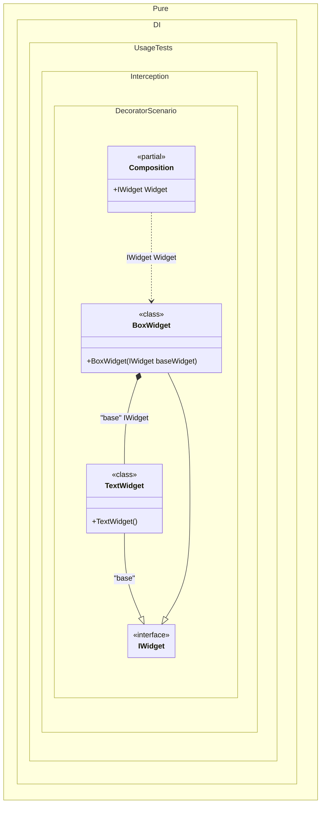

#### Decorator

Interception is the ability to intercept calls between objects in order to enrich or change their behavior, but without having to change their code. A prerequisite for interception is weak binding. That is, if programming is abstraction-based, the underlying implementation can be transformed or improved by "packaging" it into other implementations of the same abstraction. At its core, intercept is an application of the Decorator design pattern. This pattern provides a flexible alternative to inheritance by dynamically "attaching" additional responsibility to an object. Decorator "packs" one implementation of an abstraction into another implementation of the same abstraction like a "matryoshka doll".
_Decorator_ is a well-known and useful design pattern. It is convenient to use tagged dependencies to build a chain of nested decorators, as in the example below:


```c#
using Shouldly;
using Pure.DI;

DI.Setup(nameof(Composition))
    .Bind("base").To<TextWidget>()
    .Bind().To<BoxWidget>()
    .Root<IWidget>("Widget");

var composition = new Composition();
var widget = composition.Widget;
widget.Render().ShouldBe("[ Hello World ]");

interface IWidget
{
    string Render();
}

class TextWidget : IWidget
{
    public string Render() => "Hello World";
}

class BoxWidget([Tag("base")] IWidget baseWidget) : IWidget
{
    public string Render() => $"[ {baseWidget.Render()} ]";
}
```

<details>
<summary>Running this code sample locally</summary>

- Make sure you have the [.NET SDK 10.0](https://dotnet.microsoft.com/en-us/download/dotnet/10.0) or later is installed
```bash
dotnet --list-sdk
```
- Create a net10.0 (or later) console application
```bash
dotnet new console -n Sample
```
- Add references to NuGet packages
  - [Pure.DI](https://www.nuget.org/packages/Pure.DI)
  - [Shouldly](https://www.nuget.org/packages/Shouldly)
```bash
dotnet add package Pure.DI
dotnet add package Shouldly
```
- Copy the example code into the _Program.cs_ file

You are ready to run the example 🚀
```bash
dotnet run
```

</details>

Here an instance of the _TextWidget_ type, labeled _"base"_, is injected in the decorator _BoxWidget_. You can use any tag that semantically reflects the feature of the abstraction being embedded. The tag can be a constant, a type, or a value of an enumerated type.

The following partial class will be generated:

```c#
partial class Composition
{
  public IWidget Widget
  {
    [MethodImpl(MethodImplOptions.AggressiveInlining)]
    get
    {
      return new BoxWidget(new TextWidget());
    }
  }
}
```

Class diagram:



