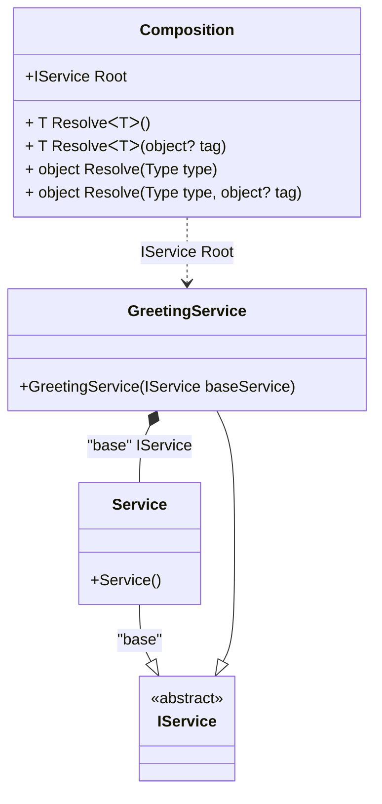

#### Decorator

[](../tests/Pure.DI.UsageTests/Interception/DecoratorScenario.cs)

_Decorator_ is a well-known and useful design pattern. It is convenient to use tagged dependencies to build a chain of nested decorators, as in the example below:

```c#
interface IService { string GetMessage(); }

class Service : IService
{
    public string GetMessage() => "Hello World";
}

class GreetingService([Tag("base")] IService baseService): IService
{
    public string GetMessage() => $"{baseService.GetMessage()} !!!";
}


DI.Setup(nameof(Composition))
    .Bind("base").To<Service>()
    .RootBind<IService>("Root").To<GreetingService>();

var composition = new Composition();
var service = composition.Root;
service.GetMessage().ShouldBe("Hello World !!!");
```

Here an instance of the _Service_ type, labeled _"base"_, is embedded in the decorator _DecoratorService_. You can use any tag that semantically reflects the feature of the abstraction being embedded. The tag can be a constant, a type, or a value of an enumerated type.

<details open>
<summary>Class Diagram</summary>



</details>

<details>
<summary>Pure.DI-generated partial class Composition</summary><blockquote>

```c#
partial class Composition
{
  private readonly Composition _rootM04D27di;

  public Composition()
  {
    _rootM04D27di = this;
  }

  internal Composition(Composition baseComposition)
  {
    _rootM04D27di = baseComposition._rootM04D27di;
  }

  public IService Root
  {
    [MethodImpl((MethodImplOptions)0x100)]
    get
    {
      return new GreetingService(new Service());
    }
  }

  [MethodImpl((MethodImplOptions)0x100)]
  public T Resolve<T>()
  {
    return ResolverM04D27di<T>.Value.Resolve(this);
  }

  [MethodImpl((MethodImplOptions)0x100)]
  public T Resolve<T>(object? tag)
  {
    return ResolverM04D27di<T>.Value.ResolveByTag(this, tag);
  }

  [MethodImpl((MethodImplOptions)0x100)]
  public object Resolve(Type type)
  {
    var index = (int)(_bucketSizeM04D27di * ((uint)RuntimeHelpers.GetHashCode(type) % 1));
    ref var pair = ref _bucketsM04D27di[index];
    return pair.Key == type ? pair.Value.Resolve(this) : ResolveM04D27di(type, index);
  }

  [MethodImpl((MethodImplOptions)0x8)]
  private object ResolveM04D27di(Type type, int index)
  {
    var finish = index + _bucketSizeM04D27di;
    while (++index < finish)
    {
      ref var pair = ref _bucketsM04D27di[index];
      if (pair.Key == type)
      {
        return pair.Value.Resolve(this);
      }
    }

    throw new InvalidOperationException($"Cannot resolve composition root of type {type}.");
  }

  [MethodImpl((MethodImplOptions)0x100)]
  public object Resolve(Type type, object? tag)
  {
    var index = (int)(_bucketSizeM04D27di * ((uint)RuntimeHelpers.GetHashCode(type) % 1));
    ref var pair = ref _bucketsM04D27di[index];
    return pair.Key == type ? pair.Value.ResolveByTag(this, tag) : ResolveM04D27di(type, tag, index);
  }

  [MethodImpl((MethodImplOptions)0x8)]
  private object ResolveM04D27di(Type type, object? tag, int index)
  {
    var finish = index + _bucketSizeM04D27di;
    while (++index < finish)
    {
      ref var pair = ref _bucketsM04D27di[index];
      if (pair.Key == type)
      {
        return pair.Value.ResolveByTag(this, tag);
      }
    }

    throw new InvalidOperationException($"Cannot resolve composition root \"{tag}\" of type {type}.");
  }

  public override string ToString()
  {
    return
      "classDiagram\n" +
        "  class Composition {\n" +
          "    +IService Root\n" +
          "    + T ResolveᐸTᐳ()\n" +
          "    + T ResolveᐸTᐳ(object? tag)\n" +
          "    + object Resolve(Type type)\n" +
          "    + object Resolve(Type type, object? tag)\n" +
        "  }\n" +
        "  Service --|> IService : \"base\" \n" +
        "  class Service {\n" +
          "    +Service()\n" +
        "  }\n" +
        "  GreetingService --|> IService : \n" +
        "  class GreetingService {\n" +
          "    +GreetingService(IService baseService)\n" +
        "  }\n" +
        "  class IService {\n" +
          "    <<abstract>>\n" +
        "  }\n" +
        "  GreetingService *--  Service : \"base\"  IService\n" +
        "  Composition ..> GreetingService : IService Root";
  }

  private readonly static int _bucketSizeM04D27di;
  private readonly static Pair<Type, IResolver<Composition, object>>[] _bucketsM04D27di;

  static Composition()
  {
    var valResolverM04D27di_0000 = new ResolverM04D27di_0000();
    ResolverM04D27di<IService>.Value = valResolverM04D27di_0000;
    _bucketsM04D27di = Buckets<Type, IResolver<Composition, object>>.Create(
      1,
      out _bucketSizeM04D27di,
      new Pair<Type, IResolver<Composition, object>>[1]
      {
         new Pair<Type, IResolver<Composition, object>>(typeof(IService), valResolverM04D27di_0000)
      });
  }

  private sealed class ResolverM04D27di<T>: IResolver<Composition, T>
  {
    public static IResolver<Composition, T> Value = new ResolverM04D27di<T>();

    public T Resolve(Composition composite)
    {
      throw new InvalidOperationException($"Cannot resolve composition root of type {typeof(T)}.");
    }

    public T ResolveByTag(Composition composite, object tag)
    {
      throw new InvalidOperationException($"Cannot resolve composition root \"{tag}\" of type {typeof(T)}.");
    }
  }

  private sealed class ResolverM04D27di_0000: IResolver<Composition, IService>
  {
    public IService Resolve(Composition composition)
    {
      return composition.Root;
    }

    public IService ResolveByTag(Composition composition, object tag)
    {
      switch (tag)
      {
        case null:
          return composition.Root;
        default:
          throw new InvalidOperationException($"Cannot resolve composition root \"{tag}\" of type IService.");
      }
    }
  }
}
```

</blockquote></details>

