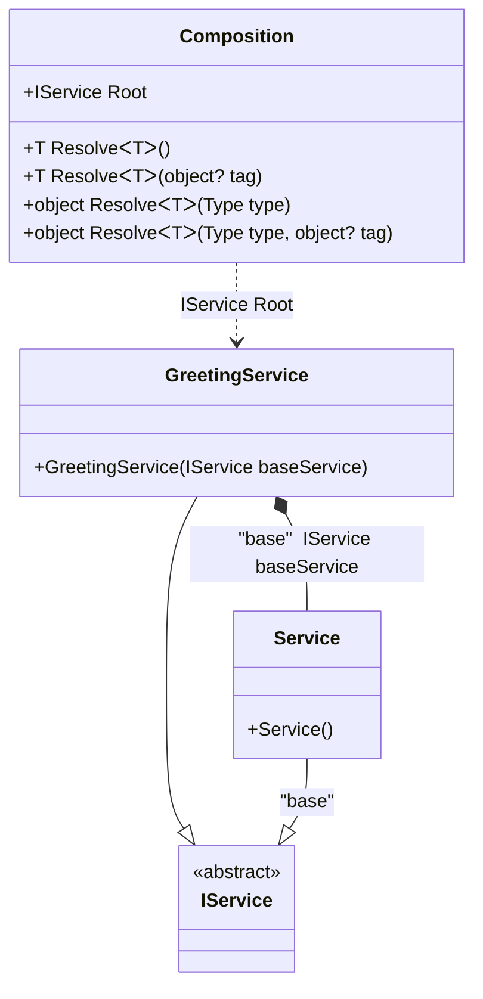

#### Decorator

[](../tests/Pure.DI.UsageTests/Interception/DecoratorScenario.cs)

_Decorator_ is a well-known and useful design pattern. It is convenient to use tagged dependencies to build a chain of nested decorators, as in the example below:

```c#
internal interface IService { string GetMessage(); }

internal class Service : IService
{
    public string GetMessage() => "Hello World";
}

internal class GreetingService : IService
{
    private readonly IService _baseService;

    public GreetingService([Tag("base")] IService baseService) => _baseService = baseService;

    public string GetMessage() => $"{_baseService.GetMessage()} !!!";
}


DI.Setup("Composition")
    .Bind<IService>("base").To<Service>()
    .Bind<IService>().To<GreetingService>().Root<IService>("Root");

var composition = new Composition();
var service = composition.Root;
service.GetMessage().ShouldBe("Hello World !!!");
```

<details open>
<summary>Class Diagram</summary>



</details>

<details>
<summary>Generated Code</summary>

```c#
partial class Composition
{
  public Composition()
  {
  }
  
  internal Composition(Composition parent)
  {
  }
  
  #region Composition Roots
  public Pure.DI.UsageTests.Interception.DecoratorScenario.IService Root
  {
    [global::System.Runtime.CompilerServices.MethodImpl((global::System.Runtime.CompilerServices.MethodImplOptions)0x300)]
    get
    {
      Pure.DI.UsageTests.Interception.DecoratorScenario.Service v95LocalAC4CF3 = new Pure.DI.UsageTests.Interception.DecoratorScenario.Service();
      Pure.DI.UsageTests.Interception.DecoratorScenario.GreetingService v94LocalAC4CF3 = new Pure.DI.UsageTests.Interception.DecoratorScenario.GreetingService(v95LocalAC4CF3);
      return v94LocalAC4CF3;
    }
  }
  #endregion
  
  #region API
  #if NETSTANDARD2_0_OR_GREATER || NETCOREAPP || NET40_OR_GREATER
  [global::System.Diagnostics.Contracts.Pure]
  #endif
  [global::System.Runtime.CompilerServices.MethodImpl((global::System.Runtime.CompilerServices.MethodImplOptions)0x300)]
  public T Resolve<T>()
  {
    return ResolverAC4CF3<T>.Value.Resolve(this);
  }
  
  #if NETSTANDARD2_0_OR_GREATER || NETCOREAPP || NET40_OR_GREATER
  [global::System.Diagnostics.Contracts.Pure]
  #endif
  [global::System.Runtime.CompilerServices.MethodImpl((global::System.Runtime.CompilerServices.MethodImplOptions)0x300)]
  public T Resolve<T>(object? tag)
  {
    return ResolverAC4CF3<T>.Value.ResolveByTag(this, tag);
  }
  
  #if NETSTANDARD2_0_OR_GREATER || NETCOREAPP || NET40_OR_GREATER
  [global::System.Diagnostics.Contracts.Pure]
  #endif
  [global::System.Runtime.CompilerServices.MethodImpl((global::System.Runtime.CompilerServices.MethodImplOptions)0x300)]
  public object Resolve(global::System.Type type)
  {
    int index = (int)(_bucketSizeAC4CF3 * ((uint)global::System.Runtime.CompilerServices.RuntimeHelpers.GetHashCode(type) % 1));
    ref var pair = ref _bucketsAC4CF3[index];
    if (ReferenceEquals(pair.Key, type))
    {
      return pair.Value.Resolve(this);
    }
    
    int maxIndex = index + _bucketSizeAC4CF3;
    for (int i = index + 1; i < maxIndex; i++)
    {
      pair = ref _bucketsAC4CF3[i];
      if (ReferenceEquals(pair.Key, type))
      {
        return pair.Value.Resolve(this);
      }
    }
    
    throw new global::System.InvalidOperationException($"Cannot resolve composition root of type {type}.");
  }
  
  #if NETSTANDARD2_0_OR_GREATER || NETCOREAPP || NET40_OR_GREATER
  [global::System.Diagnostics.Contracts.Pure]
  #endif
  [global::System.Runtime.CompilerServices.MethodImpl((global::System.Runtime.CompilerServices.MethodImplOptions)0x300)]
  public object Resolve(global::System.Type type, object? tag)
  {
    int index = (int)(_bucketSizeAC4CF3 * ((uint)global::System.Runtime.CompilerServices.RuntimeHelpers.GetHashCode(type) % 1));
    ref var pair = ref _bucketsAC4CF3[index];
    if (ReferenceEquals(pair.Key, type))
    {
      return pair.Value.ResolveByTag(this, tag);
    }
    
    int maxIndex = index + _bucketSizeAC4CF3;
    for (int i = index + 1; i < maxIndex; i++)
    {
      pair = ref _bucketsAC4CF3[i];
      if (ReferenceEquals(pair.Key, type))
      {
        return pair.Value.ResolveByTag(this, tag);
      }
    }
    
    throw new global::System.InvalidOperationException($"Cannot resolve composition root of type {type}.");
  }
  
  #endregion
  
  public override string ToString()
  {
    return
      "classDiagram\n" +
        "  class Composition {\n" +
          "    +IService Root\n" +
          "    +T ResolveᐸTᐳ()\n" +
          "    +T ResolveᐸTᐳ(object? tag)\n" +
          "    +object ResolveᐸTᐳ(Type type)\n" +
          "    +object ResolveᐸTᐳ(Type type, object? tag)\n" +
        "  }\n" +
        "  GreetingService --|> IService : \n" +
        "  class GreetingService {\n" +
          "    +GreetingService(IService baseService)\n" +
        "  }\n" +
        "  Service --|> IService : \"base\" \n" +
        "  class Service {\n" +
          "    +Service()\n" +
        "  }\n" +
        "  class IService {\n" +
          "    <<abstract>>\n" +
        "  }\n" +
        "  GreetingService *--  Service : \"base\"  IService baseService\n" +
        "  Composition ..> GreetingService : IService Root";
  }
  
  private readonly static int _bucketSizeAC4CF3;
  private readonly static global::Pure.DI.Pair<global::System.Type, global::Pure.DI.IResolver<Composition, object>>[] _bucketsAC4CF3;
  
  static Composition()
  {
    ResolverAC4CF30 valResolverAC4CF30 = new ResolverAC4CF30();
    ResolverAC4CF3<Pure.DI.UsageTests.Interception.DecoratorScenario.IService>.Value = valResolverAC4CF30;
    _bucketsAC4CF3 = global::Pure.DI.Buckets<global::System.Type, global::Pure.DI.IResolver<Composition, object>>.Create(
      1,
      out _bucketSizeAC4CF3,
      new global::Pure.DI.Pair<global::System.Type, global::Pure.DI.IResolver<Composition, object>>[1]
      {
         new global::Pure.DI.Pair<global::System.Type, global::Pure.DI.IResolver<Composition, object>>(typeof(Pure.DI.UsageTests.Interception.DecoratorScenario.IService), valResolverAC4CF30)
      });
  }
  
  #region Resolvers
  #pragma warning disable CS0649
  private class ResolverAC4CF3<T>
  {
    public static global::Pure.DI.IResolver<Composition, T> Value;
  }
  
  private sealed class ResolverAC4CF30: global::Pure.DI.IResolver<Composition, Pure.DI.UsageTests.Interception.DecoratorScenario.IService>
  {
    [global::System.Runtime.CompilerServices.MethodImpl((global::System.Runtime.CompilerServices.MethodImplOptions)0x300)]
    public Pure.DI.UsageTests.Interception.DecoratorScenario.IService Resolve(Composition composition)
    {
      return composition.Root;
    }
    
    [global::System.Runtime.CompilerServices.MethodImpl((global::System.Runtime.CompilerServices.MethodImplOptions)0x300)]
    public Pure.DI.UsageTests.Interception.DecoratorScenario.IService ResolveByTag(Composition composition, object tag)
    {
      if (Equals(tag, null)) return composition.Root;
      throw new global::System.InvalidOperationException($"Cannot resolve composition root \"{tag}\" of type Pure.DI.UsageTests.Interception.DecoratorScenario.IService.");
    }
  }
  #pragma warning restore CS0649
  #endregion
}
```

</details>


Here an instance of the _Service_ type, labeled _"base"_, is embedded in the decorator _DecoratorService_. You can use any tag that semantically reflects the feature of the abstraction being embedded. The tag can be a constant, a type, or a value of an enumerated type.
