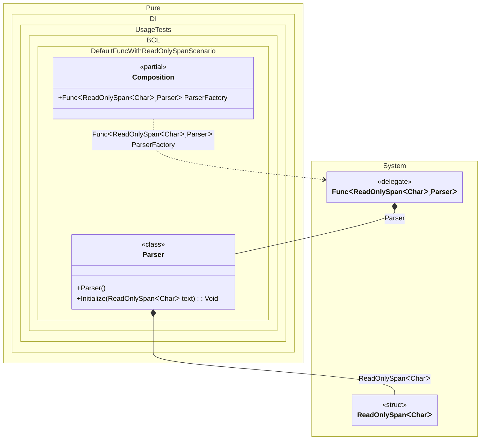

#### Default Func with ReadOnlySpan

Pure.DI can generate the standard `Func<ReadOnlySpan<char>, T>` factory automatically. The runtime span argument is kept as a local value inside the generated delegate invocation, so no manual `ctx.Override(...)` call and no `lock (ctx.Lock)` block are required.


```c#
using Shouldly;
using Pure.DI;
using System;

DI.Setup(nameof(Composition))

    // Composition root
    .Root<Func<ReadOnlySpan<char>, Parser>>("ParserFactory");

var composition = new Composition();
var parser = composition.ParserFactory("Hello".AsSpan());

parser.Value.ShouldBe("Hello");

class Parser
{
    private string _value = "";

    [Ordinal]
    public void Initialize(ReadOnlySpan<char> text)
    {
        _value = text.ToString();
    }

    public string Value => _value;
}
```

<details>
<summary>Running this code sample locally</summary>

- Make sure you have the [.NET SDK 10.0](https://dotnet.microsoft.com/en-us/download/dotnet/10.0) or later installed
```bash
dotnet --list-sdk
```
- Create a net10.0 (or later) console application
```bash
dotnet new console -n Sample
```
- Add references to the NuGet packages
  - [Pure.DI](https://www.nuget.org/packages/Pure.DI)
  - [Shouldly](https://www.nuget.org/packages/Shouldly)
```bash
dotnet add package Pure.DI
dotnet add package Shouldly
```
- Copy the example code into the _Program.cs_ file

You are ready to run the example 🚀
```bash
dotnet run
```

</details>

Use this default `Func` binding when the standard delegate shape is enough. Use a custom delegate factory with explicit `ctx.Override<T>(...)` only when you need a custom delegate type or additional factory logic.

<details>
<summary>The following partial class will be generated</summary>

```c#
partial class Composition
{
  public Func<ReadOnlySpan<char>, Parser> ParserFactory
  {
    [MethodImpl(MethodImplOptions.AggressiveInlining)]
    get
    {
      Func<ReadOnlySpan<char>, Parser> perBlockFuncReadOnlySpanCharParser;
      // Creates a factory with runtime arguments
      Func<ReadOnlySpan<char>, Parser> localFactory = new Func<ReadOnlySpan<char>, Parser>((ReadOnlySpan<char> localArg1) =>
      {
        // Creates the result
        ReadOnlySpan<char> overriddenReadOnlySpanChar = localArg1;
        var transientParser = new Parser();
        transientParser.Initialize(overriddenReadOnlySpanChar);
        return transientParser;
      });
      perBlockFuncReadOnlySpanCharParser = localFactory;
      return perBlockFuncReadOnlySpanCharParser;
    }
  }
}
```

</details>

Class diagram:



See also:

- [Span and ReadOnlySpan](span-and-readonlyspan.md)
- [Func](func.md)

