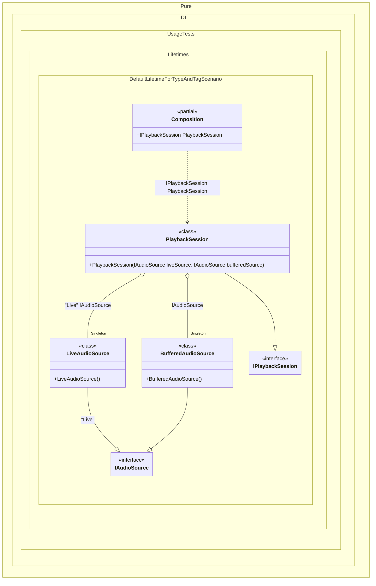

#### Default lifetime for a type and a tag

For example, if a certain lifetime is used more often than others, you can make it the default lifetime for a certain type:


```c#
using Shouldly;
using Pure.DI;
using static Pure.DI.Lifetime;

DI.Setup(nameof(Composition))
    // Real-world idea:
    // "Live" audio capture device should be shared (singleton),
    // while a regular (untagged) audio source can be created per session (transient).
    .DefaultLifetime<IAudioSource>(Singleton, "Live")

    // Tagged binding: "Live" audio capture (shared)
    .Bind("Live").To<LiveAudioSource>()

    // Untagged binding: some other source (new instance each time)
    .Bind().To<BufferedAudioSource>()

    // A playback session uses two sources:
    // - Live (shared, tagged)
    // - Buffered (transient, untagged)
    .Bind().To<PlaybackSession>()

    // Composition root
    .Root<IPlaybackSession>("PlaybackSession");

var composition = new Composition();

// Two independent sessions (transient root)
var session1 = composition.PlaybackSession;
var session2 = composition.PlaybackSession;

session1.ShouldNotBe(session2);

// Within a single session:
// - Live source is tagged => default lifetime forces it to be shared (singleton)
// - Buffered source is untagged => transient => always a new instance
session1.LiveSource.ShouldNotBe(session1.BufferedSource);

// Between sessions:
// - Live source is a shared singleton (same instance)
// - Buffered source is transient (different instances)
session1.LiveSource.ShouldBe(session2.LiveSource);

interface IAudioSource;

// "Live" device: e.g., microphone/line-in capture.
class LiveAudioSource : IAudioSource;

// "Buffered" source: e.g., decoded audio chunks, per-session pipeline buffer.
class BufferedAudioSource : IAudioSource;

interface IPlaybackSession
{
    IAudioSource LiveSource { get; }

    IAudioSource BufferedSource { get; }
}

class PlaybackSession(
    // Tagged dependency: should be singleton because of DefaultLifetime<IAudioSource>(..., "Live")
    [Tag("Live")] IAudioSource liveSource,

    // Untagged dependency: transient by default
    IAudioSource bufferedSource)
    : IPlaybackSession
{
    public IAudioSource LiveSource { get; } = liveSource;

    public IAudioSource BufferedSource { get; } = bufferedSource;
}
```

<details>
<summary>Running this code sample locally</summary>

- Make sure you have the [.NET SDK 10.0](https://dotnet.microsoft.com/en-us/download/dotnet/10.0) or later is installed
```bash
dotnet --list-sdk
```
- Create a net10.0 (or later) console application
```bash
dotnet new console -n Sample
```
- Add references to NuGet packages
  - [Pure.DI](https://www.nuget.org/packages/Pure.DI)
  - [Shouldly](https://www.nuget.org/packages/Shouldly)
```bash
dotnet add package Pure.DI
dotnet add package Shouldly
```
- Copy the example code into the _Program.cs_ file

You are ready to run the example 🚀
```bash
dotnet run
```

</details>

The following partial class will be generated:

```c#
partial class Composition
{
  private readonly Composition _root;
#if NET9_0_OR_GREATER
  private readonly Lock _lock;
#else
  private readonly Object _lock;
#endif

  private LiveAudioSource? _singletonLiveAudioSource51;
  private BufferedAudioSource? _singletonBufferedAudioSource52;

  [OrdinalAttribute(256)]
  public Composition()
  {
    _root = this;
#if NET9_0_OR_GREATER
    _lock = new Lock();
#else
    _lock = new Object();
#endif
  }

  internal Composition(Composition parentScope)
  {
    _root = (parentScope ?? throw new ArgumentNullException(nameof(parentScope)))._root;
    _lock = parentScope._lock;
  }

  public IPlaybackSession PlaybackSession
  {
    [MethodImpl(MethodImplOptions.AggressiveInlining)]
    get
    {
      if (_root._singletonLiveAudioSource51 is null)
        lock (_lock)
          if (_root._singletonLiveAudioSource51 is null)
          {
            _root._singletonLiveAudioSource51 = new LiveAudioSource();
          }

      if (_root._singletonBufferedAudioSource52 is null)
        lock (_lock)
          if (_root._singletonBufferedAudioSource52 is null)
          {
            _root._singletonBufferedAudioSource52 = new BufferedAudioSource();
          }

      return new PlaybackSession(_root._singletonLiveAudioSource51, _root._singletonBufferedAudioSource52);
    }
  }
}
```

Class diagram:



