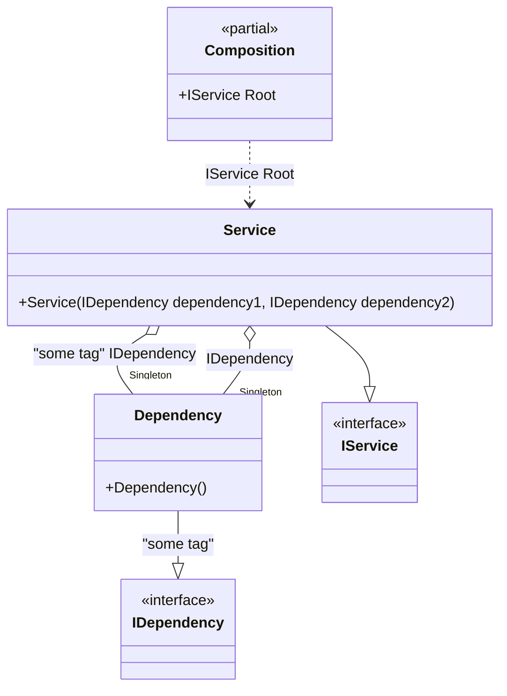

#### Default lifetime for a type and a tag

[](../tests/Pure.DI.UsageTests/Lifetimes/DefaultLifetimeForTypeAndTagScenario.cs)

For example, if a certain lifetime is used more often than others, you can make it the default lifetime for a certain type:


```c#
interface IDependency;

class Dependency : IDependency;

interface IService
{
    public IDependency Dependency1 { get; }

    public IDependency Dependency2 { get; }
}

class Service(
    [Tag("some tag")] IDependency dependency1,
    IDependency dependency2)
    : IService
{
    public IDependency Dependency1 { get; } = dependency1;

    public IDependency Dependency2 { get; } = dependency2;
}

DI.Setup(nameof(Composition))
    // This hint indicates to not generate methods such as Resolve
    .Hint(Hint.Resolve, "Off")
    // Default lifetime applied to a specific type
    .DefaultLifetime<IDependency>(Lifetime.Singleton, "some tag")
    .Bind("some tag").To<Dependency>()
    .Bind().To<Dependency>()
    .Bind().To<Service>()
    .Root<IService>("Root");

var composition = new Composition();
var service1 = composition.Root;
var service2 = composition.Root;
service1.ShouldNotBe(service2);
service1.Dependency1.ShouldNotBe(service1.Dependency2);
service1.Dependency1.ShouldBe(service2.Dependency1);
```

The following partial class will be generated:

```c#
partial class Composition
{
  private readonly Composition _root;
  private readonly object _lock;

  private Dependency? _singletonDependency39;
  private Dependency? _singletonDependency40;

  [OrdinalAttribute(20)]
  public Composition()
  {
    _root = this;
    _lock = new object();
  }

  internal Composition(Composition parentScope)
  {
    _root = (parentScope ?? throw new ArgumentNullException(nameof(parentScope)))._root;
    _lock = _root._lock;
  }

  public IService Root
  {
    [MethodImpl(MethodImplOptions.AggressiveInlining)]
    get
    {
      if (_root._singletonDependency40 == null)
      {
        lock (_lock)
        {
          if (_root._singletonDependency40 == null)
          {
            _root._singletonDependency40 = new Dependency();
          }
        }
      }

      if (_root._singletonDependency39 == null)
      {
        lock (_lock)
        {
          if (_root._singletonDependency39 == null)
          {
            _root._singletonDependency39 = new Dependency();
          }
        }
      }

      return new Service(_root._singletonDependency39!, _root._singletonDependency40!);
    }
  }
}
```

Class diagram:



