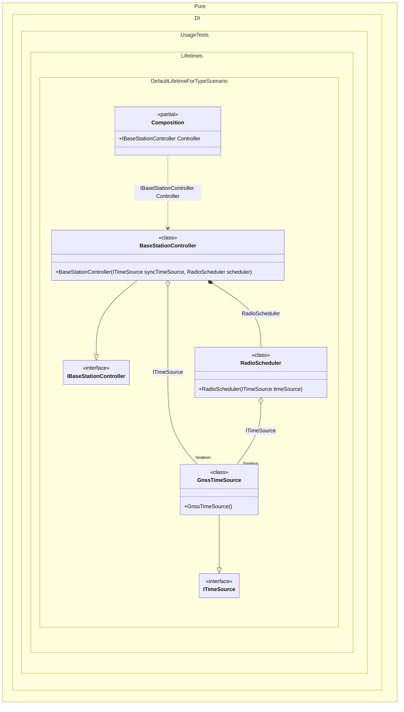

#### Default lifetime for a type

For example, if a certain lifetime is used more often than others, you can make it the default lifetime for a certain type:


```c#
using Shouldly;
using Pure.DI;
using static Pure.DI.Lifetime;

DI.Setup(nameof(Composition))
    // In a real base station, the time source (PTP/GNSS disciplined clock)
    // is a shared infrastructure component:
    // it should be created once per station and reused everywhere.
    .DefaultLifetime<ITimeSource>(Singleton)

    // Time source used by multiple subsystems
    .Bind().To<GnssTimeSource>()

    // Upper-level station components (usually transient by default)
    .Bind().To<BaseStationController>()
    .Bind().To<RadioScheduler>()

    // Composition root (represents "get me a controller instance")
    .Root<IBaseStationController>("Controller");

var composition = new Composition();

// Two independent controller instances (e.g., two independent operations)
var controller1 = composition.Controller;
var controller2 = composition.Controller;

controller1.ShouldNotBe(controller2);

// Inside one controller we request ITimeSource twice:
// the same singleton instance should be injected both times.
controller1.SyncTimeSource.ShouldBe(controller1.SchedulerTimeSource);

// Across different controllers the same station-wide time source is reused.
controller1.SyncTimeSource.ShouldBe(controller2.SyncTimeSource);

// A shared station-wide dependency
interface ITimeSource
{
    long UnixTimeMilliseconds { get; }
}

// Represents a GNSS-disciplined clock (or PTP grandmaster input).
// In real deployments you'd talk to a driver / NIC / daemon here.
class GnssTimeSource : ITimeSource
{
    public long UnixTimeMilliseconds => DateTimeOffset.UtcNow.ToUnixTimeMilliseconds();
}

interface IBaseStationController
{
    ITimeSource SyncTimeSource { get; }
    ITimeSource SchedulerTimeSource { get; }
}

// A "top-level" controller of the base station.
// It depends on the time source for synchronization and for scheduling decisions.
class BaseStationController(
    ITimeSource syncTimeSource,
    RadioScheduler scheduler)
    : IBaseStationController
{
    // Used for time synchronization / frame timing
    public ITimeSource SyncTimeSource { get; } = syncTimeSource;

    // Demonstrates that scheduler also uses the same singleton time source
    public ITimeSource SchedulerTimeSource { get; } = scheduler.TimeSource;
}

// A subsystem (e.g., MAC scheduler) that also needs precise time.
class RadioScheduler(ITimeSource timeSource)
{
    public ITimeSource TimeSource { get; } = timeSource;
}
```

<details>
<summary>Running this code sample locally</summary>

- Make sure you have the [.NET SDK 10.0](https://dotnet.microsoft.com/en-us/download/dotnet/10.0) or later is installed
```bash
dotnet --list-sdk
```
- Create a net10.0 (or later) console application
```bash
dotnet new console -n Sample
```
- Add references to NuGet packages
  - [Pure.DI](https://www.nuget.org/packages/Pure.DI)
  - [Shouldly](https://www.nuget.org/packages/Shouldly)
```bash
dotnet add package Pure.DI
dotnet add package Shouldly
```
- Copy the example code into the _Program.cs_ file

You are ready to run the example 🚀
```bash
dotnet run
```

</details>

The following partial class will be generated:

```c#
partial class Composition
{
  private readonly Composition _root;
#if NET9_0_OR_GREATER
  private readonly Lock _lock;
#else
  private readonly Object _lock;
#endif

  private GnssTimeSource? _singletonGnssTimeSource51;

  [OrdinalAttribute(256)]
  public Composition()
  {
    _root = this;
#if NET9_0_OR_GREATER
    _lock = new Lock();
#else
    _lock = new Object();
#endif
  }

  internal Composition(Composition parentScope)
  {
    _root = (parentScope ?? throw new ArgumentNullException(nameof(parentScope)))._root;
    _lock = parentScope._lock;
  }

  public IBaseStationController Controller
  {
    [MethodImpl(MethodImplOptions.AggressiveInlining)]
    get
    {
      EnsureGnssTimeSourceExists();
      return new BaseStationController(_root._singletonGnssTimeSource51, new RadioScheduler(_root._singletonGnssTimeSource51));
      [MethodImpl(MethodImplOptions.AggressiveInlining)]
      void EnsureGnssTimeSourceExists()
      {
        if (_root._singletonGnssTimeSource51 is null)
          lock (_lock)
            if (_root._singletonGnssTimeSource51 is null)
            {
              _root._singletonGnssTimeSource51 = new GnssTimeSource();
            }
      }
    }
  }
}
```

Class diagram:



