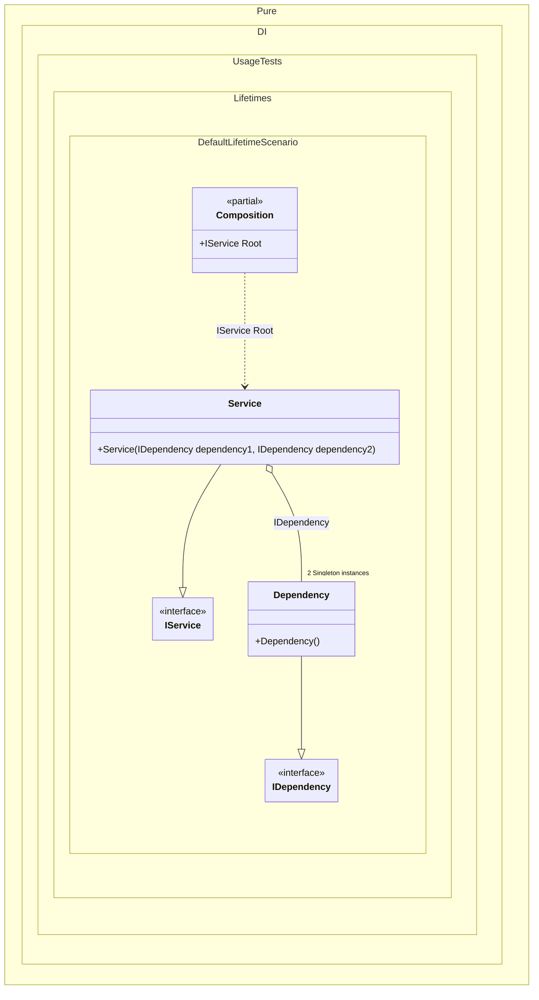

#### Default lifetime

[](../tests/Pure.DI.UsageTests/Lifetimes/DefaultLifetimeScenario.cs)

For example, if some lifetime is used more often than others, you can make it the default lifetime:


```c#
using Pure.DI;
using Shouldly;
using static Pure.DI.Lifetime;

DI.Setup(nameof(Composition))
    // This hint indicates to not generate methods such as Resolve
    .Hint(Hint.Resolve, "Off")
    // Default Lifetime applies
    // to all bindings until the end of the chain
    // or the next call to the DefaultLifetime method
    .DefaultLifetime(Singleton)
    .Bind().To<Dependency>()
    .Bind().To<Service>()
    .Root<IService>("Root");

var composition = new Composition();
var service1 = composition.Root;
var service2 = composition.Root;
service1.ShouldBe(service2);
service1.Dependency1.ShouldBe(service1.Dependency2);
service1.Dependency1.ShouldBe(service2.Dependency1);

interface IDependency;

class Dependency : IDependency;

interface IService
{
    public IDependency Dependency1 { get; }

    public IDependency Dependency2 { get; }
}

class Service(
    IDependency dependency1,
    IDependency dependency2)
    : IService
{
    public IDependency Dependency1 { get; } = dependency1;

    public IDependency Dependency2 { get; } = dependency2;
}
```


Class diagram:



