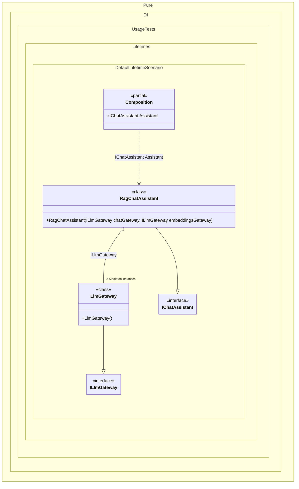

#### Default lifetime

For example, if some lifetime is used more often than others, you can make it the default lifetime:


```c#
using Shouldly;
using Pure.DI;
using static Pure.DI.Lifetime;

DI.Setup(nameof(Composition))
    // In real AI apps, the "client" (HTTP handler, connection pool, retries, telemetry)
    // is typically expensive and should be shared.
    //
    // DefaultLifetime(Singleton) makes *all* bindings in this chain singletons,
    // until the chain ends or DefaultLifetime(...) is called again.
    .DefaultLifetime(Singleton)
    .Bind().To<LlmGateway>()
    .Bind().To<RagChatAssistant>()
    .Root<IChatAssistant>("Assistant");

var composition = new Composition();

// Think of these as two independent "requests" to resolve the assistant.
// With singleton lifetime, you get the same assistant instance each time.
var assistant1 = composition.Assistant;
var assistant2 = composition.Assistant;

assistant1.ShouldBe(assistant2);

// The assistant depends on the same gateway in two places (e.g., chat + embeddings).
// Because the gateway is singleton, both references are the *same instance*.
assistant1.ChatGateway.ShouldBe(assistant1.EmbeddingsGateway);

// And because the assistant itself is singleton, it reuses the same gateway across resolutions.
assistant1.ChatGateway.ShouldBe(assistant2.ChatGateway);

// Represents an "LLM provider gateway": HTTP client, auth, retries, rate limiting, etc.
// NOTE: No secrets here; in real projects you'd configure credentials via secure configuration.
interface ILlmGateway;

// Concrete gateway implementation (placeholder for "OpenAI/Anthropic/Azure/etc. client").
class LlmGateway : ILlmGateway;

// A chat assistant that does RAG (Retrieval-Augmented Generation).
// It needs the gateway for:
// - Chat completions (answer generation)
// - Embeddings (vectorization of question/documents)
interface IChatAssistant
{
    ILlmGateway ChatGateway { get; }

    ILlmGateway EmbeddingsGateway { get; }
}

class RagChatAssistant(
    ILlmGateway chatGateway,
    ILlmGateway embeddingsGateway)
    : IChatAssistant
{
    public ILlmGateway ChatGateway { get; } = chatGateway;

    public ILlmGateway EmbeddingsGateway { get; } = embeddingsGateway;
}
```

<details>
<summary>Running this code sample locally</summary>

- Make sure you have the [.NET SDK 10.0](https://dotnet.microsoft.com/en-us/download/dotnet/10.0) or later is installed
```bash
dotnet --list-sdk
```
- Create a net10.0 (or later) console application
```bash
dotnet new console -n Sample
```
- Add references to NuGet packages
  - [Pure.DI](https://www.nuget.org/packages/Pure.DI)
  - [Shouldly](https://www.nuget.org/packages/Shouldly)
```bash
dotnet add package Pure.DI
dotnet add package Shouldly
```
- Copy the example code into the _Program.cs_ file

You are ready to run the example 🚀
```bash
dotnet run
```

</details>

The following partial class will be generated:

```c#
partial class Composition
{
  private readonly Composition _root;
#if NET9_0_OR_GREATER
  private readonly Lock _lock;
#else
  private readonly Object _lock;
#endif

  private RagChatAssistant? _singletonRagChatAssistant52;
  private LlmGateway? _singletonLlmGateway51;

  [OrdinalAttribute(256)]
  public Composition()
  {
    _root = this;
#if NET9_0_OR_GREATER
    _lock = new Lock();
#else
    _lock = new Object();
#endif
  }

  internal Composition(Composition parentScope)
  {
    _root = (parentScope ?? throw new ArgumentNullException(nameof(parentScope)))._root;
    _lock = parentScope._lock;
  }

  public IChatAssistant Assistant
  {
    [MethodImpl(MethodImplOptions.AggressiveInlining)]
    get
    {
      if (_root._singletonRagChatAssistant52 is null)
        lock (_lock)
          if (_root._singletonRagChatAssistant52 is null)
          {
            EnsureLlmGatewayExists();
            _root._singletonRagChatAssistant52 = new RagChatAssistant(_root._singletonLlmGateway51, _root._singletonLlmGateway51);
          }

      return _root._singletonRagChatAssistant52;
      [MethodImpl(MethodImplOptions.AggressiveInlining)]
      void EnsureLlmGatewayExists()
      {
        if (_root._singletonLlmGateway51 is null)
          lock (_lock)
            if (_root._singletonLlmGateway51 is null)
            {
              _root._singletonLlmGateway51 = new LlmGateway();
            }
      }
    }
  }
}
```

Class diagram:



