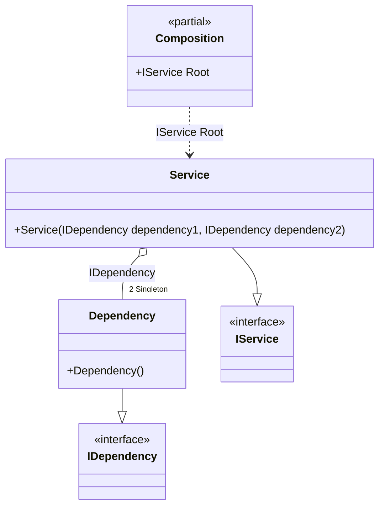

#### Default lifetime

[](../tests/Pure.DI.UsageTests/Lifetimes/DefaultLifetimeScenario.cs)

For example, if some lifetime is used more often than others, you can make it the default lifetime:


```c#
interface IDependency;

class Dependency : IDependency;

interface IService
{
    public IDependency Dependency1 { get; }

    public IDependency Dependency2 { get; }
}

class Service(
    IDependency dependency1,
    IDependency dependency2)
    : IService
{
    public IDependency Dependency1 { get; } = dependency1;

    public IDependency Dependency2 { get; } = dependency2;
}

DI.Setup(nameof(Composition))
    // This hint indicates to not generate methods such as Resolve
    .Hint(Hint.Resolve, "Off")
    // Default Lifetime applies
    // to all bindings until the end of the chain
    // or the next call to the DefaultLifetime method
    .DefaultLifetime(Lifetime.Singleton)

    .Bind().To<Dependency>()
    .RootBind<IService>("Root").To<Service>();

var composition = new Composition();
var service1 = composition.Root;
var service2 = composition.Root;
service1.ShouldBe(service2);
service1.Dependency1.ShouldBe(service1.Dependency2);
```

The following partial class will be generated:

```c#
partial class Composition
{
  private readonly Composition _root;
  private readonly object _lock;

  private Service? _singletonService37;
  private Dependency? _singletonDependency36;

  public Composition()
  {
    _root = this;
    _lock = new object();
  }

  internal Composition(Composition parentScope)
  {
    _root = (parentScope ?? throw new ArgumentNullException(nameof(parentScope)))._root;
    _lock = _root._lock;
  }

  public IService Root
  {
    [MethodImpl(MethodImplOptions.AggressiveInlining)]
    get
    {
      if (_root._singletonService37 == null)
      {
          lock (_lock)
          {
              if (_root._singletonService37 == null)
              {
                  if (_root._singletonDependency36 == null)
                  {
                      _root._singletonDependency36 = new Dependency();
                  }

                  _root._singletonService37 = new Service(_root._singletonDependency36!, _root._singletonDependency36!);
              }
          }
      }

      return _root._singletonService37!;
    }
  }
}
```

Class diagram:



