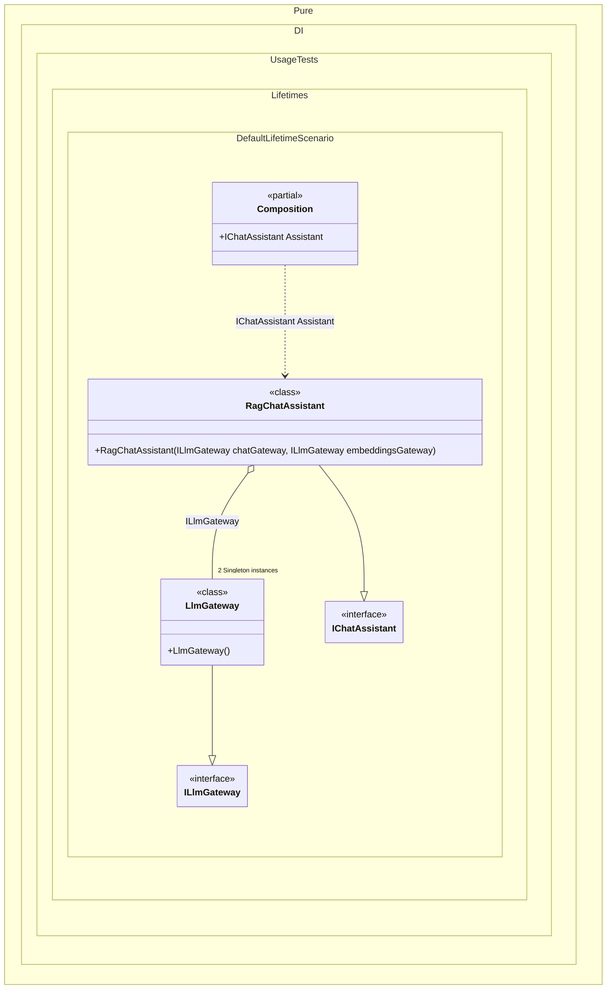

#### Default lifetime

Demonstrates how to set a default lifetime that is used when no specific lifetime is specified for a binding. This is useful when a particular lifetime is used more often than others.


```c#
using Shouldly;
using Pure.DI;
using static Pure.DI.Lifetime;

DI.Setup(nameof(Composition))
    // In real AI apps, the "client" (HTTP handler, connection pool, retries, telemetry)
    // is typically expensive and should be shared.
    //
    // DefaultLifetime(Singleton) makes *all* bindings in this chain singletons,
    // until the chain ends or DefaultLifetime(...) is called again.
    .DefaultLifetime(Singleton)
    .Bind().To<LlmGateway>()
    .Bind().To<RagChatAssistant>()
    .Root<IChatAssistant>("Assistant");

var composition = new Composition();

// Think of these as two independent "requests" to resolve the assistant.
// With singleton lifetime, you get the same assistant instance each time.
var assistant1 = composition.Assistant;
var assistant2 = composition.Assistant;

assistant1.ShouldBe(assistant2);

// The assistant depends on the same gateway in two places (e.g., chat + embeddings).
// Because the gateway is singleton, both references are the *same instance*.
assistant1.ChatGateway.ShouldBe(assistant1.EmbeddingsGateway);

// And because the assistant itself is singleton, it reuses the same gateway across resolutions.
assistant1.ChatGateway.ShouldBe(assistant2.ChatGateway);

// Represents an "LLM provider gateway": HTTP client, auth, retries, rate limiting, etc.
// NOTE: No secrets here; in real projects you'd configure credentials via secure configuration.
interface ILlmGateway;

// Concrete gateway implementation (placeholder for "OpenAI/Anthropic/Azure/etc. client").
class LlmGateway : ILlmGateway;

// A chat assistant that does RAG (Retrieval-Augmented Generation).
// It needs the gateway for:
// - Chat completions (answer generation)
// - Embeddings (vectorization of question/documents)
interface IChatAssistant
{
    ILlmGateway ChatGateway { get; }

    ILlmGateway EmbeddingsGateway { get; }
}

class RagChatAssistant(
    ILlmGateway chatGateway,
    ILlmGateway embeddingsGateway)
    : IChatAssistant
{
    public ILlmGateway ChatGateway { get; } = chatGateway;

    public ILlmGateway EmbeddingsGateway { get; } = embeddingsGateway;
}
```

<details>
<summary>Running this code sample locally</summary>

- Make sure you have the [.NET SDK 10.0](https://dotnet.microsoft.com/en-us/download/dotnet/10.0) or later installed
```bash
dotnet --list-sdk
```
- Create a net10.0 (or later) console application
```bash
dotnet new console -n Sample
```
- Add references to the NuGet packages
  - [Pure.DI](https://www.nuget.org/packages/Pure.DI)
  - [Shouldly](https://www.nuget.org/packages/Shouldly)
```bash
dotnet add package Pure.DI
dotnet add package Shouldly
```
- Copy the example code into the _Program.cs_ file

You are ready to run the example 🚀
```bash
dotnet run
```

</details>

>[!NOTE]
>Default lifetime reduces configuration verbosity when a particular lifetime is predominant in your composition.

The following partial class will be generated:

```c#
partial class Composition
{
#if NET9_0_OR_GREATER
  private readonly Lock _lock = new Lock();
#else
  private readonly Object _lock = new Object();
#endif

  private RagChatAssistant? _singletonRagChatAssistant63;
  private LlmGateway? _singletonLlmGateway62;

  public IChatAssistant Assistant
  {
    [MethodImpl(MethodImplOptions.AggressiveInlining)]
    get
    {
      if (_singletonRagChatAssistant63 is null)
        lock (_lock)
          if (_singletonRagChatAssistant63 is null)
          {
            EnsureLlmGatewayExists();
            _singletonRagChatAssistant63 = new RagChatAssistant(_singletonLlmGateway62, _singletonLlmGateway62);
          }

      return _singletonRagChatAssistant63;
      [MethodImpl(MethodImplOptions.AggressiveInlining)]
      void EnsureLlmGatewayExists()
      {
        if (_singletonLlmGateway62 is null)
          lock (_lock)
            if (_singletonLlmGateway62 is null)
            {
              _singletonLlmGateway62 = new LlmGateway();
            }
      }
    }
  }
}
```

Class diagram:


```mermaid
---
 config:
  maxTextSize: 2147483647
  maxEdges: 2147483647
  class:
   hideEmptyMembersBox: true
---
classDiagram
	LlmGateway --|> ILlmGateway
	RagChatAssistant --|> IChatAssistant
	Composition ..> RagChatAssistant : IChatAssistant Assistant
	RagChatAssistant o-- "2 Singleton instances" LlmGateway : ILlmGateway
	namespace Pure.DI.UsageTests.Lifetimes.DefaultLifetimeScenario {
		class Composition {
		<<partial>>
		+IChatAssistant Assistant
		}
		class IChatAssistant {
			<<interface>>
		}
		class ILlmGateway {
			<<interface>>
		}
		class LlmGateway {
				<<class>>
			+LlmGateway()
		}
		class RagChatAssistant {
				<<class>>
			+RagChatAssistant(ILlmGateway chatGateway, ILlmGateway embeddingsGateway)
		}
	}
```

