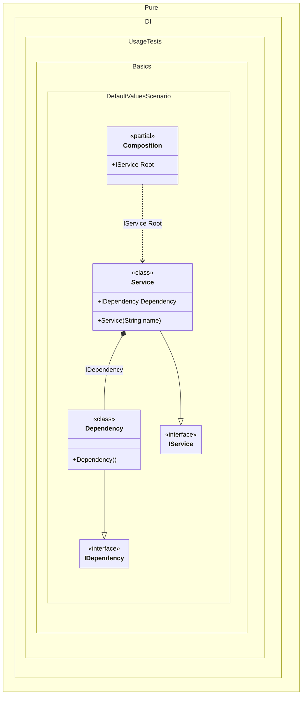

#### Default values

This example demonstrates how to use default values in dependency injection when explicit injection is not possible.


```c#
using Shouldly;
using Pure.DI;

DI.Setup(nameof(Composition))
    .Bind<IDependency>().To<Dependency>()
    .Bind<IService>().To<Service>()

    // Composition root
    .Root<IService>("Root");

var composition = new Composition();
var service = composition.Root;
service.Dependency.ShouldBeOfType<Dependency>();
service.Name.ShouldBe("My Service");

interface IDependency;

class Dependency : IDependency;

interface IService
{
    string Name { get; }

    IDependency Dependency { get; }
}

// If injection cannot be performed explicitly,
// the default value will be used
class Service(string name = "My Service") : IService
{
    public string Name { get; } = name;

    public required IDependency Dependency { get; init; } = new Dependency();
}
```

<details>
<summary>Running this code sample locally</summary>

- Make sure you have the [.NET SDK 10.0](https://dotnet.microsoft.com/en-us/download/dotnet/10.0) or later is installed
```bash
dotnet --list-sdk
```
- Create a net10.0 (or later) console application
```bash
dotnet new console -n Sample
```
- Add references to NuGet packages
  - [Pure.DI](https://www.nuget.org/packages/Pure.DI)
  - [Shouldly](https://www.nuget.org/packages/Shouldly)
```bash
dotnet add package Pure.DI
dotnet add package Shouldly
```
- Copy the example code into the _Program.cs_ file

You are ready to run the example 🚀
```bash
dotnet run
```

</details>

The key points are:
- Default constructor arguments can be used for simple values
- The DI container will use these defaults if no explicit bindings are provided

This example illustrates how to handle default values in a dependency injection scenario:
- **Constructor Default Argument**: The `Service` class has a constructor with a default value for the name parameter. If no value is provided, “My Service” will be used.
- **Required Property with Default**: The Dependency property is marked as required but has a default instantiation. This ensures that:
  - The property must be set
  - If no explicit injection occurs, a default value will be used

The following partial class will be generated:

```c#
partial class Composition
{
  [OrdinalAttribute(256)]
  public Composition()
  {
  }

  internal Composition(Composition parentScope)
  {
  }

  public IService Root
  {
    [MethodImpl(MethodImplOptions.AggressiveInlining)]
    get
    {
      return new Service()
      {
        Dependency = new Dependency()
      };
    }
  }
}
```

Class diagram:



