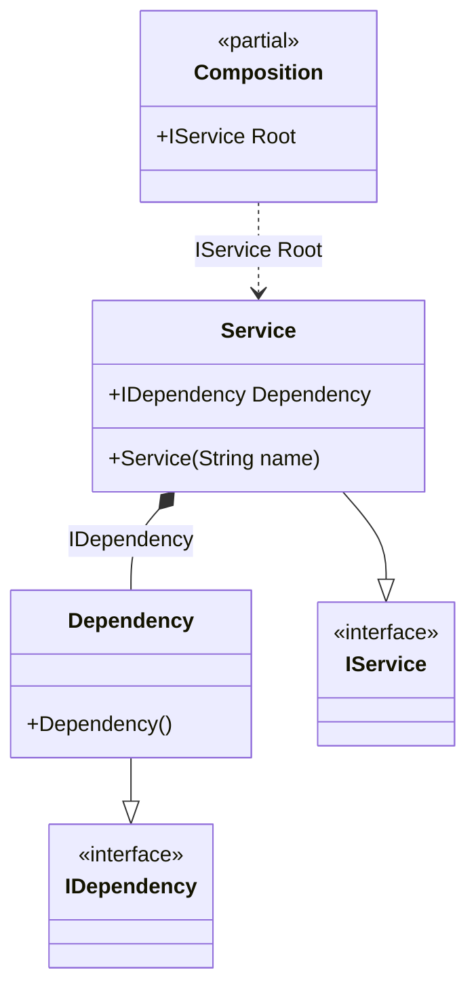

#### Default values

[](../tests/Pure.DI.UsageTests/Basics/DefaultValuesScenario.cs)


```c#
interface IDependency;

class Dependency : IDependency;

interface IService
{
    string Name { get; }

    IDependency Dependency { get; }
}

// If injection cannot be performed explicitly,
// the default value will be used
class Service(string name = "My Service") : IService
{
    public string Name { get; } = name;

    public required IDependency Dependency { get; init; } = new Dependency();
}

DI.Setup(nameof(Composition))
    .Bind<IDependency>().To<Dependency>()
    .Bind<IService>().To<Service>()

    // Composition root
    .Root<IService>("Root");

var composition = new Composition();
var service = composition.Root;
service.Dependency.ShouldBeOfType<Dependency>();
service.Name.ShouldBe("My Service");
```

The following partial class will be generated:

```c#
partial class Composition
{
  private readonly Composition _root;

  [OrdinalAttribute(20)]
  public Composition()
  {
    _root = this;
  }

  internal Composition(Composition parentScope)
  {
    _root = (parentScope ?? throw new ArgumentNullException(nameof(parentScope)))._root;
  }

  public IService Root
  {
    [MethodImpl(MethodImplOptions.AggressiveInlining)]
    get
    {
      return new Service() { Dependency = new Dependency() };
    }
  }
}
```

Class diagram:



