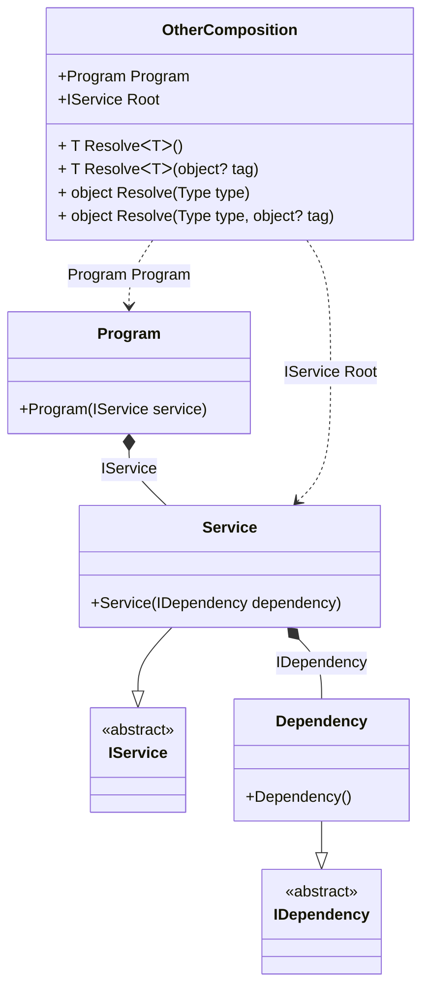

#### Dependent compositions

[](../tests/Pure.DI.UsageTests/Advanced/DependentCompositionsScenario.cs)

The _Setup_ method has an additional argument _kind_, which defines the type of composition:
- _CompositionKind.Public_ - will create a normal composition class, this is the default setting and can be omitted, it can also use the _DependsOn_ method to use it as a dependency in other compositions
- _CompositionKind.Internal_ - the composition class will not be created, but that composition can be used to create other compositions by calling the _DependsOn_ method with its name
- _CompositionKind.Global_ - the composition class will also not be created, but that composition will automatically be used to create other compositions

```c#
interface IDependency;

class Dependency : IDependency;

interface IService;

class Service(IDependency dependency) : IService;

class Program(IService service)
{
    public IService Service { get; } = service;
}

// This setup does not generate code, but can be used as a dependency
// and requires the use of the "DependsOn" call to add it as a dependency
DI.Setup("BaseComposition", CompositionKind.Internal)
    .Bind<IDependency>().To<Dependency>();
        
// This setup generates code and can also be used as a dependency
DI.Setup(nameof(Composition))
    // Uses "BaseComposition" setup
    .DependsOn("BaseComposition")
    .Bind<IService>().To<Service>()
    .Root<IService>("Root");
        
// As in the previous case, this setup generates code and can also be used as a dependency
DI.Setup(nameof(OtherComposition))
    // Uses "Composition" setup
    .DependsOn(nameof(Composition))
    .Root<Program>("Program");
        
var composition = new Composition();
var service = composition.Root;

var otherComposition = new OtherComposition();
service = otherComposition.Program.Service;
```

<details open>
<summary>Class Diagram</summary>



</details>

<details>
<summary>Pure.DI-generated partial class Composition</summary><blockquote>

```c#
partial class Composition
{
  private readonly Composition _root;

  public Composition()
  {
    _root = this;
  }

  internal Composition(Composition baseComposition)
  {
    _root = baseComposition._root;
  }

  public IService Root
  {
    [MethodImpl((MethodImplOptions)0x100)]
    get
    {
      return new Service(new Dependency());
    }
  }

  [MethodImpl((MethodImplOptions)0x100)]
  public T Resolve<T>()
  {
    return Resolver<T>.Value.Resolve(this);
  }

  [MethodImpl((MethodImplOptions)0x100)]
  public T Resolve<T>(object? tag)
  {
    return Resolver<T>.Value.ResolveByTag(this, tag);
  }

  [MethodImpl((MethodImplOptions)0x100)]
  public object Resolve(Type type)
  {
    var index = (int)(_bucketSize * ((uint)RuntimeHelpers.GetHashCode(type) % 1));
    ref var pair = ref _buckets[index];
    return pair.Key == type ? pair.Value.Resolve(this) : Resolve(type, index);
  }

  [MethodImpl((MethodImplOptions)0x8)]
  private object Resolve(Type type, int index)
  {
    var finish = index + _bucketSize;
    while (++index < finish)
    {
      ref var pair = ref _buckets[index];
      if (pair.Key == type)
      {
        return pair.Value.Resolve(this);
      }
    }

    throw new InvalidOperationException($"Cannot resolve composition root of type {type}.");
  }

  [MethodImpl((MethodImplOptions)0x100)]
  public object Resolve(Type type, object? tag)
  {
    var index = (int)(_bucketSize * ((uint)RuntimeHelpers.GetHashCode(type) % 1));
    ref var pair = ref _buckets[index];
    return pair.Key == type ? pair.Value.ResolveByTag(this, tag) : Resolve(type, tag, index);
  }

  [MethodImpl((MethodImplOptions)0x8)]
  private object Resolve(Type type, object? tag, int index)
  {
    var finish = index + _bucketSize;
    while (++index < finish)
    {
      ref var pair = ref _buckets[index];
      if (pair.Key == type)
      {
        return pair.Value.ResolveByTag(this, tag);
      }
    }

    throw new InvalidOperationException($"Cannot resolve composition root \"{tag}\" of type {type}.");
  }

  public override string ToString()
  {
    return
      "classDiagram\n" +
        "  class Composition {\n" +
          "    +IService Root\n" +
          "    + T ResolveᐸTᐳ()\n" +
          "    + T ResolveᐸTᐳ(object? tag)\n" +
          "    + object Resolve(Type type)\n" +
          "    + object Resolve(Type type, object? tag)\n" +
        "  }\n" +
        "  Dependency --|> IDependency : \n" +
        "  class Dependency {\n" +
          "    +Dependency()\n" +
        "  }\n" +
        "  Service --|> IService : \n" +
        "  class Service {\n" +
          "    +Service(IDependency dependency)\n" +
        "  }\n" +
        "  class IDependency {\n" +
          "    <<abstract>>\n" +
        "  }\n" +
        "  class IService {\n" +
          "    <<abstract>>\n" +
        "  }\n" +
        "  Service *--  Dependency : IDependency\n" +
        "  Composition ..> Service : IService Root";
  }

  private readonly static int _bucketSize;
  private readonly static Pair<Type, IResolver<Composition, object>>[] _buckets;

  static Composition()
  {
    var valResolver_0000 = new Resolver_0000();
    Resolver<IService>.Value = valResolver_0000;
    _buckets = Buckets<Type, IResolver<Composition, object>>.Create(
      1,
      out _bucketSize,
      new Pair<Type, IResolver<Composition, object>>[1]
      {
         new Pair<Type, IResolver<Composition, object>>(typeof(IService), valResolver_0000)
      });
  }

  private class Resolver<T>: IResolver<Composition, T>
  {
    private const string CannotResolve = "Cannot resolve composition root ";
    private const string OfType = "of type ";
    public static IResolver<Composition, T> Value = new Resolver<T>();

    public virtual T Resolve(Composition composite)
    {
      throw new InvalidOperationException($"{CannotResolve}{OfType}{typeof(T)}.");
    }

    public virtual T ResolveByTag(Composition composite, object tag)
    {
      throw new InvalidOperationException($"{CannotResolve}\"{tag}\" {OfType}{typeof(T)}.");
    }
  }

  private sealed class Resolver_0000: Resolver<IService>
  {
    public override IService Resolve(Composition composition)
    {
      return composition.Root;
    }

    public override IService ResolveByTag(Composition composition, object tag)
    {
      switch (tag)
      {
        case null:
          return composition.Root;
        default:
          return base.ResolveByTag(composition, tag);
      }
    }
  }
}
```

</blockquote></details>

<details>
<summary>Pure.DI-generated partial class OtherComposition</summary><blockquote>

```c#
partial class OtherComposition
{
  private readonly OtherComposition _root;

  public OtherComposition()
  {
    _root = this;
  }

  internal OtherComposition(OtherComposition baseComposition)
  {
    _root = baseComposition._root;
  }

  public IService Root
  {
    [MethodImpl((MethodImplOptions)0x100)]
    get
    {
      return new Service(new Dependency());
    }
  }

  public Program Program
  {
    [MethodImpl((MethodImplOptions)0x100)]
    get
    {
      return new Program(new Service(new Dependency()));
    }
  }

  [MethodImpl((MethodImplOptions)0x100)]
  public T Resolve<T>()
  {
    return Resolver<T>.Value.Resolve(this);
  }

  [MethodImpl((MethodImplOptions)0x100)]
  public T Resolve<T>(object? tag)
  {
    return Resolver<T>.Value.ResolveByTag(this, tag);
  }

  [MethodImpl((MethodImplOptions)0x100)]
  public object Resolve(Type type)
  {
    var index = (int)(_bucketSize * ((uint)RuntimeHelpers.GetHashCode(type) % 4));
    ref var pair = ref _buckets[index];
    return pair.Key == type ? pair.Value.Resolve(this) : Resolve(type, index);
  }

  [MethodImpl((MethodImplOptions)0x8)]
  private object Resolve(Type type, int index)
  {
    var finish = index + _bucketSize;
    while (++index < finish)
    {
      ref var pair = ref _buckets[index];
      if (pair.Key == type)
      {
        return pair.Value.Resolve(this);
      }
    }

    throw new InvalidOperationException($"Cannot resolve composition root of type {type}.");
  }

  [MethodImpl((MethodImplOptions)0x100)]
  public object Resolve(Type type, object? tag)
  {
    var index = (int)(_bucketSize * ((uint)RuntimeHelpers.GetHashCode(type) % 4));
    ref var pair = ref _buckets[index];
    return pair.Key == type ? pair.Value.ResolveByTag(this, tag) : Resolve(type, tag, index);
  }

  [MethodImpl((MethodImplOptions)0x8)]
  private object Resolve(Type type, object? tag, int index)
  {
    var finish = index + _bucketSize;
    while (++index < finish)
    {
      ref var pair = ref _buckets[index];
      if (pair.Key == type)
      {
        return pair.Value.ResolveByTag(this, tag);
      }
    }

    throw new InvalidOperationException($"Cannot resolve composition root \"{tag}\" of type {type}.");
  }

  public override string ToString()
  {
    return
      "classDiagram\n" +
        "  class OtherComposition {\n" +
          "    +Program Program\n" +
          "    +IService Root\n" +
          "    + T ResolveᐸTᐳ()\n" +
          "    + T ResolveᐸTᐳ(object? tag)\n" +
          "    + object Resolve(Type type)\n" +
          "    + object Resolve(Type type, object? tag)\n" +
        "  }\n" +
        "  class Program {\n" +
          "    +Program(IService service)\n" +
        "  }\n" +
        "  Service --|> IService : \n" +
        "  class Service {\n" +
          "    +Service(IDependency dependency)\n" +
        "  }\n" +
        "  Dependency --|> IDependency : \n" +
        "  class Dependency {\n" +
          "    +Dependency()\n" +
        "  }\n" +
        "  class IService {\n" +
          "    <<abstract>>\n" +
        "  }\n" +
        "  class IDependency {\n" +
          "    <<abstract>>\n" +
        "  }\n" +
        "  Program *--  Service : IService\n" +
        "  Service *--  Dependency : IDependency\n" +
        "  OtherComposition ..> Service : IService Root\n" +
        "  OtherComposition ..> Program : Program Program";
  }

  private readonly static int _bucketSize;
  private readonly static Pair<Type, IResolver<OtherComposition, object>>[] _buckets;

  static OtherComposition()
  {
    var valResolver_0000 = new Resolver_0000();
    Resolver<IService>.Value = valResolver_0000;
    var valResolver_0001 = new Resolver_0001();
    Resolver<Program>.Value = valResolver_0001;
    _buckets = Buckets<Type, IResolver<OtherComposition, object>>.Create(
      4,
      out _bucketSize,
      new Pair<Type, IResolver<OtherComposition, object>>[2]
      {
         new Pair<Type, IResolver<OtherComposition, object>>(typeof(IService), valResolver_0000)
        ,new Pair<Type, IResolver<OtherComposition, object>>(typeof(Program), valResolver_0001)
      });
  }

  private class Resolver<T>: IResolver<OtherComposition, T>
  {
    private const string CannotResolve = "Cannot resolve composition root ";
    private const string OfType = "of type ";
    public static IResolver<OtherComposition, T> Value = new Resolver<T>();

    public virtual T Resolve(OtherComposition composite)
    {
      throw new InvalidOperationException($"{CannotResolve}{OfType}{typeof(T)}.");
    }

    public virtual T ResolveByTag(OtherComposition composite, object tag)
    {
      throw new InvalidOperationException($"{CannotResolve}\"{tag}\" {OfType}{typeof(T)}.");
    }
  }

  private sealed class Resolver_0000: Resolver<IService>
  {
    public override IService Resolve(OtherComposition composition)
    {
      return composition.Root;
    }

    public override IService ResolveByTag(OtherComposition composition, object tag)
    {
      switch (tag)
      {
        case null:
          return composition.Root;
        default:
          return base.ResolveByTag(composition, tag);
      }
    }
  }

  private sealed class Resolver_0001: Resolver<Program>
  {
    public override Program Resolve(OtherComposition composition)
    {
      return composition.Program;
    }

    public override Program ResolveByTag(OtherComposition composition, object tag)
    {
      switch (tag)
      {
        case null:
          return composition.Program;
        default:
          return base.ResolveByTag(composition, tag);
      }
    }
  }
}
```

</blockquote></details>

