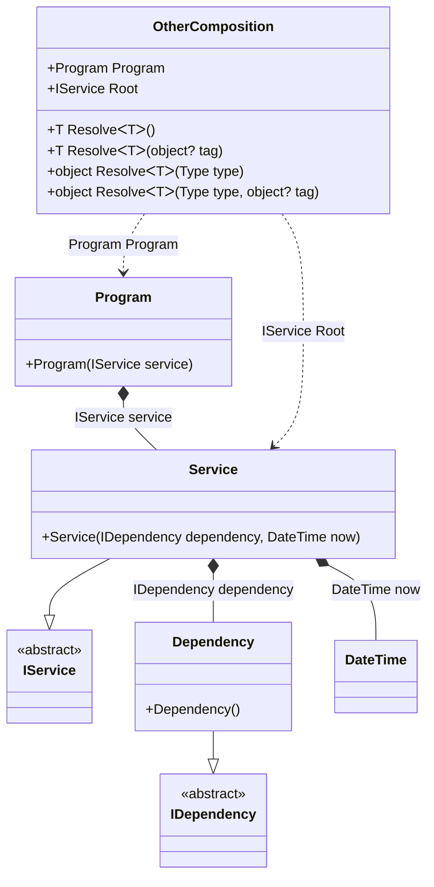

#### Dependent compositions

[](../tests/Pure.DI.UsageTests/Basics/DependentCompositionsScenario.cs)

The _Setup_ method has an additional argument _kind_, which defines the type of composition:
- _CompositionKind.Public_ - will create a normal composition class, this is the default setting and can be omitted, it can also use the _DependsOn_ method to use it as a dependency in other compositions
- _CompositionKind.Internal_ - the composition class will not be created, but that composition can be used to create other compositions by calling the _DependsOn_ method with its name
- _CompositionKind.Global_ - the composition class will also not be created, but that composition will automatically be used to create other compositions

```c#
internal interface IDependency { }

internal class Dependency : IDependency { }

internal interface IService { }

internal class Service : IService
{
    public Service(IDependency dependency, DateTime now)
    {
    }
}

internal class Program
{
    public Program(IService service)
    {
        Service = service;
    }

    public IService Service { get; }
}

// This setup affects all compositions created
// and does not require the use of the "DependsOn" call to add it as a dependency
DI.Setup("MyGlobal", CompositionKind.Global)
    .Bind<DateTime>().To(_ => DateTime.Now);
        
// This setup does not generate code, but can be used as a dependency
// and requires the use of the "DependsOn" call to add it as a dependency
DI.Setup("BaseComposition", CompositionKind.Internal)
    .Bind<IDependency>().To<Dependency>();
        
// This setup generates code and can also be used as a dependency
DI.Setup("Composition")
    // Uses "BaseComposition" setup
    .DependsOn("BaseComposition")
    .Bind<IService>().To<Service>().Root<IService>("Root");
        
// As in the previous case, this setup generates code and can also be used as a dependency
DI.Setup("OtherComposition")
    // Uses "Composition" setup
    .DependsOn("Composition")
    .Root<Program>("Program");
        
var composition = new Composition();
var service = composition.Root;

var otherComposition = new OtherComposition();
service = otherComposition.Program.Service;
```

<details open>
<summary>Class Diagram</summary>



</details>

<details>
<summary>Composition Code</summary>

```c#
partial class Composition
{
  public Composition()
  {
  }
  
  internal Composition(Composition parent)
  {
  }
  
  #region Composition Roots
  public Pure.DI.UsageTests.Basics.DependentCompositionsScenario.IService Root
  {
    [global::System.Runtime.CompilerServices.MethodImpl((global::System.Runtime.CompilerServices.MethodImplOptions)0x300)]
    get
    {
      Pure.DI.UsageTests.Basics.DependentCompositionsScenario.Dependency v62LocalA1F7 = new Pure.DI.UsageTests.Basics.DependentCompositionsScenario.Dependency();
      System.DateTime v63LocalA1F7;
      v63LocalA1F7 = DateTime.Now;
      Pure.DI.UsageTests.Basics.DependentCompositionsScenario.Service v61LocalA1F7 = new Pure.DI.UsageTests.Basics.DependentCompositionsScenario.Service(v62LocalA1F7, v63LocalA1F7);
      return v61LocalA1F7;
    }
  }
  #endregion
  
  #region API
  #if NETSTANDARD2_0_OR_GREATER || NETCOREAPP || NET40_OR_GREATER
  [global::System.Diagnostics.Contracts.Pure]
  #endif
  [global::System.Runtime.CompilerServices.MethodImpl((global::System.Runtime.CompilerServices.MethodImplOptions)0x300)]
  public T Resolve<T>()
  {
    return ResolverA1F7<T>.Value.Resolve(this);
  }
  
  #if NETSTANDARD2_0_OR_GREATER || NETCOREAPP || NET40_OR_GREATER
  [global::System.Diagnostics.Contracts.Pure]
  #endif
  [global::System.Runtime.CompilerServices.MethodImpl((global::System.Runtime.CompilerServices.MethodImplOptions)0x300)]
  public T Resolve<T>(object? tag)
  {
    return ResolverA1F7<T>.Value.ResolveByTag(this, tag);
  }
  
  #if NETSTANDARD2_0_OR_GREATER || NETCOREAPP || NET40_OR_GREATER
  [global::System.Diagnostics.Contracts.Pure]
  #endif
  [global::System.Runtime.CompilerServices.MethodImpl((global::System.Runtime.CompilerServices.MethodImplOptions)0x300)]
  public object Resolve(global::System.Type type)
  {
    int index = (int)(_bucketSizeA1F7 * ((uint)global::System.Runtime.CompilerServices.RuntimeHelpers.GetHashCode(type) % 1));
    ref var pair = ref _bucketsA1F7[index];
    if (ReferenceEquals(pair.Key, type))
    {
      return pair.Value.Resolve(this);
    }
    
    int maxIndex = index + _bucketSizeA1F7;
    for (int i = index + 1; i < maxIndex; i++)
    {
      pair = ref _bucketsA1F7[i];
      if (ReferenceEquals(pair.Key, type))
      {
        return pair.Value.Resolve(this);
      }
    }
    
    throw new global::System.InvalidOperationException($"Cannot resolve composition root of type {type}.");
  }
  
  #if NETSTANDARD2_0_OR_GREATER || NETCOREAPP || NET40_OR_GREATER
  [global::System.Diagnostics.Contracts.Pure]
  #endif
  [global::System.Runtime.CompilerServices.MethodImpl((global::System.Runtime.CompilerServices.MethodImplOptions)0x300)]
  public object Resolve(global::System.Type type, object? tag)
  {
    int index = (int)(_bucketSizeA1F7 * ((uint)global::System.Runtime.CompilerServices.RuntimeHelpers.GetHashCode(type) % 1));
    ref var pair = ref _bucketsA1F7[index];
    if (ReferenceEquals(pair.Key, type))
    {
      return pair.Value.ResolveByTag(this, tag);
    }
    
    int maxIndex = index + _bucketSizeA1F7;
    for (int i = index + 1; i < maxIndex; i++)
    {
      pair = ref _bucketsA1F7[i];
      if (ReferenceEquals(pair.Key, type))
      {
        return pair.Value.ResolveByTag(this, tag);
      }
    }
    
    throw new global::System.InvalidOperationException($"Cannot resolve composition root \"{tag}\" of type {type}.");
  }
  #endregion
  
  public override string ToString()
  {
    return
      "classDiagram\n" +
        "  class Composition {\n" +
          "    +IService Root\n" +
          "    +T ResolveᐸTᐳ()\n" +
          "    +T ResolveᐸTᐳ(object? tag)\n" +
          "    +object ResolveᐸTᐳ(Type type)\n" +
          "    +object ResolveᐸTᐳ(Type type, object? tag)\n" +
        "  }\n" +
        "  Service --|> IService : \n" +
        "  class Service {\n" +
          "    +Service(IDependency dependency, DateTime now)\n" +
        "  }\n" +
        "  Dependency --|> IDependency : \n" +
        "  class Dependency {\n" +
          "    +Dependency()\n" +
        "  }\n" +
        "  class DateTime\n" +
        "  class IService {\n" +
          "    <<abstract>>\n" +
        "  }\n" +
        "  class IDependency {\n" +
          "    <<abstract>>\n" +
        "  }\n" +
        "  Service *--  Dependency : IDependency dependency\n" +
        "  Service *--  DateTime : DateTime now\n" +
        "  Composition ..> Service : IService Root";
  }
  
  private readonly static int _bucketSizeA1F7;
  private readonly static global::Pure.DI.Pair<global::System.Type, global::Pure.DI.IResolver<Composition, object>>[] _bucketsA1F7;
  
  static Composition()
  {
    ResolverA1F70 valResolverA1F70 = new ResolverA1F70();
    ResolverA1F7<Pure.DI.UsageTests.Basics.DependentCompositionsScenario.IService>.Value = valResolverA1F70;
    _bucketsA1F7 = global::Pure.DI.Buckets<global::System.Type, global::Pure.DI.IResolver<Composition, object>>.Create(
      1,
      out _bucketSizeA1F7,
      new global::Pure.DI.Pair<global::System.Type, global::Pure.DI.IResolver<Composition, object>>[1]
      {
         new global::Pure.DI.Pair<global::System.Type, global::Pure.DI.IResolver<Composition, object>>(typeof(Pure.DI.UsageTests.Basics.DependentCompositionsScenario.IService), valResolverA1F70)
      });
  }
  
  #region Resolvers
  private sealed class ResolverA1F7<T>: global::Pure.DI.IResolver<Composition, T>
  {
    public static global::Pure.DI.IResolver<Composition, T> Value = new ResolverA1F7<T>();
    
    public T Resolve(Composition composite)
    {
      throw new global::System.InvalidOperationException($"Cannot resolve composition root of type {typeof(T)}.");
    }
    
    public T ResolveByTag(Composition composite, object tag)
    {
      throw new global::System.InvalidOperationException($"Cannot resolve composition root \"{tag}\" of type {typeof(T)}.");
    }
  }
  
  private sealed class ResolverA1F70: global::Pure.DI.IResolver<Composition, Pure.DI.UsageTests.Basics.DependentCompositionsScenario.IService>
  {
    [global::System.Runtime.CompilerServices.MethodImpl((global::System.Runtime.CompilerServices.MethodImplOptions)0x300)]
    public Pure.DI.UsageTests.Basics.DependentCompositionsScenario.IService Resolve(Composition composition)
    {
      return composition.Root;
    }
    
    [global::System.Runtime.CompilerServices.MethodImpl((global::System.Runtime.CompilerServices.MethodImplOptions)0x300)]
    public Pure.DI.UsageTests.Basics.DependentCompositionsScenario.IService ResolveByTag(Composition composition, object tag)
    {
      if (Equals(tag, null)) return composition.Root;
      throw new global::System.InvalidOperationException($"Cannot resolve composition root \"{tag}\" of type Pure.DI.UsageTests.Basics.DependentCompositionsScenario.IService.");
    }
  }
  #endregion
}
```

</details>

<details>
<summary>OtherComposition Code</summary>

```c#
partial class OtherComposition
{
  public OtherComposition()
  {
  }
  
  internal OtherComposition(OtherComposition parent)
  {
  }
  
  #region Composition Roots
  public Pure.DI.UsageTests.Basics.DependentCompositionsScenario.IService Root
  {
    [global::System.Runtime.CompilerServices.MethodImpl((global::System.Runtime.CompilerServices.MethodImplOptions)0x300)]
    get
    {
      Pure.DI.UsageTests.Basics.DependentCompositionsScenario.Dependency v66LocalA1F7 = new Pure.DI.UsageTests.Basics.DependentCompositionsScenario.Dependency();
      System.DateTime v67LocalA1F7;
      v67LocalA1F7 = DateTime.Now;
      Pure.DI.UsageTests.Basics.DependentCompositionsScenario.Service v65LocalA1F7 = new Pure.DI.UsageTests.Basics.DependentCompositionsScenario.Service(v66LocalA1F7, v67LocalA1F7);
      return v65LocalA1F7;
    }
  }
  
  public Pure.DI.UsageTests.Basics.DependentCompositionsScenario.Program Program
  {
    [global::System.Runtime.CompilerServices.MethodImpl((global::System.Runtime.CompilerServices.MethodImplOptions)0x300)]
    get
    {
      Pure.DI.UsageTests.Basics.DependentCompositionsScenario.Dependency v71LocalA1F7 = new Pure.DI.UsageTests.Basics.DependentCompositionsScenario.Dependency();
      System.DateTime v72LocalA1F7;
      v72LocalA1F7 = DateTime.Now;
      Pure.DI.UsageTests.Basics.DependentCompositionsScenario.Service v70LocalA1F7 = new Pure.DI.UsageTests.Basics.DependentCompositionsScenario.Service(v71LocalA1F7, v72LocalA1F7);
      Pure.DI.UsageTests.Basics.DependentCompositionsScenario.Program v69LocalA1F7 = new Pure.DI.UsageTests.Basics.DependentCompositionsScenario.Program(v70LocalA1F7);
      return v69LocalA1F7;
    }
  }
  #endregion
  
  #region API
  #if NETSTANDARD2_0_OR_GREATER || NETCOREAPP || NET40_OR_GREATER
  [global::System.Diagnostics.Contracts.Pure]
  #endif
  [global::System.Runtime.CompilerServices.MethodImpl((global::System.Runtime.CompilerServices.MethodImplOptions)0x300)]
  public T Resolve<T>()
  {
    return ResolverA1F7<T>.Value.Resolve(this);
  }
  
  #if NETSTANDARD2_0_OR_GREATER || NETCOREAPP || NET40_OR_GREATER
  [global::System.Diagnostics.Contracts.Pure]
  #endif
  [global::System.Runtime.CompilerServices.MethodImpl((global::System.Runtime.CompilerServices.MethodImplOptions)0x300)]
  public T Resolve<T>(object? tag)
  {
    return ResolverA1F7<T>.Value.ResolveByTag(this, tag);
  }
  
  #if NETSTANDARD2_0_OR_GREATER || NETCOREAPP || NET40_OR_GREATER
  [global::System.Diagnostics.Contracts.Pure]
  #endif
  [global::System.Runtime.CompilerServices.MethodImpl((global::System.Runtime.CompilerServices.MethodImplOptions)0x300)]
  public object Resolve(global::System.Type type)
  {
    int index = (int)(_bucketSizeA1F7 * ((uint)global::System.Runtime.CompilerServices.RuntimeHelpers.GetHashCode(type) % 4));
    ref var pair = ref _bucketsA1F7[index];
    if (ReferenceEquals(pair.Key, type))
    {
      return pair.Value.Resolve(this);
    }
    
    int maxIndex = index + _bucketSizeA1F7;
    for (int i = index + 1; i < maxIndex; i++)
    {
      pair = ref _bucketsA1F7[i];
      if (ReferenceEquals(pair.Key, type))
      {
        return pair.Value.Resolve(this);
      }
    }
    
    throw new global::System.InvalidOperationException($"Cannot resolve composition root of type {type}.");
  }
  
  #if NETSTANDARD2_0_OR_GREATER || NETCOREAPP || NET40_OR_GREATER
  [global::System.Diagnostics.Contracts.Pure]
  #endif
  [global::System.Runtime.CompilerServices.MethodImpl((global::System.Runtime.CompilerServices.MethodImplOptions)0x300)]
  public object Resolve(global::System.Type type, object? tag)
  {
    int index = (int)(_bucketSizeA1F7 * ((uint)global::System.Runtime.CompilerServices.RuntimeHelpers.GetHashCode(type) % 4));
    ref var pair = ref _bucketsA1F7[index];
    if (ReferenceEquals(pair.Key, type))
    {
      return pair.Value.ResolveByTag(this, tag);
    }
    
    int maxIndex = index + _bucketSizeA1F7;
    for (int i = index + 1; i < maxIndex; i++)
    {
      pair = ref _bucketsA1F7[i];
      if (ReferenceEquals(pair.Key, type))
      {
        return pair.Value.ResolveByTag(this, tag);
      }
    }
    
    throw new global::System.InvalidOperationException($"Cannot resolve composition root \"{tag}\" of type {type}.");
  }
  #endregion
  
  public override string ToString()
  {
    return
      "classDiagram\n" +
        "  class OtherComposition {\n" +
          "    +Program Program\n" +
          "    +IService Root\n" +
          "    +T ResolveᐸTᐳ()\n" +
          "    +T ResolveᐸTᐳ(object? tag)\n" +
          "    +object ResolveᐸTᐳ(Type type)\n" +
          "    +object ResolveᐸTᐳ(Type type, object? tag)\n" +
        "  }\n" +
        "  class Program {\n" +
          "    +Program(IService service)\n" +
        "  }\n" +
        "  Service --|> IService : \n" +
        "  class Service {\n" +
          "    +Service(IDependency dependency, DateTime now)\n" +
        "  }\n" +
        "  Dependency --|> IDependency : \n" +
        "  class Dependency {\n" +
          "    +Dependency()\n" +
        "  }\n" +
        "  class DateTime\n" +
        "  class IService {\n" +
          "    <<abstract>>\n" +
        "  }\n" +
        "  class IDependency {\n" +
          "    <<abstract>>\n" +
        "  }\n" +
        "  Program *--  Service : IService service\n" +
        "  Service *--  Dependency : IDependency dependency\n" +
        "  Service *--  DateTime : DateTime now\n" +
        "  OtherComposition ..> Service : IService Root\n" +
        "  OtherComposition ..> Program : Program Program";
  }
  
  private readonly static int _bucketSizeA1F7;
  private readonly static global::Pure.DI.Pair<global::System.Type, global::Pure.DI.IResolver<OtherComposition, object>>[] _bucketsA1F7;
  
  static OtherComposition()
  {
    ResolverA1F70 valResolverA1F70 = new ResolverA1F70();
    ResolverA1F7<Pure.DI.UsageTests.Basics.DependentCompositionsScenario.IService>.Value = valResolverA1F70;
    ResolverA1F71 valResolverA1F71 = new ResolverA1F71();
    ResolverA1F7<Pure.DI.UsageTests.Basics.DependentCompositionsScenario.Program>.Value = valResolverA1F71;
    _bucketsA1F7 = global::Pure.DI.Buckets<global::System.Type, global::Pure.DI.IResolver<OtherComposition, object>>.Create(
      4,
      out _bucketSizeA1F7,
      new global::Pure.DI.Pair<global::System.Type, global::Pure.DI.IResolver<OtherComposition, object>>[2]
      {
         new global::Pure.DI.Pair<global::System.Type, global::Pure.DI.IResolver<OtherComposition, object>>(typeof(Pure.DI.UsageTests.Basics.DependentCompositionsScenario.IService), valResolverA1F70)
        ,new global::Pure.DI.Pair<global::System.Type, global::Pure.DI.IResolver<OtherComposition, object>>(typeof(Pure.DI.UsageTests.Basics.DependentCompositionsScenario.Program), valResolverA1F71)
      });
  }
  
  #region Resolvers
  private sealed class ResolverA1F7<T>: global::Pure.DI.IResolver<OtherComposition, T>
  {
    public static global::Pure.DI.IResolver<OtherComposition, T> Value = new ResolverA1F7<T>();
    
    public T Resolve(OtherComposition composite)
    {
      throw new global::System.InvalidOperationException($"Cannot resolve composition root of type {typeof(T)}.");
    }
    
    public T ResolveByTag(OtherComposition composite, object tag)
    {
      throw new global::System.InvalidOperationException($"Cannot resolve composition root \"{tag}\" of type {typeof(T)}.");
    }
  }
  
  private sealed class ResolverA1F70: global::Pure.DI.IResolver<OtherComposition, Pure.DI.UsageTests.Basics.DependentCompositionsScenario.IService>
  {
    [global::System.Runtime.CompilerServices.MethodImpl((global::System.Runtime.CompilerServices.MethodImplOptions)0x300)]
    public Pure.DI.UsageTests.Basics.DependentCompositionsScenario.IService Resolve(OtherComposition composition)
    {
      return composition.Root;
    }
    
    [global::System.Runtime.CompilerServices.MethodImpl((global::System.Runtime.CompilerServices.MethodImplOptions)0x300)]
    public Pure.DI.UsageTests.Basics.DependentCompositionsScenario.IService ResolveByTag(OtherComposition composition, object tag)
    {
      if (Equals(tag, null)) return composition.Root;
      throw new global::System.InvalidOperationException($"Cannot resolve composition root \"{tag}\" of type Pure.DI.UsageTests.Basics.DependentCompositionsScenario.IService.");
    }
  }
  
  private sealed class ResolverA1F71: global::Pure.DI.IResolver<OtherComposition, Pure.DI.UsageTests.Basics.DependentCompositionsScenario.Program>
  {
    [global::System.Runtime.CompilerServices.MethodImpl((global::System.Runtime.CompilerServices.MethodImplOptions)0x300)]
    public Pure.DI.UsageTests.Basics.DependentCompositionsScenario.Program Resolve(OtherComposition composition)
    {
      return composition.Program;
    }
    
    [global::System.Runtime.CompilerServices.MethodImpl((global::System.Runtime.CompilerServices.MethodImplOptions)0x300)]
    public Pure.DI.UsageTests.Basics.DependentCompositionsScenario.Program ResolveByTag(OtherComposition composition, object tag)
    {
      if (Equals(tag, null)) return composition.Program;
      throw new global::System.InvalidOperationException($"Cannot resolve composition root \"{tag}\" of type Pure.DI.UsageTests.Basics.DependentCompositionsScenario.Program.");
    }
  }
  #endregion
}
```

</details>

