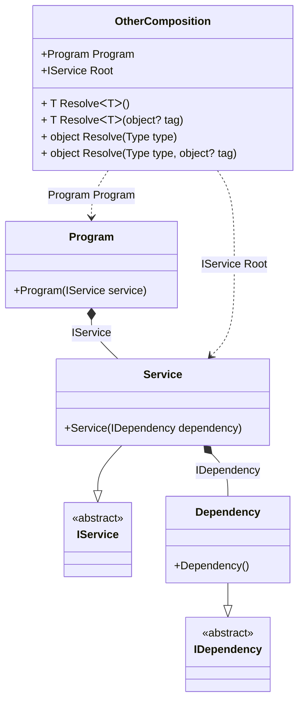

#### Dependent compositions

[](../tests/Pure.DI.UsageTests/Advanced/DependentCompositionsScenario.cs)

The _Setup_ method has an additional argument _kind_, which defines the type of composition:
- _CompositionKind.Public_ - will create a normal composition class, this is the default setting and can be omitted, it can also use the _DependsOn_ method to use it as a dependency in other compositions
- _CompositionKind.Internal_ - the composition class will not be created, but that composition can be used to create other compositions by calling the _DependsOn_ method with its name
- _CompositionKind.Global_ - the composition class will also not be created, but that composition will automatically be used to create other compositions

```c#
interface IDependency;

class Dependency : IDependency;

interface IService;

class Service(IDependency dependency) : IService;

class Program(IService service)
{
    public IService Service { get; } = service;
}

// This setup does not generate code, but can be used as a dependency
// and requires the use of the "DependsOn" call to add it as a dependency
DI.Setup("BaseComposition", CompositionKind.Internal)
    .Bind<IDependency>().To<Dependency>();
        
// This setup generates code and can also be used as a dependency
DI.Setup(nameof(Composition))
    // Uses "BaseComposition" setup
    .DependsOn("BaseComposition")
    .Bind<IService>().To<Service>().Root<IService>("Root");
        
// As in the previous case, this setup generates code and can also be used as a dependency
DI.Setup(nameof(OtherComposition))
    // Uses "Composition" setup
    .DependsOn(nameof(Composition))
    .Root<Program>("Program");
        
var composition = new Composition();
var service = composition.Root;

var otherComposition = new OtherComposition();
service = otherComposition.Program.Service;
```

<details open>
<summary>Class Diagram</summary>



</details>

<details>
<summary>Pure.DI-generated partial class Composition</summary><blockquote>

```c#
partial class Composition
{
  private readonly Composition _rootM03D24di;
  
  public Composition()
  {
    _rootM03D24di = this;
  }
  
  internal Composition(Composition baseComposition)
  {
    _rootM03D24di = baseComposition._rootM03D24di;
  }
  
  public Pure.DI.UsageTests.Advanced.DependentCompositionsScenario.IService Root
  {
    get
    {
      return new Pure.DI.UsageTests.Advanced.DependentCompositionsScenario.Service(new Pure.DI.UsageTests.Advanced.DependentCompositionsScenario.Dependency());
    }
  }
  
  public T Resolve<T>()
  {
    return ResolverM03D24di<T>.Value.Resolve(this);
  }
  
  public T Resolve<T>(object? tag)
  {
    return ResolverM03D24di<T>.Value.ResolveByTag(this, tag);
  }
  
  public object Resolve(global::System.Type type)
  {
    var index = (int)(_bucketSizeM03D24di * ((uint)global::System.Runtime.CompilerServices.RuntimeHelpers.GetHashCode(type) % 1));
    var finish = index + _bucketSizeM03D24di;
    do {
      ref var pair = ref _bucketsM03D24di[index];
      if (ReferenceEquals(pair.Key, type))
      {
        return pair.Value.Resolve(this);
      }
    } while (++index < finish);
    
    throw new global::System.InvalidOperationException($"Cannot resolve composition root of type {type}.");
  }
  
  public object Resolve(global::System.Type type, object? tag)
  {
    var index = (int)(_bucketSizeM03D24di * ((uint)global::System.Runtime.CompilerServices.RuntimeHelpers.GetHashCode(type) % 1));
    var finish = index + _bucketSizeM03D24di;
    do {
      ref var pair = ref _bucketsM03D24di[index];
      if (ReferenceEquals(pair.Key, type))
      {
        return pair.Value.ResolveByTag(this, tag);
      }
    } while (++index < finish);
    
    throw new global::System.InvalidOperationException($"Cannot resolve composition root \"{tag}\" of type {type}.");
  }
  
  public override string ToString()
  {
    return
      "classDiagram\n" +
        "  class Composition {\n" +
          "    +IService Root\n" +
          "    + T ResolveᐸTᐳ()\n" +
          "    + T ResolveᐸTᐳ(object? tag)\n" +
          "    + object Resolve(Type type)\n" +
          "    + object Resolve(Type type, object? tag)\n" +
        "  }\n" +
        "  Dependency --|> IDependency : \n" +
        "  class Dependency {\n" +
          "    +Dependency()\n" +
        "  }\n" +
        "  Service --|> IService : \n" +
        "  class Service {\n" +
          "    +Service(IDependency dependency)\n" +
        "  }\n" +
        "  class IDependency {\n" +
          "    <<abstract>>\n" +
        "  }\n" +
        "  class IService {\n" +
          "    <<abstract>>\n" +
        "  }\n" +
        "  Service *--  Dependency : IDependency\n" +
        "  Composition ..> Service : IService Root";
  }
  
  private readonly static int _bucketSizeM03D24di;
  private readonly static global::Pure.DI.Pair<global::System.Type, global::Pure.DI.IResolver<Composition, object>>[] _bucketsM03D24di;
  
  static Composition()
  {
    var valResolverM03D24di_0000 = new ResolverM03D24di_0000();
    ResolverM03D24di<Pure.DI.UsageTests.Advanced.DependentCompositionsScenario.IService>.Value = valResolverM03D24di_0000;
    _bucketsM03D24di = global::Pure.DI.Buckets<global::System.Type, global::Pure.DI.IResolver<Composition, object>>.Create(
      1,
      out _bucketSizeM03D24di,
      new global::Pure.DI.Pair<global::System.Type, global::Pure.DI.IResolver<Composition, object>>[1]
      {
         new global::Pure.DI.Pair<global::System.Type, global::Pure.DI.IResolver<Composition, object>>(typeof(Pure.DI.UsageTests.Advanced.DependentCompositionsScenario.IService), valResolverM03D24di_0000)
      });
  }
  
  private sealed class ResolverM03D24di<T>: global::Pure.DI.IResolver<Composition, T>
  {
    public static global::Pure.DI.IResolver<Composition, T> Value = new ResolverM03D24di<T>();
    
    public T Resolve(Composition composite)
    {
      throw new global::System.InvalidOperationException($"Cannot resolve composition root of type {typeof(T)}.");
    }
    
    public T ResolveByTag(Composition composite, object tag)
    {
      throw new global::System.InvalidOperationException($"Cannot resolve composition root \"{tag}\" of type {typeof(T)}.");
    }
  }
  
  private sealed class ResolverM03D24di_0000: global::Pure.DI.IResolver<Composition, Pure.DI.UsageTests.Advanced.DependentCompositionsScenario.IService>
  {
    public Pure.DI.UsageTests.Advanced.DependentCompositionsScenario.IService Resolve(Composition composition)
    {
      return composition.Root;
    }
    
    public Pure.DI.UsageTests.Advanced.DependentCompositionsScenario.IService ResolveByTag(Composition composition, object tag)
    {
      switch (tag)
      {
        case null:
          return composition.Root;
      }
      throw new global::System.InvalidOperationException($"Cannot resolve composition root \"{tag}\" of type Pure.DI.UsageTests.Advanced.DependentCompositionsScenario.IService.");
    }
  }
}
```

</blockquote></details>

<details>
<summary>Pure.DI-generated partial class OtherComposition</summary><blockquote>

```c#
partial class OtherComposition
{
  private readonly OtherComposition _rootM03D24di;
  
  public OtherComposition()
  {
    _rootM03D24di = this;
  }
  
  internal OtherComposition(OtherComposition baseComposition)
  {
    _rootM03D24di = baseComposition._rootM03D24di;
  }
  
  public Pure.DI.UsageTests.Advanced.DependentCompositionsScenario.IService Root
  {
    get
    {
      return new Pure.DI.UsageTests.Advanced.DependentCompositionsScenario.Service(new Pure.DI.UsageTests.Advanced.DependentCompositionsScenario.Dependency());
    }
  }
  
  public Pure.DI.UsageTests.Advanced.DependentCompositionsScenario.Program Program
  {
    get
    {
      return new Pure.DI.UsageTests.Advanced.DependentCompositionsScenario.Program(new Pure.DI.UsageTests.Advanced.DependentCompositionsScenario.Service(new Pure.DI.UsageTests.Advanced.DependentCompositionsScenario.Dependency()));
    }
  }
  
  public T Resolve<T>()
  {
    return ResolverM03D24di<T>.Value.Resolve(this);
  }
  
  public T Resolve<T>(object? tag)
  {
    return ResolverM03D24di<T>.Value.ResolveByTag(this, tag);
  }
  
  public object Resolve(global::System.Type type)
  {
    var index = (int)(_bucketSizeM03D24di * ((uint)global::System.Runtime.CompilerServices.RuntimeHelpers.GetHashCode(type) % 4));
    var finish = index + _bucketSizeM03D24di;
    do {
      ref var pair = ref _bucketsM03D24di[index];
      if (ReferenceEquals(pair.Key, type))
      {
        return pair.Value.Resolve(this);
      }
    } while (++index < finish);
    
    throw new global::System.InvalidOperationException($"Cannot resolve composition root of type {type}.");
  }
  
  public object Resolve(global::System.Type type, object? tag)
  {
    var index = (int)(_bucketSizeM03D24di * ((uint)global::System.Runtime.CompilerServices.RuntimeHelpers.GetHashCode(type) % 4));
    var finish = index + _bucketSizeM03D24di;
    do {
      ref var pair = ref _bucketsM03D24di[index];
      if (ReferenceEquals(pair.Key, type))
      {
        return pair.Value.ResolveByTag(this, tag);
      }
    } while (++index < finish);
    
    throw new global::System.InvalidOperationException($"Cannot resolve composition root \"{tag}\" of type {type}.");
  }
  
  public override string ToString()
  {
    return
      "classDiagram\n" +
        "  class OtherComposition {\n" +
          "    +Program Program\n" +
          "    +IService Root\n" +
          "    + T ResolveᐸTᐳ()\n" +
          "    + T ResolveᐸTᐳ(object? tag)\n" +
          "    + object Resolve(Type type)\n" +
          "    + object Resolve(Type type, object? tag)\n" +
        "  }\n" +
        "  class Program {\n" +
          "    +Program(IService service)\n" +
        "  }\n" +
        "  Service --|> IService : \n" +
        "  class Service {\n" +
          "    +Service(IDependency dependency)\n" +
        "  }\n" +
        "  Dependency --|> IDependency : \n" +
        "  class Dependency {\n" +
          "    +Dependency()\n" +
        "  }\n" +
        "  class IService {\n" +
          "    <<abstract>>\n" +
        "  }\n" +
        "  class IDependency {\n" +
          "    <<abstract>>\n" +
        "  }\n" +
        "  Program *--  Service : IService\n" +
        "  Service *--  Dependency : IDependency\n" +
        "  OtherComposition ..> Service : IService Root\n" +
        "  OtherComposition ..> Program : Program Program";
  }
  
  private readonly static int _bucketSizeM03D24di;
  private readonly static global::Pure.DI.Pair<global::System.Type, global::Pure.DI.IResolver<OtherComposition, object>>[] _bucketsM03D24di;
  
  static OtherComposition()
  {
    var valResolverM03D24di_0000 = new ResolverM03D24di_0000();
    ResolverM03D24di<Pure.DI.UsageTests.Advanced.DependentCompositionsScenario.IService>.Value = valResolverM03D24di_0000;
    var valResolverM03D24di_0001 = new ResolverM03D24di_0001();
    ResolverM03D24di<Pure.DI.UsageTests.Advanced.DependentCompositionsScenario.Program>.Value = valResolverM03D24di_0001;
    _bucketsM03D24di = global::Pure.DI.Buckets<global::System.Type, global::Pure.DI.IResolver<OtherComposition, object>>.Create(
      4,
      out _bucketSizeM03D24di,
      new global::Pure.DI.Pair<global::System.Type, global::Pure.DI.IResolver<OtherComposition, object>>[2]
      {
         new global::Pure.DI.Pair<global::System.Type, global::Pure.DI.IResolver<OtherComposition, object>>(typeof(Pure.DI.UsageTests.Advanced.DependentCompositionsScenario.IService), valResolverM03D24di_0000)
        ,new global::Pure.DI.Pair<global::System.Type, global::Pure.DI.IResolver<OtherComposition, object>>(typeof(Pure.DI.UsageTests.Advanced.DependentCompositionsScenario.Program), valResolverM03D24di_0001)
      });
  }
  
  private sealed class ResolverM03D24di<T>: global::Pure.DI.IResolver<OtherComposition, T>
  {
    public static global::Pure.DI.IResolver<OtherComposition, T> Value = new ResolverM03D24di<T>();
    
    public T Resolve(OtherComposition composite)
    {
      throw new global::System.InvalidOperationException($"Cannot resolve composition root of type {typeof(T)}.");
    }
    
    public T ResolveByTag(OtherComposition composite, object tag)
    {
      throw new global::System.InvalidOperationException($"Cannot resolve composition root \"{tag}\" of type {typeof(T)}.");
    }
  }
  
  private sealed class ResolverM03D24di_0000: global::Pure.DI.IResolver<OtherComposition, Pure.DI.UsageTests.Advanced.DependentCompositionsScenario.IService>
  {
    public Pure.DI.UsageTests.Advanced.DependentCompositionsScenario.IService Resolve(OtherComposition composition)
    {
      return composition.Root;
    }
    
    public Pure.DI.UsageTests.Advanced.DependentCompositionsScenario.IService ResolveByTag(OtherComposition composition, object tag)
    {
      switch (tag)
      {
        case null:
          return composition.Root;
      }
      throw new global::System.InvalidOperationException($"Cannot resolve composition root \"{tag}\" of type Pure.DI.UsageTests.Advanced.DependentCompositionsScenario.IService.");
    }
  }
  
  private sealed class ResolverM03D24di_0001: global::Pure.DI.IResolver<OtherComposition, Pure.DI.UsageTests.Advanced.DependentCompositionsScenario.Program>
  {
    public Pure.DI.UsageTests.Advanced.DependentCompositionsScenario.Program Resolve(OtherComposition composition)
    {
      return composition.Program;
    }
    
    public Pure.DI.UsageTests.Advanced.DependentCompositionsScenario.Program ResolveByTag(OtherComposition composition, object tag)
    {
      switch (tag)
      {
        case null:
          return composition.Program;
      }
      throw new global::System.InvalidOperationException($"Cannot resolve composition root \"{tag}\" of type Pure.DI.UsageTests.Advanced.DependentCompositionsScenario.Program.");
    }
  }
}
```

</blockquote></details>

