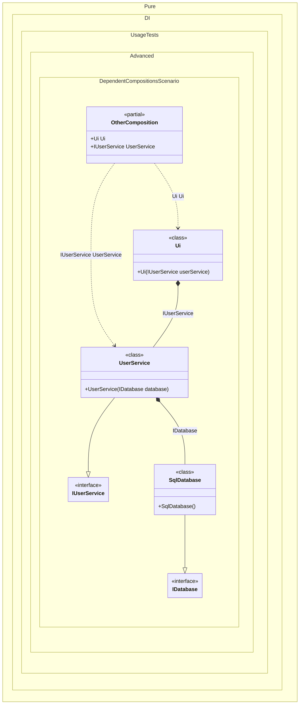

#### Dependent compositions

The _Setup_ method has an additional argument _kind_, which defines the type of composition:
- _CompositionKind.Public_ - will create a normal composition class, this is the default setting and can be omitted, it can also use the _DependsOn_ method to use it as a dependency in other compositions
- _CompositionKind.Internal_ - the composition class will not be created, but that composition can be used to create other compositions by calling the _DependsOn_ method with its name
- _CompositionKind.Global_ - the composition class will also not be created, but that composition will automatically be used to create other compositions


```c#
using Pure.DI;
using static Pure.DI.CompositionKind;

// This setup does not generate code, but can be used as a dependency
// and requires the use of the "DependsOn" call to add it as a dependency
DI.Setup("Infrastructure", Internal)
    .Bind<IDatabase>().To<SqlDatabase>();

// This setup generates code and can also be used as a dependency
DI.Setup(nameof(Composition))
    // Uses "Infrastructure" setup
    .DependsOn("Infrastructure")
    .Bind<IUserService>().To<UserService>()
    .Root<IUserService>("UserService");

// As in the previous case, this setup generates code and can also be used as a dependency
DI.Setup(nameof(OtherComposition))
    // Uses "Composition" setup
    .DependsOn(nameof(Composition))
    .Root<Ui>("Ui");

var composition = new Composition();
var userService = composition.UserService;

var otherComposition = new OtherComposition();
userService = otherComposition.Ui.UserService;

interface IDatabase;

class SqlDatabase : IDatabase;

interface IUserService;

class UserService(IDatabase database) : IUserService;

partial class Ui(IUserService userService)
{
    public IUserService UserService { get; } = userService;
}
```

<details>
<summary>Running this code sample locally</summary>

- Make sure you have the [.NET SDK 10.0](https://dotnet.microsoft.com/en-us/download/dotnet/10.0) or later is installed
```bash
dotnet --list-sdk
```
- Create a net10.0 (or later) console application
```bash
dotnet new console -n Sample
```
- Add reference to NuGet package
  - [Pure.DI](https://www.nuget.org/packages/Pure.DI)
```bash
dotnet add package Pure.DI
```
- Copy the example code into the _Program.cs_ file

You are ready to run the example 🚀
```bash
dotnet run
```

</details>

The following partial class will be generated:

```c#
partial class Composition
{
  public IUserService UserService
  {
    [MethodImpl(MethodImplOptions.AggressiveInlining)]
    get
    {
      return new UserService(new SqlDatabase());
    }
  }
}
```
The following partial class will be generated:

```c#
partial class OtherComposition
{
  public IUserService UserService
  {
    [MethodImpl(MethodImplOptions.AggressiveInlining)]
    get
    {
      return new UserService(new SqlDatabase());
    }
  }

  public Ui Ui
  {
    [MethodImpl(MethodImplOptions.AggressiveInlining)]
    get
    {
      return new Ui(new UserService(new SqlDatabase()));
    }
  }
}
```

Class diagram:



