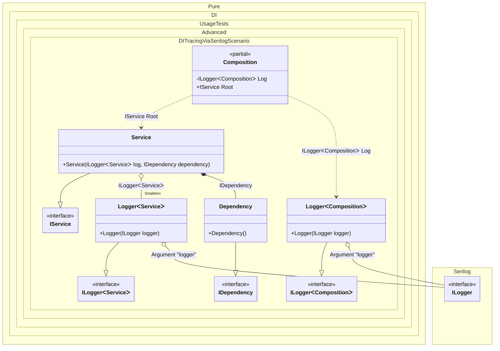

#### DI tracing via serilog

[](../tests/Pure.DI.UsageTests/Advanced/DITracingViaSerilogScenario.cs)


```c#
interface IDependency;

class Dependency : IDependency;

interface IService
{
    IDependency Dependency { get; }
}

class Service : IService
{
    public Service(ILogger<Service> log, IDependency dependency)
    {
        Dependency = dependency;
        log.Information("Created");
    }

    public IDependency Dependency { get; }
}

interface ILogger<T>: Serilog.ILogger;

class Logger<T>(Serilog.ILogger logger) : ILogger<T>
{
    private readonly Serilog.ILogger _logger =
        logger.ForContext(typeof(T));

    public void Write(LogEvent logEvent) =>
        _logger.Write(logEvent);
}

partial class Composition
{
    private void Setup() =>
        DI.Setup(nameof(Composition))

            .Hint(Hint.OnNewInstance, "On")
            .Hint(Hint.OnDependencyInjection, "On")
            // Excluding loggers
            .Hint(Hint.OnNewInstanceImplementationTypeNameRegularExpression, "^((?!Logger).)*$")
            .Hint(Hint.OnDependencyInjectionContractTypeNameRegularExpression, "^((?!Logger).)*$")

            .Arg<Serilog.ILogger>("logger")
            .Bind().As(Lifetime.Singleton).To<Logger<TT>>()

            .Bind().To<Dependency>()
            .Bind().To<Service>()
            .Root<ILogger<Composition>>(nameof(Log), kind: RootKinds.Private)
            .Root<IService>(nameof(Root));

    [MethodImpl(MethodImplOptions.AggressiveInlining)]
    partial void OnNewInstance<T>(ref T value, object? tag, Lifetime lifetime) =>
        Log.Information("Created [{Value}], tag [{Tag}] as {Lifetime}", value, tag, lifetime);

    [MethodImpl(MethodImplOptions.AggressiveInlining)]
    private partial T OnDependencyInjection<T>(in T value, object? tag, Lifetime lifetime)
    {
        Log.Information("Injected [{Value}], tag [{Tag}] as {Lifetime}", value, tag, lifetime);
        return value;
    }
}

Serilog.ILogger serilogLogger = CreateLogger();
var composition = new Composition(logger: serilogLogger);
var service = composition.Root;
```

The following partial class will be generated:

```c#
partial class Composition
{
  private readonly Composition _root;
  private readonly Lock _lock;

  private Logger<Service>? _singletonLogger48;
  private Logger<Composition>? _singletonLogger47;

  private readonly Serilog.ILogger _argLogger;

  [OrdinalAttribute(128)]
  public Composition(Serilog.ILogger logger)
  {
    _argLogger = logger ?? throw new ArgumentNullException(nameof(logger));
    _root = this;
    _lock = new Lock();
  }

  internal Composition(Composition parentScope)
  {
    _root = (parentScope ?? throw new ArgumentNullException(nameof(parentScope)))._root;
    _argLogger = _root._argLogger;
    _lock = _root._lock;
  }

  public IService Root
  {
    [MethodImpl(MethodImplOptions.AggressiveInlining)]
    get
    {
      Dependency transientDependency1 = new Dependency();
      OnNewInstance<Dependency>(ref transientDependency1, null, Lifetime.Transient);
      if (_root._singletonLogger48 is null)
      {
        using (_lock.EnterScope())
        {
          if (_root._singletonLogger48 is null)
          {
            _root._singletonLogger48 = new Logger<Service>(_argLogger);
          }
        }
      }

      Service transientService0 = new Service(_root._singletonLogger48!, OnDependencyInjection<IDependency>(transientDependency1, null, Lifetime.Transient));
      OnNewInstance<Service>(ref transientService0, null, Lifetime.Transient);
      return OnDependencyInjection<IService>(transientService0, null, Lifetime.Transient);
    }
  }

  private ILogger<Composition> Log
  {
    [MethodImpl(MethodImplOptions.AggressiveInlining)]
    get
    {
      if (_root._singletonLogger47 is null)
      {
        using (_lock.EnterScope())
        {
          if (_root._singletonLogger47 is null)
          {
            _root._singletonLogger47 = new Logger<Composition>(_argLogger);
          }
        }
      }

      return _root._singletonLogger47!;
    }
  }


  partial void OnNewInstance<T>(ref T value, object? tag, Lifetime lifetime);

  private partial T OnDependencyInjection<T>(in T value, object? tag, Lifetime lifetime);
}
```

Class diagram:



