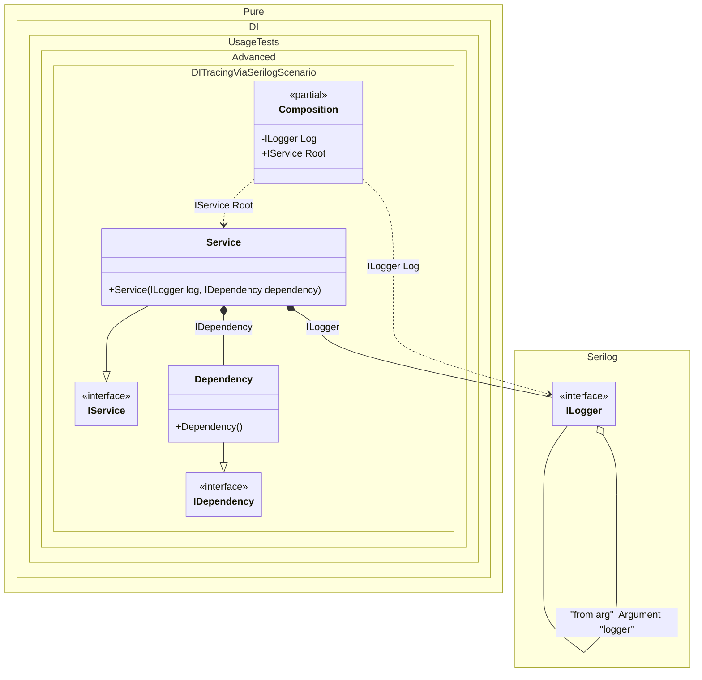

#### DI tracing via serilog

[](../tests/Pure.DI.UsageTests/Advanced/DITracingViaSerilogScenario.cs)


```c#
using Serilog.Core;
using Serilog.Events;
using Pure.DI;
using System.Runtime.CompilerServices;

Serilog.ILogger serilogLogger = new Serilog.LoggerConfiguration().CreateLogger();
var composition = new Composition(logger: serilogLogger);
var service = composition.Root;

interface IDependency;

class Dependency : IDependency;

interface IService
{
    IDependency Dependency { get; }
}

class Service : IService
{
    public Service(Serilog.ILogger log, IDependency dependency)
    {
        Dependency = dependency;
        log.Information("Created");
    }

    public IDependency Dependency { get; }
}

partial class Composition
{
    private void Setup() =>
        DI.Setup(nameof(Composition))

            .Hint(Hint.OnNewInstance, "On")
            .Hint(Hint.OnDependencyInjection, "On")
            // Excluding loggers
            .Hint(Hint.OnNewInstanceImplementationTypeNameRegularExpression, "^((?!Logger).)*$")
            .Hint(Hint.OnDependencyInjectionContractTypeNameRegularExpression, "^((?!Logger).)*$")

            .Arg<Serilog.ILogger>("logger", "from arg")
            .Bind<Serilog.ILogger>().To(ctx =>
            {
                ctx.Inject("from arg", out Serilog.ILogger logger);
                return logger.ForContext(ctx.ConsumerTypes[0]);
            })

            .Bind().To<Dependency>()
            .Bind().To<Service>()
            .Root<Serilog.ILogger>(nameof(Log), kind: RootKinds.Private)
            .Root<IService>(nameof(Root));

    [MethodImpl(MethodImplOptions.AggressiveInlining)]
    partial void OnNewInstance<T>(ref T value, object? tag, Lifetime lifetime) =>
        Log.Information("Created [{Value}], tag [{Tag}] as {Lifetime}", value, tag, lifetime);

    [MethodImpl(MethodImplOptions.AggressiveInlining)]
    private partial T OnDependencyInjection<T>(in T value, object? tag, Lifetime lifetime)
    {
        Log.Information("Injected [{Value}], tag [{Tag}] as {Lifetime}", value, tag, lifetime);
        return value;
    }
}
```

<details>
<summary>Running this code sample locally</summary>

- Make sure you have the [.NET SDK 9.0](https://dotnet.microsoft.com/en-us/download/dotnet/9.0) or later is installed
- Create a net9.0 (or later) console application
- Add references to NuGet packages
  - [Pure.DI](https://www.nuget.org/packages/Pure.DI)
  - [Serilog.Core](https://www.nuget.org/packages/Serilog.Core)
  - [Serilog.Events](https://www.nuget.org/packages/Serilog.Events)
- Copy the example code into the _Program.cs_ file

You are ready to run the example!

</details>

The following partial class will be generated:

```c#
partial class Composition
{
  private readonly Composition _root;

  private readonly Serilog.ILogger _argLogger;

  [OrdinalAttribute(128)]
  public Composition(Serilog.ILogger logger)
  {
    _argLogger = logger ?? throw new ArgumentNullException(nameof(logger));
    _root = this;
  }

  internal Composition(Composition parentScope)
  {
    _root = (parentScope ?? throw new ArgumentNullException(nameof(parentScope)))._root;
    _argLogger = _root._argLogger;
  }

  private Serilog.ILogger Log
  {
    [MethodImpl(MethodImplOptions.AggressiveInlining)]
    get
    {
      Serilog.ILogger transientILogger0;
      Serilog.ILogger localLogger1 = _argLogger;
      transientILogger0 = localLogger1.ForContext( new Type[1]{typeof(Composition)}[0]);
      return transientILogger0;
    }
  }

  public IService Root
  {
    [MethodImpl(MethodImplOptions.AggressiveInlining)]
    get
    {
      Dependency transientDependency2 = new Dependency();
      OnNewInstance<Dependency>(ref transientDependency2, null, Lifetime.Transient);
      Serilog.ILogger transientILogger1;
      Serilog.ILogger localLogger0 = _argLogger;
      transientILogger1 = localLogger0.ForContext( new Type[1]{typeof(Service)}[0]);
      Service transientService0 = new Service(transientILogger1, OnDependencyInjection<IDependency>(transientDependency2, null, Lifetime.Transient));
      OnNewInstance<Service>(ref transientService0, null, Lifetime.Transient);
      return OnDependencyInjection<IService>(transientService0, null, Lifetime.Transient);
    }
  }


  partial void OnNewInstance<T>(ref T value, object? tag, Lifetime lifetime);

  private partial T OnDependencyInjection<T>(in T value, object? tag, Lifetime lifetime);
}
```

Class diagram:



