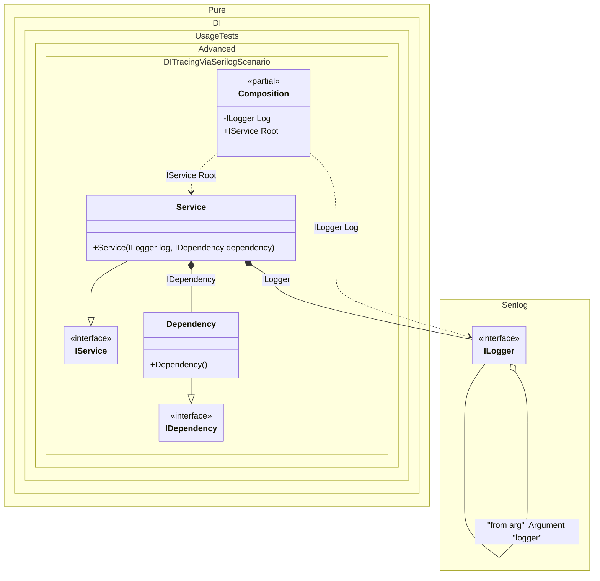

#### DI tracing via serilog

[](../tests/Pure.DI.UsageTests/Advanced/DITracingViaSerilogScenario.cs)


```c#
using Pure.DI;
using Serilog.Core;
using Serilog.Events;
using System.Runtime.CompilerServices;

Serilog.ILogger serilogLogger = new Serilog.LoggerConfiguration().CreateLogger();
var composition = new Composition(logger: serilogLogger);
var service = composition.Root;

interface IDependency;

class Dependency : IDependency;

interface IService
{
    IDependency Dependency { get; }
}

class Service : IService
{
    public Service(Serilog.ILogger log, IDependency dependency)
    {
        Dependency = dependency;
        log.Information("Created");
    }

    public IDependency Dependency { get; }
}

partial class Composition
{
    private void Setup() =>
        DI.Setup(nameof(Composition))

            .Hint(Hint.OnNewInstance, "On")
            .Hint(Hint.OnDependencyInjection, "On")
            // Excluding loggers
            .Hint(Hint.OnNewInstanceImplementationTypeNameRegularExpression, "^((?!Logger).)*$")
            .Hint(Hint.OnDependencyInjectionContractTypeNameRegularExpression, "^((?!Logger).)*$")

            .Arg<Serilog.ILogger>("logger", "from arg")
            .Bind<Serilog.ILogger>().To(ctx =>
            {
                ctx.Inject("from arg", out Serilog.ILogger logger);
                return logger.ForContext(ctx.ConsumerTypes[0]);
            })

            .Bind().To<Dependency>()
            .Bind().To<Service>()
            .Root<Serilog.ILogger>(nameof(Log), kind: RootKinds.Private)
            .Root<IService>(nameof(Root));

    [MethodImpl(MethodImplOptions.AggressiveInlining)]
    partial void OnNewInstance<T>(ref T value, object? tag, Lifetime lifetime) =>
        Log.Information("Created [{Value}], tag [{Tag}] as {Lifetime}", value, tag, lifetime);

    [MethodImpl(MethodImplOptions.AggressiveInlining)]
    private partial T OnDependencyInjection<T>(in T value, object? tag, Lifetime lifetime)
    {
        Log.Information("Injected [{Value}], tag [{Tag}] as {Lifetime}", value, tag, lifetime);
        return value;
    }
}
```


Class diagram:



