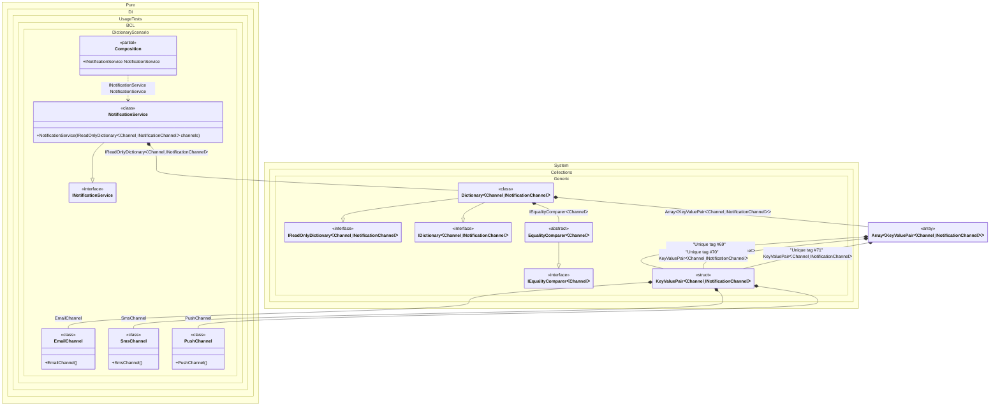

#### Dictionary

Demonstrates dictionary injection using IReadOnlyDictionary<TKey, TValue>, allowing key-value pair collection injection.


```c#
using Shouldly;
using Pure.DI;

DI.Setup(nameof(Composition))
    .Bind(Tag.Unique).To((EmailChannel chanel) => new KeyValuePair<Channel, INotificationChannel>(Channel.Email, chanel))
    .Bind(Tag.Unique).To((SmsChannel chanel) => new KeyValuePair<Channel, INotificationChannel>(Channel.Sms, chanel))
    .Bind(Tag.Unique).To((PushChannel chanel) => new KeyValuePair<Channel, INotificationChannel>(Channel.Push, chanel))
    .Bind<INotificationService>().To<NotificationService>()

    // Composition root
    .Root<INotificationService>("NotificationService");

var composition = new Composition();
var notificationService = composition.NotificationService;

// Verify that all notification channels are injected into the dictionary
notificationService.Channels.Count.ShouldBe(3);
notificationService.Channels[Channel.Email].ShouldBeOfType<EmailChannel>();
notificationService.Channels[Channel.Sms].ShouldBeOfType<SmsChannel>();
notificationService.Channels[Channel.Push].ShouldBeOfType<PushChannel>();

interface INotificationChannel
{
    void Send(string message);
}

class EmailChannel : INotificationChannel
{
    public void Send(string message) => Console.WriteLine($"Email: {message}");
}

class SmsChannel : INotificationChannel
{
    public void Send(string message) => Console.WriteLine($"SMS: {message}");
}

class PushChannel : INotificationChannel
{
    public void Send(string message) => Console.WriteLine($"Push: {message}");
}

enum Channel { Email, Sms, Push }

interface INotificationService
{
    IReadOnlyDictionary<Channel, INotificationChannel> Channels { get; }
}

class NotificationService(IReadOnlyDictionary<Channel, INotificationChannel> channels) : INotificationService
{
    public IReadOnlyDictionary<Channel, INotificationChannel> Channels { get; } = channels;
}
```

<details>
<summary>Running this code sample locally</summary>

- Make sure you have the [.NET SDK 10.0](https://dotnet.microsoft.com/en-us/download/dotnet/10.0) or later installed
```bash
dotnet --list-sdk
```
- Create a net10.0 (or later) console application
```bash
dotnet new console -n Sample
```
- Add references to the NuGet packages
  - [Pure.DI](https://www.nuget.org/packages/Pure.DI)
  - [Shouldly](https://www.nuget.org/packages/Shouldly)
```bash
dotnet add package Pure.DI
dotnet add package Shouldly
```
- Copy the example code into the _Program.cs_ file

You are ready to run the example 🚀
```bash
dotnet run
```

</details>

>[!NOTE]
>Dictionary injection is useful when you need to access dependencies by keys, such as named or tagged implementations like notification channels.

The following partial class will be generated:

```c#
partial class Composition
{
  public INotificationService NotificationService
  {
    [MethodImpl(MethodImplOptions.AggressiveInlining)]
    get
    {
      Dictionary<Channel, INotificationChannel> transientDictionary380;
      KeyValuePair<Channel, INotificationChannel> transientKeyValuePair383;
      EmailChannel localChanel = new EmailChannel();
      transientKeyValuePair383 = new KeyValuePair<Channel, INotificationChannel>(Channel.Email, localChanel);
      KeyValuePair<Channel, INotificationChannel> transientKeyValuePair384;
      SmsChannel localChanel1 = new SmsChannel();
      transientKeyValuePair384 = new KeyValuePair<Channel, INotificationChannel>(Channel.Sms, localChanel1);
      KeyValuePair<Channel, INotificationChannel> transientKeyValuePair385;
      PushChannel localChanel2 = new PushChannel();
      transientKeyValuePair385 = new KeyValuePair<Channel, INotificationChannel>(Channel.Push, localChanel2);
      KeyValuePair<Channel, INotificationChannel>[] localPairs = new KeyValuePair<Channel, INotificationChannel>[3]
      {
        transientKeyValuePair383,
        transientKeyValuePair384,
        transientKeyValuePair385
      };
      EqualityComparer<Channel> transientEqualityComparer382 = EqualityComparer<Channel>.Default;
      IEqualityComparer<Channel> localComparer = transientEqualityComparer382;
      Dictionary<Channel, INotificationChannel> localVal = new Dictionary<Channel, INotificationChannel>(localPairs.Length, localComparer);
      foreach (KeyValuePair<Channel, INotificationChannel> pair in localPairs)
      {
        localVal[pair.Key] = pair.Value;
      }

      transientDictionary380 = localVal;
      return new NotificationService(transientDictionary380);
    }
  }
}
```

Class diagram:



