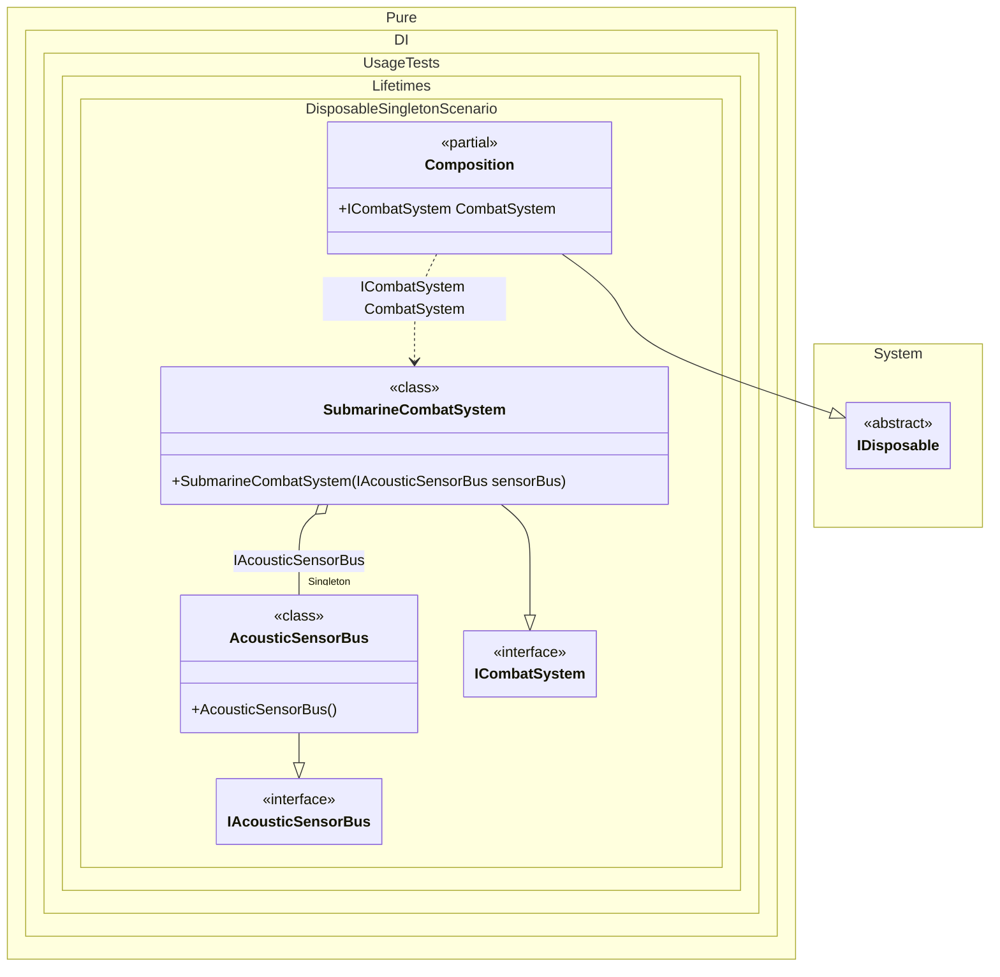

#### Disposable singleton

To dispose all created singleton instances, simply dispose the composition instance:


```c#
using Shouldly;
using Pure.DI;
using static Pure.DI.Lifetime;

DI.Setup(nameof(Composition))
    // This hint indicates to not generate methods such as Resolve
    .Hint(Hint.Resolve, "Off")

    // A realistic example:
    // a submarine has a shared hardware bus to onboard sensors.
    // It should be created once and disposed when the "mission scope"
    // (the composition instance) ends.
    .Bind().As(Singleton).To<AcousticSensorBus>()
    .Bind().To<SubmarineCombatSystem>()
    .Root<ICombatSystem>("CombatSystem");

IAcousticSensorBus bus;
using (var composition = new Composition())
{
    var combatSystem = composition.CombatSystem;

    // Store the singleton instance to verify that it gets disposed
    // when composition is disposed.
    bus = combatSystem.SensorBus;

    // In real usage you would call methods like:
    // combatSystem.ScanForContacts();
}

// When the mission scope ends, all disposable singletons created by it
// must be disposed.
bus.IsDisposed.ShouldBeTrue();

interface IAcousticSensorBus
{
    bool IsDisposed { get; }
}

// Represents a shared connection to submarine sensors (sonar, hydrophones, etc.).
// This is a singleton because the hardware bus is typically a single shared resource,
// and it must be cleaned up properly.
class AcousticSensorBus : IAcousticSensorBus, IDisposable
{
    public bool IsDisposed { get; private set; }

    public void Dispose() => IsDisposed = true;
}

interface ICombatSystem
{
    IAcousticSensorBus SensorBus { get; }
}

// A "combat system" is a typical high-level service that uses shared hardware resources.
class SubmarineCombatSystem(IAcousticSensorBus sensorBus) : ICombatSystem
{
    public IAcousticSensorBus SensorBus { get; } = sensorBus;
}
```

<details>
<summary>Running this code sample locally</summary>

- Make sure you have the [.NET SDK 10.0](https://dotnet.microsoft.com/en-us/download/dotnet/10.0) or later is installed
```bash
dotnet --list-sdk
```
- Create a net10.0 (or later) console application
```bash
dotnet new console -n Sample
```
- Add references to NuGet packages
  - [Pure.DI](https://www.nuget.org/packages/Pure.DI)
  - [Shouldly](https://www.nuget.org/packages/Shouldly)
```bash
dotnet add package Pure.DI
dotnet add package Shouldly
```
- Copy the example code into the _Program.cs_ file

You are ready to run the example 🚀
```bash
dotnet run
```

</details>

A composition class becomes disposable if it creates at least one disposable singleton instance.

The following partial class will be generated:

```c#
partial class Composition: IDisposable
{
  private readonly Composition _root;
#if NET9_0_OR_GREATER
  private readonly Lock _lock;
#else
  private readonly Object _lock;
#endif
  private object[] _disposables;
  private int _disposeIndex;

  private AcousticSensorBus? _singletonAcousticSensorBus51;

  [OrdinalAttribute(256)]
  public Composition()
  {
    _root = this;
#if NET9_0_OR_GREATER
    _lock = new Lock();
#else
    _lock = new Object();
#endif
    _disposables = new object[1];
  }

  internal Composition(Composition parentScope)
  {
    _root = (parentScope ?? throw new ArgumentNullException(nameof(parentScope)))._root;
    _lock = parentScope._lock;
    _disposables = parentScope._disposables;
  }

  public ICombatSystem CombatSystem
  {
    [MethodImpl(MethodImplOptions.AggressiveInlining)]
    get
    {
      if (_root._singletonAcousticSensorBus51 is null)
        lock (_lock)
          if (_root._singletonAcousticSensorBus51 is null)
          {
            _root._singletonAcousticSensorBus51 = new AcousticSensorBus();
            _root._disposables[_root._disposeIndex++] = _root._singletonAcousticSensorBus51;
          }

      return new SubmarineCombatSystem(_root._singletonAcousticSensorBus51);
    }
  }

  public void Dispose()
  {
    int disposeIndex;
    object[] disposables;
    lock (_lock)
    {
      disposeIndex = _disposeIndex;
      _disposeIndex = 0;
      disposables = _disposables;
      _disposables = new object[1];
      _singletonAcousticSensorBus51 = null;
    }

    while (disposeIndex-- > 0)
    {
      switch (disposables[disposeIndex])
      {
        case IDisposable disposableInstance:
          try
          {
            disposableInstance.Dispose();
          }
          catch (Exception exception)
          {
            OnDisposeException(disposableInstance, exception);
          }
          break;
      }
    }
  }

  partial void OnDisposeException<T>(T disposableInstance, Exception exception) where T : IDisposable;
}
```

Class diagram:



