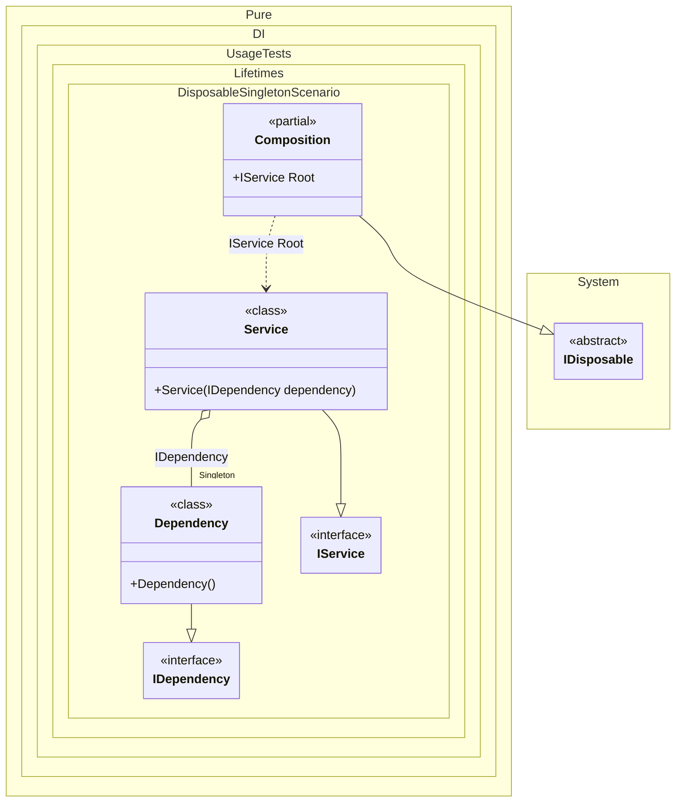

#### Disposable singleton

To dispose all created singleton instances, simply dispose the composition instance:


```c#
using Shouldly;
using Pure.DI;
using static Pure.DI.Lifetime;

DI.Setup(nameof(Composition))
    // This hint indicates to not generate methods such as Resolve
    .Hint(Hint.Resolve, "Off")
    .Bind().As(Singleton).To<Dependency>()
    .Bind().To<Service>()
    .Root<IService>("Root");

IDependency dependency;
using (var composition = new Composition())
{
    var service = composition.Root;
    dependency = service.Dependency;
}

dependency.IsDisposed.ShouldBeTrue();

interface IDependency
{
    bool IsDisposed { get; }
}

class Dependency : IDependency, IDisposable
{
    public bool IsDisposed { get; private set; }

    public void Dispose() => IsDisposed = true;
}

interface IService
{
    public IDependency Dependency { get; }
}

class Service(IDependency dependency) : IService
{
    public IDependency Dependency { get; } = dependency;
}
```

<details>
<summary>Running this code sample locally</summary>

- Make sure you have the [.NET SDK 9.0](https://dotnet.microsoft.com/en-us/download/dotnet/9.0) or later is installed
```bash
dotnet --list-sdk
```
- Create a net9.0 (or later) console application
```bash
dotnet new console -n Sample
```
- Add references to NuGet packages
  - [Pure.DI](https://www.nuget.org/packages/Pure.DI)
  - [Shouldly](https://www.nuget.org/packages/Shouldly)
```bash
dotnet add package Pure.DI
dotnet add package Shouldly
```
- Copy the example code into the _Program.cs_ file

You are ready to run the example 🚀
```bash
dotnet run
```

</details>

A composition class becomes disposable if it creates at least one disposable singleton instance.

The following partial class will be generated:

```c#
partial class Composition: IDisposable
{
  private readonly Composition _root;
#if NET9_0_OR_GREATER
  private readonly Lock _lock;
#else
  private readonly Object _lock;
#endif
  private object[] _disposables;
  private int _disposeIndex;

  private Dependency? _singletonDependency52;

  [OrdinalAttribute(256)]
  public Composition()
  {
    _root = this;
#if NET9_0_OR_GREATER
    _lock = new Lock();
#else
    _lock = new Object();
#endif
    _disposables = new object[1];
  }

  internal Composition(Composition parentScope)
  {
    _root = (parentScope ?? throw new ArgumentNullException(nameof(parentScope)))._root;
    _lock = _root._lock;
    _disposables = parentScope._disposables;
  }

  public IService Root
  {
    [MethodImpl(MethodImplOptions.AggressiveInlining)]
    get
    {
      if (_root._singletonDependency52 is null)
      {
        lock (_lock)
        {
          if (_root._singletonDependency52 is null)
          {
            _root._singletonDependency52 = new Dependency();
            _root._disposables[_root._disposeIndex++] = _root._singletonDependency52;
          }
        }
      }

      return new Service(_root._singletonDependency52);
    }
  }

  public void Dispose()
  {
    int disposeIndex;
    object[] disposables;
    lock (_lock)
    {
      disposeIndex = _disposeIndex;
      _disposeIndex = 0;
      disposables = _disposables;
      _disposables = new object[1];
      _singletonDependency52 = null;
      }

      while (disposeIndex-- > 0)
      {
        switch (disposables[disposeIndex])
        {
          case IDisposable disposableInstance:
            try
            {
              disposableInstance.Dispose();
            }
            catch (Exception exception)
            {
              OnDisposeException(disposableInstance, exception);
            }
            break;
        }
      }
    }

    partial void OnDisposeException<T>(T disposableInstance, Exception exception) where T : IDisposable;
}
```

Class diagram:



