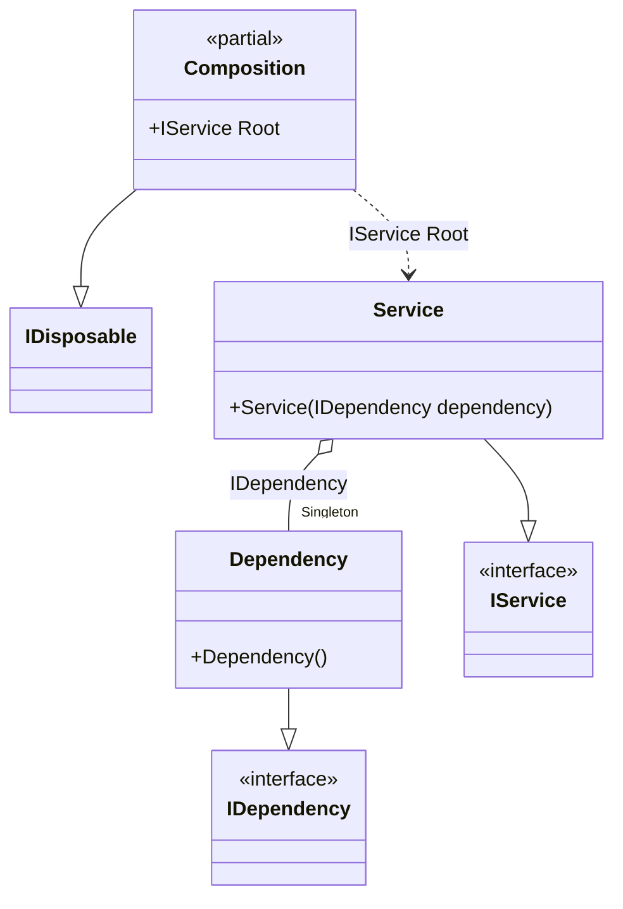

#### Disposable singleton

[](../tests/Pure.DI.UsageTests/Lifetimes/DisposableSingletonScenario.cs)

To dispose all created singleton instances, simply dispose the composition instance:


```c#
interface IDependency
{
    bool IsDisposed { get; }
}

class Dependency : IDependency, IDisposable
{
    public bool IsDisposed { get; private set; }

    public void Dispose() => IsDisposed = true;
}

interface IService
{
    public IDependency Dependency { get; }
}

class Service(IDependency dependency): IService
{
    public IDependency Dependency { get; } = dependency;
}

DI.Setup(nameof(Composition))
    // This hint indicates to not generate methods such as Resolve
    .Hint(Hint.Resolve, "Off")
    .Bind().As(Lifetime.Singleton).To<Dependency>()
    .RootBind<IService>("Root").To<Service>();

IDependency dependency;
using (var composition = new Composition())
{
    var service = composition.Root;
    dependency = service.Dependency;
}

dependency.IsDisposed.ShouldBeTrue();
```

A composition class becomes disposable if it creates at least one disposable singleton instance.

The following partial class will be generated:

```c#
partial class Composition: IDisposable
{
  private readonly Composition _root;
  private readonly object _lock;
  private object[] _disposables;
  private int _disposeIndex;
  private Dependency? _singleton36_Dependency;

  public Composition()
  {
    _root = this;
    _lock = new object();
    _disposables = new object[1];
  }

  internal Composition(Composition parentScope)
  {
    _root = (parentScope ?? throw new ArgumentNullException(nameof(parentScope)))._root;
    _lock = _root._lock;
    _disposables = parentScope._disposables;
  }

  public IService Root
  {
    [MethodImpl(MethodImplOptions.AggressiveInlining)]
    get
    {
      if (_root._singleton36_Dependency == null)
      {
          lock (_lock)
          {
              if (_root._singleton36_Dependency == null)
              {
                  _root._singleton36_Dependency = new Dependency();
                  _root._disposables[_root._disposeIndex++] = _root._singleton36_Dependency;
              }
          }
      }
      return new Service(_root._singleton36_Dependency!);
    }
  }

  public void Dispose()
  {
    int disposeIndex;
    object[] disposables;
    lock (_lock)
    {
      disposeIndex = _disposeIndex;
      _disposeIndex = 0;
      disposables = _disposables;
      _disposables = new object[1];
      _singleton36_Dependency = null;
    }

    while (disposeIndex-- > 0)
    {
      switch (disposables[disposeIndex])
      {
        case IDisposable disposableInstance:
          try
          {
            disposableInstance.Dispose();
          }
          catch (Exception exception)
          {
            OnDisposeException(disposableInstance, exception);
          }
          break;
      }
    }
  }

  partial void OnDisposeException<T>(T disposableInstance, Exception exception) where T : IDisposable;
}
```

Class diagram:



