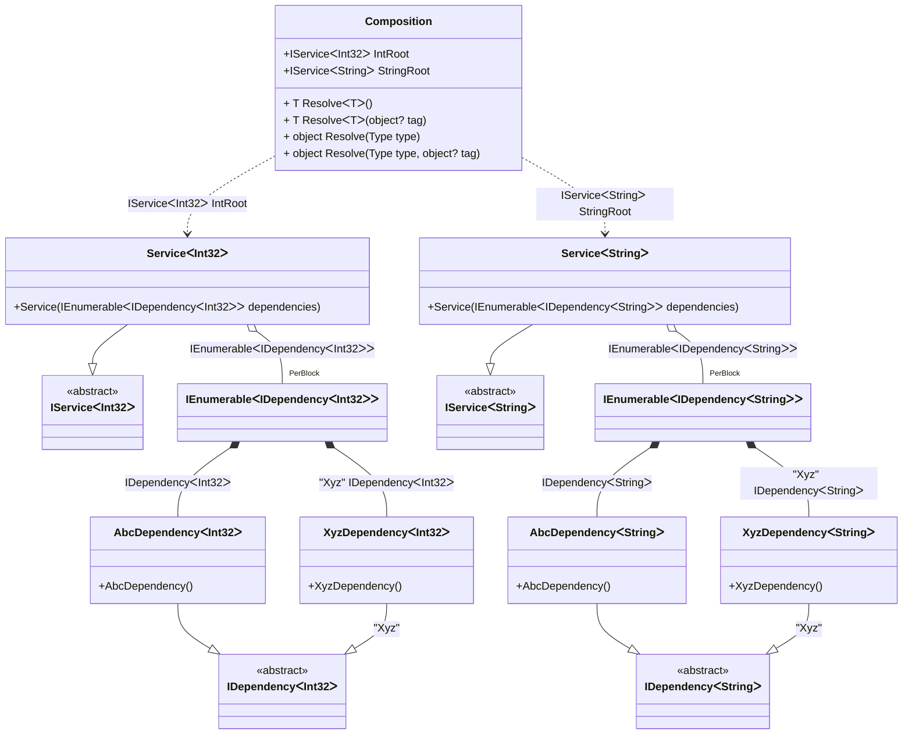

#### Enumerable generics

[](../tests/Pure.DI.UsageTests/BaseClassLibrary/EnumerableGenericsScenario.cs)

```c#
interface IDependency<T>;

class AbcDependency<T> : IDependency<T>;

class XyzDependency<T> : IDependency<T>;

interface IService<T>
{
    ImmutableArray<IDependency<T>> Dependencies { get; }
}

class Service<T>(IEnumerable<IDependency<T>> dependencies) : IService<T>
{
    public ImmutableArray<IDependency<T>> Dependencies { get; }
        = [..dependencies];
}

DI.Setup(nameof(Composition))
    .Bind<IDependency<TT>>().To<AbcDependency<TT>>()
    .Bind<IDependency<TT>>("Xyz").To<XyzDependency<TT>>()
    .Bind<IService<TT>>().To<Service<TT>>()

    // Composition roots
    .Root<IService<int>>("IntRoot")
    .Root<IService<string>>("StringRoot");

var composition = new Composition();
        
var intService = composition.IntRoot;
intService.Dependencies.Length.ShouldBe(2);
intService.Dependencies[0].ShouldBeOfType<AbcDependency<int>>();
intService.Dependencies[1].ShouldBeOfType<XyzDependency<int>>();
        
var stringService = composition.StringRoot;
stringService.Dependencies.Length.ShouldBe(2);
stringService.Dependencies[0].ShouldBeOfType<AbcDependency<string>>();
stringService.Dependencies[1].ShouldBeOfType<XyzDependency<string>>();
```

<details open>
<summary>Class Diagram</summary>



</details>

<details>
<summary>Pure.DI-generated partial class Composition</summary><blockquote>

```c#
partial class Composition
{
  private readonly Composition _root;

  public Composition()
  {
    _root = this;
  }

  internal Composition(Composition baseComposition)
  {
    _root = baseComposition._root;
  }

  public IService<int> IntRoot
  {
    [MethodImpl((MethodImplOptions)0x100)]
    get
    {
      [MethodImpl((MethodImplOptions)0x200)]
      IEnumerable<IDependency<int>> LocalperBlock1_IEnumerable()
      {
          yield return new AbcDependency<int>();
          yield return new XyzDependency<int>();
      }
      IEnumerable<IDependency<int>> perBlock1_IEnumerable = LocalperBlock1_IEnumerable();
      return new Service<int>(perBlock1_IEnumerable);
    }
  }

  public IService<string> StringRoot
  {
    [MethodImpl((MethodImplOptions)0x100)]
    get
    {
      [MethodImpl((MethodImplOptions)0x200)]
      IEnumerable<IDependency<string>> LocalperBlock1_IEnumerable()
      {
          yield return new AbcDependency<string>();
          yield return new XyzDependency<string>();
      }
      IEnumerable<IDependency<string>> perBlock1_IEnumerable = LocalperBlock1_IEnumerable();
      return new Service<string>(perBlock1_IEnumerable);
    }
  }

  [MethodImpl((MethodImplOptions)0x100)]
  public T Resolve<T>()
  {
    return Resolver<T>.Value.Resolve(this);
  }

  [MethodImpl((MethodImplOptions)0x100)]
  public T Resolve<T>(object? tag)
  {
    return Resolver<T>.Value.ResolveByTag(this, tag);
  }

  [MethodImpl((MethodImplOptions)0x100)]
  public object Resolve(Type type)
  {
    var index = (int)(_bucketSize * ((uint)RuntimeHelpers.GetHashCode(type) % 4));
    ref var pair = ref _buckets[index];
    return pair.Key == type ? pair.Value.Resolve(this) : Resolve(type, index);
  }

  [MethodImpl((MethodImplOptions)0x8)]
  private object Resolve(Type type, int index)
  {
    var finish = index + _bucketSize;
    while (++index < finish)
    {
      ref var pair = ref _buckets[index];
      if (pair.Key == type)
      {
        return pair.Value.Resolve(this);
      }
    }

    throw new InvalidOperationException($"Cannot resolve composition root of type {type}.");
  }

  [MethodImpl((MethodImplOptions)0x100)]
  public object Resolve(Type type, object? tag)
  {
    var index = (int)(_bucketSize * ((uint)RuntimeHelpers.GetHashCode(type) % 4));
    ref var pair = ref _buckets[index];
    return pair.Key == type ? pair.Value.ResolveByTag(this, tag) : Resolve(type, tag, index);
  }

  [MethodImpl((MethodImplOptions)0x8)]
  private object Resolve(Type type, object? tag, int index)
  {
    var finish = index + _bucketSize;
    while (++index < finish)
    {
      ref var pair = ref _buckets[index];
      if (pair.Key == type)
      {
        return pair.Value.ResolveByTag(this, tag);
      }
    }

    throw new InvalidOperationException($"Cannot resolve composition root \"{tag}\" of type {type}.");
  }

  public override string ToString()
  {
    return
      "classDiagram\n" +
        "  class Composition {\n" +
          "    +IServiceᐸInt32ᐳ IntRoot\n" +
          "    +IServiceᐸStringᐳ StringRoot\n" +
          "    + T ResolveᐸTᐳ()\n" +
          "    + T ResolveᐸTᐳ(object? tag)\n" +
          "    + object Resolve(Type type)\n" +
          "    + object Resolve(Type type, object? tag)\n" +
        "  }\n" +
        "  ServiceᐸInt32ᐳ --|> IServiceᐸInt32ᐳ : \n" +
        "  class ServiceᐸInt32ᐳ {\n" +
          "    +Service(IEnumerableᐸIDependencyᐸInt32ᐳᐳ dependencies)\n" +
        "  }\n" +
        "  ServiceᐸStringᐳ --|> IServiceᐸStringᐳ : \n" +
        "  class ServiceᐸStringᐳ {\n" +
          "    +Service(IEnumerableᐸIDependencyᐸStringᐳᐳ dependencies)\n" +
        "  }\n" +
        "  class IEnumerableᐸIDependencyᐸInt32ᐳᐳ\n" +
        "  class IEnumerableᐸIDependencyᐸStringᐳᐳ\n" +
        "  AbcDependencyᐸInt32ᐳ --|> IDependencyᐸInt32ᐳ : \n" +
        "  class AbcDependencyᐸInt32ᐳ {\n" +
          "    +AbcDependency()\n" +
        "  }\n" +
        "  XyzDependencyᐸInt32ᐳ --|> IDependencyᐸInt32ᐳ : \"Xyz\" \n" +
        "  class XyzDependencyᐸInt32ᐳ {\n" +
          "    +XyzDependency()\n" +
        "  }\n" +
        "  AbcDependencyᐸStringᐳ --|> IDependencyᐸStringᐳ : \n" +
        "  class AbcDependencyᐸStringᐳ {\n" +
          "    +AbcDependency()\n" +
        "  }\n" +
        "  XyzDependencyᐸStringᐳ --|> IDependencyᐸStringᐳ : \"Xyz\" \n" +
        "  class XyzDependencyᐸStringᐳ {\n" +
          "    +XyzDependency()\n" +
        "  }\n" +
        "  class IServiceᐸInt32ᐳ {\n" +
          "    <<abstract>>\n" +
        "  }\n" +
        "  class IServiceᐸStringᐳ {\n" +
          "    <<abstract>>\n" +
        "  }\n" +
        "  class IDependencyᐸInt32ᐳ {\n" +
          "    <<abstract>>\n" +
        "  }\n" +
        "  class IDependencyᐸStringᐳ {\n" +
          "    <<abstract>>\n" +
        "  }\n" +
        "  Composition ..> ServiceᐸInt32ᐳ : IServiceᐸInt32ᐳ IntRoot\n" +
        "  Composition ..> ServiceᐸStringᐳ : IServiceᐸStringᐳ StringRoot\n" +
        "  ServiceᐸInt32ᐳ o--  \"PerBlock\" IEnumerableᐸIDependencyᐸInt32ᐳᐳ : IEnumerableᐸIDependencyᐸInt32ᐳᐳ\n" +
        "  ServiceᐸStringᐳ o--  \"PerBlock\" IEnumerableᐸIDependencyᐸStringᐳᐳ : IEnumerableᐸIDependencyᐸStringᐳᐳ\n" +
        "  IEnumerableᐸIDependencyᐸInt32ᐳᐳ *--  AbcDependencyᐸInt32ᐳ : IDependencyᐸInt32ᐳ\n" +
        "  IEnumerableᐸIDependencyᐸInt32ᐳᐳ *--  XyzDependencyᐸInt32ᐳ : \"Xyz\"  IDependencyᐸInt32ᐳ\n" +
        "  IEnumerableᐸIDependencyᐸStringᐳᐳ *--  AbcDependencyᐸStringᐳ : IDependencyᐸStringᐳ\n" +
        "  IEnumerableᐸIDependencyᐸStringᐳᐳ *--  XyzDependencyᐸStringᐳ : \"Xyz\"  IDependencyᐸStringᐳ";
  }

  private readonly static int _bucketSize;
  private readonly static Pair<Type, IResolver<Composition, object>>[] _buckets;

  static Composition()
  {
    var valResolver_0000 = new Resolver_0000();
    Resolver<IService<int>>.Value = valResolver_0000;
    var valResolver_0001 = new Resolver_0001();
    Resolver<IService<string>>.Value = valResolver_0001;
    _buckets = Buckets<Type, IResolver<Composition, object>>.Create(
      4,
      out _bucketSize,
      new Pair<Type, IResolver<Composition, object>>[2]
      {
         new Pair<Type, IResolver<Composition, object>>(typeof(IService<int>), valResolver_0000)
        ,new Pair<Type, IResolver<Composition, object>>(typeof(IService<string>), valResolver_0001)
      });
  }

  private class Resolver<T>: IResolver<Composition, T>
  {
    private const string CannotResolve = "Cannot resolve composition root ";
    private const string OfType = "of type ";
    public static IResolver<Composition, T> Value = new Resolver<T>();

    public virtual T Resolve(Composition composite)
    {
      throw new InvalidOperationException($"{CannotResolve}{OfType}{typeof(T)}.");
    }

    public virtual T ResolveByTag(Composition composite, object tag)
    {
      throw new InvalidOperationException($"{CannotResolve}\"{tag}\" {OfType}{typeof(T)}.");
    }
  }

  private sealed class Resolver_0000: Resolver<IService<int>>
  {
    public override IService<int> Resolve(Composition composition)
    {
      return composition.IntRoot;
    }

    public override IService<int> ResolveByTag(Composition composition, object tag)
    {
      switch (tag)
      {
        case null:
          return composition.IntRoot;
        default:
          return base.ResolveByTag(composition, tag);
      }
    }
  }

  private sealed class Resolver_0001: Resolver<IService<string>>
  {
    public override IService<string> Resolve(Composition composition)
    {
      return composition.StringRoot;
    }

    public override IService<string> ResolveByTag(Composition composition, object tag)
    {
      switch (tag)
      {
        case null:
          return composition.StringRoot;
        default:
          return base.ResolveByTag(composition, tag);
      }
    }
  }
}
```

</blockquote></details>

