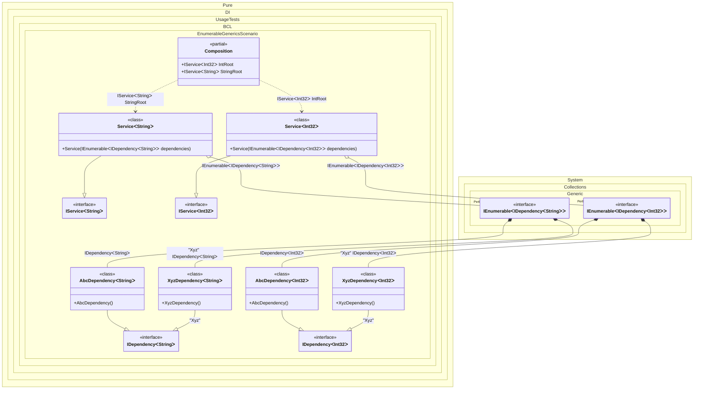

#### Enumerable generics


```c#
using Shouldly;
using Pure.DI;
using System.Collections.Immutable;

DI.Setup(nameof(Composition))
    .Bind<IDependency<TT>>().To<AbcDependency<TT>>()
    .Bind<IDependency<TT>>("Xyz").To<XyzDependency<TT>>()
    .Bind<IService<TT>>().To<Service<TT>>()

    // Composition roots
    .Root<IService<int>>("IntRoot")
    .Root<IService<string>>("StringRoot");

var composition = new Composition();

var intService = composition.IntRoot;
intService.Dependencies.Length.ShouldBe(2);
intService.Dependencies[0].ShouldBeOfType<AbcDependency<int>>();
intService.Dependencies[1].ShouldBeOfType<XyzDependency<int>>();

var stringService = composition.StringRoot;
stringService.Dependencies.Length.ShouldBe(2);
stringService.Dependencies[0].ShouldBeOfType<AbcDependency<string>>();
stringService.Dependencies[1].ShouldBeOfType<XyzDependency<string>>();

interface IDependency<T>;

class AbcDependency<T> : IDependency<T>;

class XyzDependency<T> : IDependency<T>;

interface IService<T>
{
    ImmutableArray<IDependency<T>> Dependencies { get; }
}

class Service<T>(IEnumerable<IDependency<T>> dependencies) : IService<T>
{
    public ImmutableArray<IDependency<T>> Dependencies { get; }
        = [..dependencies];
}
```

<details>
<summary>Running this code sample locally</summary>

- Make sure you have the [.NET SDK 9.0](https://dotnet.microsoft.com/en-us/download/dotnet/9.0) or later is installed
```bash
dotnet --list-sdk
```
- Create a net9.0 (or later) console application
```bash
dotnet new console -n Sample
```
- Add references to NuGet packages
  - [Pure.DI](https://www.nuget.org/packages/Pure.DI)
  - [Shouldly](https://www.nuget.org/packages/Shouldly)
```bash
dotnet add package Pure.DI
dotnet add package Shouldly
```
- Copy the example code into the _Program.cs_ file

You are ready to run the example 🚀
```bash
dotnet run
```

</details>

The following partial class will be generated:

```c#
partial class Composition
{
  [OrdinalAttribute(256)]
  public Composition()
  {
  }

  internal Composition(Composition parentScope)
  {
  }

  public IService<string> StringRoot
  {
    [MethodImpl(MethodImplOptions.AggressiveInlining)]
    get
    {
      [MethodImpl(MethodImplOptions.AggressiveInlining)]
      IEnumerable<IDependency<string>> EnumerationOf_perBlockIEnumerable1()
      {
        yield return new AbcDependency<string>();
        yield return new XyzDependency<string>();
      }

      var perBlockIEnumerable1 = EnumerationOf_perBlockIEnumerable1();
      return new Service<string>(perBlockIEnumerable1);
    }
  }

  public IService<int> IntRoot
  {
    [MethodImpl(MethodImplOptions.AggressiveInlining)]
    get
    {
      [MethodImpl(MethodImplOptions.AggressiveInlining)]
      IEnumerable<IDependency<int>> EnumerationOf_perBlockIEnumerable5()
      {
        yield return new AbcDependency<int>();
        yield return new XyzDependency<int>();
      }

      var perBlockIEnumerable5 = EnumerationOf_perBlockIEnumerable5();
      return new Service<int>(perBlockIEnumerable5);
    }
  }
}
```

Class diagram:



