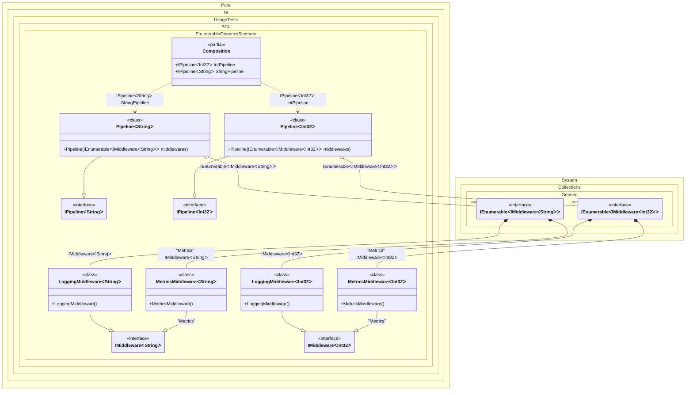

#### Enumerable generics


```c#
using Shouldly;
using Pure.DI;
using System.Collections.Immutable;

DI.Setup(nameof(Composition))
    // Регистрируем обобщенные компоненты middleware.
    // LoggingMiddleware<T> регистрируется как стандартная реализация.
    .Bind<IMiddleware<TT>>().To<LoggingMiddleware<TT>>()
    // MetricsMiddleware<T> регистрируется с тегом "Metrics".
    .Bind<IMiddleware<TT>>("Metrics").To<MetricsMiddleware<TT>>()

    // Регистрируем сам конвейер, который будет принимать коллекцию всех middleware.
    .Bind<IPipeline<TT>>().To<Pipeline<TT>>()

    // Корни композиции для разных типов данных (int и string)
    .Root<IPipeline<int>>("IntPipeline")
    .Root<IPipeline<string>>("StringPipeline");

var composition = new Composition();

// Проверяем конвейер для обработки int
var intPipeline = composition.IntPipeline;
intPipeline.Middlewares.Length.ShouldBe(2);
intPipeline.Middlewares[0].ShouldBeOfType<LoggingMiddleware<int>>();
intPipeline.Middlewares[1].ShouldBeOfType<MetricsMiddleware<int>>();

// Проверяем конвейер для обработки string
var stringPipeline = composition.StringPipeline;
stringPipeline.Middlewares.Length.ShouldBe(2);
stringPipeline.Middlewares[0].ShouldBeOfType<LoggingMiddleware<string>>();
stringPipeline.Middlewares[1].ShouldBeOfType<MetricsMiddleware<string>>();

// Интерфейс для промежуточного ПО (middleware)
interface IMiddleware<T>;

// Реализация для логирования
class LoggingMiddleware<T> : IMiddleware<T>;

// Реализация для сбора метрик
class MetricsMiddleware<T> : IMiddleware<T>;

// Интерфейс конвейера обработки
interface IPipeline<T>
{
    ImmutableArray<IMiddleware<T>> Middlewares { get; }
}

// Реализация конвейера, собирающая все доступные middleware
class Pipeline<T>(IEnumerable<IMiddleware<T>> middlewares) : IPipeline<T>
{
    public ImmutableArray<IMiddleware<T>> Middlewares { get; }
        = [..middlewares];
}
```

<details>
<summary>Running this code sample locally</summary>

- Make sure you have the [.NET SDK 10.0](https://dotnet.microsoft.com/en-us/download/dotnet/10.0) or later is installed
```bash
dotnet --list-sdk
```
- Create a net10.0 (or later) console application
```bash
dotnet new console -n Sample
```
- Add references to NuGet packages
  - [Pure.DI](https://www.nuget.org/packages/Pure.DI)
  - [Shouldly](https://www.nuget.org/packages/Shouldly)
```bash
dotnet add package Pure.DI
dotnet add package Shouldly
```
- Copy the example code into the _Program.cs_ file

You are ready to run the example 🚀
```bash
dotnet run
```

</details>

The following partial class will be generated:

```c#
partial class Composition
{
  [OrdinalAttribute(256)]
  public Composition()
  {
  }

  internal Composition(Composition parentScope)
  {
  }

  public IPipeline<string> StringPipeline
  {
    [MethodImpl(MethodImplOptions.AggressiveInlining)]
    get
    {
      [MethodImpl(MethodImplOptions.AggressiveInlining)]
      IEnumerable<IMiddleware<string>> EnumerationOf_transientIEnumerable1()
      {
        yield return new LoggingMiddleware<string>();
        yield return new MetricsMiddleware<string>();
      }

      return new Pipeline<string>(EnumerationOf_transientIEnumerable1());
    }
  }

  public IPipeline<int> IntPipeline
  {
    [MethodImpl(MethodImplOptions.AggressiveInlining)]
    get
    {
      [MethodImpl(MethodImplOptions.AggressiveInlining)]
      IEnumerable<IMiddleware<int>> EnumerationOf_transientIEnumerable5()
      {
        yield return new LoggingMiddleware<int>();
        yield return new MetricsMiddleware<int>();
      }

      return new Pipeline<int>(EnumerationOf_transientIEnumerable5());
    }
  }
}
```

Class diagram:



