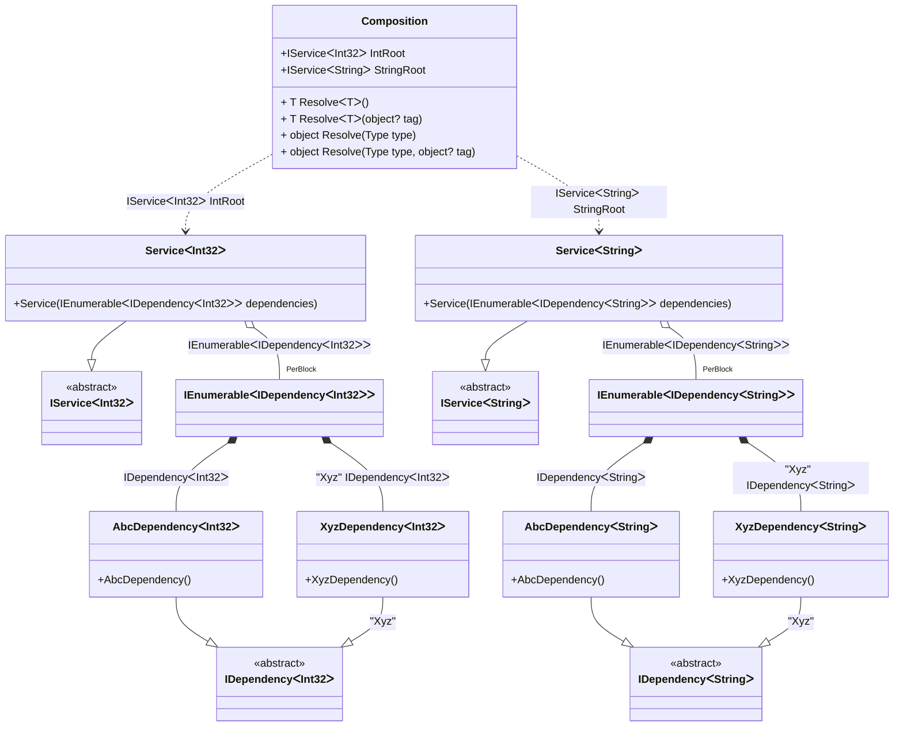

#### Enumerable generics

[](../tests/Pure.DI.UsageTests/BaseClassLibrary/EnumerableGenericsScenario.cs)

```c#
interface IDependency<T>;

class AbcDependency<T> : IDependency<T>;

class XyzDependency<T> : IDependency<T>;

interface IService<T>
{
    ImmutableArray<IDependency<T>> Dependencies { get; }
}

class Service<T>(IEnumerable<IDependency<T>> dependencies) : IService<T>
{
    public ImmutableArray<IDependency<T>> Dependencies { get; }
        = dependencies.ToImmutableArray();
}

DI.Setup(nameof(Composition))
    .Bind<IDependency<TT>>().To<AbcDependency<TT>>()
    .Bind<IDependency<TT>>("Xyz").To<XyzDependency<TT>>()
    .Bind<IService<TT>>().To<Service<TT>>()
        .Root<IService<int>>("IntRoot")
        .Root<IService<string>>("StringRoot");

var composition = new Composition();
        
var intService = composition.IntRoot;
intService.Dependencies.Length.ShouldBe(2);
intService.Dependencies[0].ShouldBeOfType<AbcDependency<int>>();
intService.Dependencies[1].ShouldBeOfType<XyzDependency<int>>();
        
var stringService = composition.StringRoot;
stringService.Dependencies.Length.ShouldBe(2);
stringService.Dependencies[0].ShouldBeOfType<AbcDependency<string>>();
stringService.Dependencies[1].ShouldBeOfType<XyzDependency<string>>();
```

<details open>
<summary>Class Diagram</summary>



</details>

<details>
<summary>Pure.DI-generated partial class Composition</summary><blockquote>

```c#
/// <para>
/// <b>Composition roots</b><br/>
/// <list type="table">
/// <listheader>
/// <term>Root</term>
/// <description>Description</description>
/// </listheader>
/// <item>
/// <term>
/// <see cref="Pure.DI.UsageTests.BCL.EnumerableGenericsScenario.IService{int}"/> <see cref="IntRoot"/><br/>or using <see cref="Resolve{T}()"/> method: <c>Resolve&lt;Pure.DI.UsageTests.BCL.EnumerableGenericsScenario.IService&lt;int&gt;&gt;()</c>
/// </term>
/// <description>
/// Provides a composition root of type <see cref="Pure.DI.UsageTests.BCL.EnumerableGenericsScenario.Service{int}"/>.
/// </description>
/// </item>
/// <item>
/// <term>
/// <see cref="Pure.DI.UsageTests.BCL.EnumerableGenericsScenario.IService{string}"/> <see cref="StringRoot"/><br/>or using <see cref="Resolve{T}()"/> method: <c>Resolve&lt;Pure.DI.UsageTests.BCL.EnumerableGenericsScenario.IService&lt;string&gt;&gt;()</c>
/// </term>
/// <description>
/// Provides a composition root of type <see cref="Pure.DI.UsageTests.BCL.EnumerableGenericsScenario.Service{string}"/>.
/// </description>
/// </item>
/// </list>
/// </para>
/// </summary>
/// <example>
/// This shows how to get an instance of type <see cref="Pure.DI.UsageTests.BCL.EnumerableGenericsScenario.Service{int}"/> using the composition root <see cref="IntRoot"/>:
/// <code>
/// var composition = new Composition();
/// var instance = composition.IntRoot;
/// </code>
/// </example>
/// <a href="https://mermaid.live/view#pako:eNqtVr1uwjAQfhXLcweUDLRskFApWwUMHbI4iUXTJjFyDBJFvAPv0qWvw5vUcUJxIP6BsFiGfHf33Xfn0-1gTBIMRzDOUFn6KVpSlIc0LMRv4JF8RcqUpaQA4XowGE6qb9XNmQRzTDdpjI-H36BgrnM8_AB-mRHCOkFzRtNiWaHqWxsIFmCGS5JtKuiCo8Tfz-J8McJI9IljVt3dV8DQ8sqsBpxsa6PFdoUB48cdaA_oQw79s4jBtFjnmKIoE1r5eIWLBBfxVhalSsXK4qR1YzCO4m6Hol6Ofz6HniA7BYHGwB2DMw29b7kXWsiuytV6vG-_H00Wcp8hlEjrY8ikW0g16UsV_pvdknMLr9W3hXyAvL2ZGsVVMrbUtmOEqLkqwC1JFRiZWgOpSVm-NJCcPqS41Cdi09MqtCIVdQtb5yLPGWMyzRCyekZunZSHopJR1AzEaXMavSqKdLNTY9l7eOyfuXVhRDHGct8AwxDmHaPw1zuwfpBK4-FeBvL7ssn88tV3e-sbVTvi1FnL4S-3Jkd0RX3y56-eY4aVytrvdY-Y17CO0KStTAjfMJ1kJP7i6d8icUXAfqPponovk6smN1C5XMfgE-TQHKUJX5F3IWQfOMchHIUwQZQH38P9H_T_ZNI">Class diagram</a><br/>
/// This class was created by <a href="https://github.com/DevTeam/Pure.DI">Pure.DI</a> source code generator.
/// <seealso cref="Pure.DI.DI.Setup"/>
/// <seealso cref="Pure.DI.IConfiguration.Bind(object[])"/>
/// <seealso cref="Pure.DI.IConfiguration.Bind{T}(object[])"/>
[global::System.Diagnostics.CodeAnalysis.ExcludeFromCodeCoverage]
partial class Composition
{
  private readonly Composition _rootM03D15di;
  
  /// <summary>
  /// This constructor creates a new instance of <see cref="Composition"/>.
  /// </summary>
  public Composition()
  {
    _rootM03D15di = this;
  }
  
  /// <summary>
  /// This constructor creates a new instance of <see cref="Composition"/> scope based on <paramref name="baseComposition"/>. This allows the <see cref="Lifetime.Scoped"/> life time to be applied.
  /// </summary>
  /// <param name="baseComposition">Base composition.</param>
  internal Composition(Composition baseComposition)
  {
    _rootM03D15di = baseComposition._rootM03D15di;
  }
  
  #region Composition Roots
  /// <summary>
  /// Provides a composition root of type <see cref="Pure.DI.UsageTests.BCL.EnumerableGenericsScenario.Service{int}"/>.
  /// </summary>
  /// <example>
  /// This shows how to get an instance of type <see cref="Pure.DI.UsageTests.BCL.EnumerableGenericsScenario.Service{int}"/>:
  /// <code>
  /// var composition = new Composition();
  /// var instance = composition.IntRoot;
  /// </code>
  /// </example>
  public Pure.DI.UsageTests.BCL.EnumerableGenericsScenario.IService<int> IntRoot
  {
    #if NETSTANDARD2_0_OR_GREATER || NETCOREAPP || NET40_OR_GREATER || NET
    [global::System.Diagnostics.Contracts.Pure]
    #endif
    get
    {
      [global::System.Runtime.CompilerServices.MethodImpl((global::System.Runtime.CompilerServices.MethodImplOptions)0x200)]
      System.Collections.Generic.IEnumerable<Pure.DI.UsageTests.BCL.EnumerableGenericsScenario.IDependency<int>> LocalperBlockM03D15di1_IEnumerable()
      {
          yield return new Pure.DI.UsageTests.BCL.EnumerableGenericsScenario.AbcDependency<int>();
          yield return new Pure.DI.UsageTests.BCL.EnumerableGenericsScenario.XyzDependency<int>();
      }
      var perBlockM03D15di1_IEnumerable = LocalperBlockM03D15di1_IEnumerable();
      return new Pure.DI.UsageTests.BCL.EnumerableGenericsScenario.Service<int>(perBlockM03D15di1_IEnumerable);
    }
  }
  
  /// <summary>
  /// Provides a composition root of type <see cref="Pure.DI.UsageTests.BCL.EnumerableGenericsScenario.Service{string}"/>.
  /// </summary>
  /// <example>
  /// This shows how to get an instance of type <see cref="Pure.DI.UsageTests.BCL.EnumerableGenericsScenario.Service{string}"/>:
  /// <code>
  /// var composition = new Composition();
  /// var instance = composition.StringRoot;
  /// </code>
  /// </example>
  public Pure.DI.UsageTests.BCL.EnumerableGenericsScenario.IService<string> StringRoot
  {
    #if NETSTANDARD2_0_OR_GREATER || NETCOREAPP || NET40_OR_GREATER || NET
    [global::System.Diagnostics.Contracts.Pure]
    #endif
    get
    {
      [global::System.Runtime.CompilerServices.MethodImpl((global::System.Runtime.CompilerServices.MethodImplOptions)0x200)]
      System.Collections.Generic.IEnumerable<Pure.DI.UsageTests.BCL.EnumerableGenericsScenario.IDependency<string>> LocalperBlockM03D15di1_IEnumerable()
      {
          yield return new Pure.DI.UsageTests.BCL.EnumerableGenericsScenario.AbcDependency<string>();
          yield return new Pure.DI.UsageTests.BCL.EnumerableGenericsScenario.XyzDependency<string>();
      }
      var perBlockM03D15di1_IEnumerable = LocalperBlockM03D15di1_IEnumerable();
      return new Pure.DI.UsageTests.BCL.EnumerableGenericsScenario.Service<string>(perBlockM03D15di1_IEnumerable);
    }
  }
  #endregion
  
  #region API
  /// <summary>
  /// Resolves the composition root.
  /// </summary>
  /// <typeparam name="T">The type of the composition root.</typeparam>
  /// <returns>A composition root.</returns>
  #if NETSTANDARD2_0_OR_GREATER || NETCOREAPP || NET40_OR_GREATER || NET
  [global::System.Diagnostics.Contracts.Pure]
  #endif
  public T Resolve<T>()
  {
    return ResolverM03D15di<T>.Value.Resolve(this);
  }
  
  /// <summary>
  /// Resolves the composition root by tag.
  /// </summary>
  /// <typeparam name="T">The type of the composition root.</typeparam>
  /// <param name="tag">The tag of a composition root.</param>
  /// <returns>A composition root.</returns>
  #if NETSTANDARD2_0_OR_GREATER || NETCOREAPP || NET40_OR_GREATER || NET
  [global::System.Diagnostics.Contracts.Pure]
  #endif
  public T Resolve<T>(object? tag)
  {
    return ResolverM03D15di<T>.Value.ResolveByTag(this, tag);
  }
  
  /// <summary>
  /// Resolves the composition root.
  /// </summary>
  /// <param name="type">The type of the composition root.</param>
  /// <returns>A composition root.</returns>
  #if NETSTANDARD2_0_OR_GREATER || NETCOREAPP || NET40_OR_GREATER || NET
  [global::System.Diagnostics.Contracts.Pure]
  #endif
  public object Resolve(global::System.Type type)
  {
    var index = (int)(_bucketSizeM03D15di * ((uint)global::System.Runtime.CompilerServices.RuntimeHelpers.GetHashCode(type) % 4));
    var finish = index + _bucketSizeM03D15di;
    do {
      ref var pair = ref _bucketsM03D15di[index];
      if (ReferenceEquals(pair.Key, type))
      {
        return pair.Value.Resolve(this);
      }
    } while (++index < finish);
    
    throw new global::System.InvalidOperationException($"Cannot resolve composition root of type {type}.");
  }
  
  /// <summary>
  /// Resolves the composition root by tag.
  /// </summary>
  /// <param name="type">The type of the composition root.</param>
  /// <param name="tag">The tag of a composition root.</param>
  /// <returns>A composition root.</returns>
  #if NETSTANDARD2_0_OR_GREATER || NETCOREAPP || NET40_OR_GREATER || NET
  [global::System.Diagnostics.Contracts.Pure]
  #endif
  public object Resolve(global::System.Type type, object? tag)
  {
    var index = (int)(_bucketSizeM03D15di * ((uint)global::System.Runtime.CompilerServices.RuntimeHelpers.GetHashCode(type) % 4));
    var finish = index + _bucketSizeM03D15di;
    do {
      ref var pair = ref _bucketsM03D15di[index];
      if (ReferenceEquals(pair.Key, type))
      {
        return pair.Value.ResolveByTag(this, tag);
      }
    } while (++index < finish);
    
    throw new global::System.InvalidOperationException($"Cannot resolve composition root \"{tag}\" of type {type}.");
  }
  #endregion
  
  /// <summary>
  /// This method provides a class diagram in mermaid format. To see this diagram, simply call the method and copy the text to this site https://mermaid.live/.
  /// </summary>
  public override string ToString()
  {
    return
      "classDiagram\n" +
        "  class Composition {\n" +
          "    +IServiceᐸInt32ᐳ IntRoot\n" +
          "    +IServiceᐸStringᐳ StringRoot\n" +
          "    + T ResolveᐸTᐳ()\n" +
          "    + T ResolveᐸTᐳ(object? tag)\n" +
          "    + object Resolve(Type type)\n" +
          "    + object Resolve(Type type, object? tag)\n" +
        "  }\n" +
        "  class IEnumerableᐸIDependencyᐸStringᐳᐳ\n" +
        "  class IEnumerableᐸIDependencyᐸInt32ᐳᐳ\n" +
        "  AbcDependencyᐸStringᐳ --|> IDependencyᐸStringᐳ : \n" +
        "  class AbcDependencyᐸStringᐳ {\n" +
          "    +AbcDependency()\n" +
        "  }\n" +
        "  XyzDependencyᐸStringᐳ --|> IDependencyᐸStringᐳ : \"Xyz\" \n" +
        "  class XyzDependencyᐸStringᐳ {\n" +
          "    +XyzDependency()\n" +
        "  }\n" +
        "  AbcDependencyᐸInt32ᐳ --|> IDependencyᐸInt32ᐳ : \n" +
        "  class AbcDependencyᐸInt32ᐳ {\n" +
          "    +AbcDependency()\n" +
        "  }\n" +
        "  XyzDependencyᐸInt32ᐳ --|> IDependencyᐸInt32ᐳ : \"Xyz\" \n" +
        "  class XyzDependencyᐸInt32ᐳ {\n" +
          "    +XyzDependency()\n" +
        "  }\n" +
        "  ServiceᐸInt32ᐳ --|> IServiceᐸInt32ᐳ : \n" +
        "  class ServiceᐸInt32ᐳ {\n" +
          "    +Service(IEnumerableᐸIDependencyᐸInt32ᐳᐳ dependencies)\n" +
        "  }\n" +
        "  ServiceᐸStringᐳ --|> IServiceᐸStringᐳ : \n" +
        "  class ServiceᐸStringᐳ {\n" +
          "    +Service(IEnumerableᐸIDependencyᐸStringᐳᐳ dependencies)\n" +
        "  }\n" +
        "  class IDependencyᐸStringᐳ {\n" +
          "    <<abstract>>\n" +
        "  }\n" +
        "  class IDependencyᐸInt32ᐳ {\n" +
          "    <<abstract>>\n" +
        "  }\n" +
        "  class IServiceᐸInt32ᐳ {\n" +
          "    <<abstract>>\n" +
        "  }\n" +
        "  class IServiceᐸStringᐳ {\n" +
          "    <<abstract>>\n" +
        "  }\n" +
        "  IEnumerableᐸIDependencyᐸStringᐳᐳ *--  AbcDependencyᐸStringᐳ : IDependencyᐸStringᐳ\n" +
        "  IEnumerableᐸIDependencyᐸStringᐳᐳ *--  XyzDependencyᐸStringᐳ : \"Xyz\"  IDependencyᐸStringᐳ\n" +
        "  IEnumerableᐸIDependencyᐸInt32ᐳᐳ *--  AbcDependencyᐸInt32ᐳ : IDependencyᐸInt32ᐳ\n" +
        "  IEnumerableᐸIDependencyᐸInt32ᐳᐳ *--  XyzDependencyᐸInt32ᐳ : \"Xyz\"  IDependencyᐸInt32ᐳ\n" +
        "  Composition ..> ServiceᐸInt32ᐳ : IServiceᐸInt32ᐳ IntRoot\n" +
        "  Composition ..> ServiceᐸStringᐳ : IServiceᐸStringᐳ StringRoot\n" +
        "  ServiceᐸInt32ᐳ o--  \"PerBlock\" IEnumerableᐸIDependencyᐸInt32ᐳᐳ : IEnumerableᐸIDependencyᐸInt32ᐳᐳ\n" +
        "  ServiceᐸStringᐳ o--  \"PerBlock\" IEnumerableᐸIDependencyᐸStringᐳᐳ : IEnumerableᐸIDependencyᐸStringᐳᐳ";
  }
  
  private readonly static int _bucketSizeM03D15di;
  private readonly static global::Pure.DI.Pair<global::System.Type, global::Pure.DI.IResolver<Composition, object>>[] _bucketsM03D15di;
  
  static Composition()
  {
    var valResolverM03D15di_0000 = new ResolverM03D15di_0000();
    ResolverM03D15di<Pure.DI.UsageTests.BCL.EnumerableGenericsScenario.IService<int>>.Value = valResolverM03D15di_0000;
    var valResolverM03D15di_0001 = new ResolverM03D15di_0001();
    ResolverM03D15di<Pure.DI.UsageTests.BCL.EnumerableGenericsScenario.IService<string>>.Value = valResolverM03D15di_0001;
    _bucketsM03D15di = global::Pure.DI.Buckets<global::System.Type, global::Pure.DI.IResolver<Composition, object>>.Create(
      4,
      out _bucketSizeM03D15di,
      new global::Pure.DI.Pair<global::System.Type, global::Pure.DI.IResolver<Composition, object>>[2]
      {
         new global::Pure.DI.Pair<global::System.Type, global::Pure.DI.IResolver<Composition, object>>(typeof(Pure.DI.UsageTests.BCL.EnumerableGenericsScenario.IService<int>), valResolverM03D15di_0000)
        ,new global::Pure.DI.Pair<global::System.Type, global::Pure.DI.IResolver<Composition, object>>(typeof(Pure.DI.UsageTests.BCL.EnumerableGenericsScenario.IService<string>), valResolverM03D15di_0001)
      });
  }
  
  #region Resolvers
  private sealed class ResolverM03D15di<T>: global::Pure.DI.IResolver<Composition, T>
  {
    public static global::Pure.DI.IResolver<Composition, T> Value = new ResolverM03D15di<T>();
    
    public T Resolve(Composition composite)
    {
      throw new global::System.InvalidOperationException($"Cannot resolve composition root of type {typeof(T)}.");
    }
    
    public T ResolveByTag(Composition composite, object tag)
    {
      throw new global::System.InvalidOperationException($"Cannot resolve composition root \"{tag}\" of type {typeof(T)}.");
    }
  }
  
  private sealed class ResolverM03D15di_0000: global::Pure.DI.IResolver<Composition, Pure.DI.UsageTests.BCL.EnumerableGenericsScenario.IService<int>>
  {
    public Pure.DI.UsageTests.BCL.EnumerableGenericsScenario.IService<int> Resolve(Composition composition)
    {
      return composition.IntRoot;
    }
    
    public Pure.DI.UsageTests.BCL.EnumerableGenericsScenario.IService<int> ResolveByTag(Composition composition, object tag)
    {
      switch (tag)
      {
        case null:
          return composition.IntRoot;
      }
      throw new global::System.InvalidOperationException($"Cannot resolve composition root \"{tag}\" of type Pure.DI.UsageTests.BCL.EnumerableGenericsScenario.IService<int>.");
    }
  }
  
  private sealed class ResolverM03D15di_0001: global::Pure.DI.IResolver<Composition, Pure.DI.UsageTests.BCL.EnumerableGenericsScenario.IService<string>>
  {
    public Pure.DI.UsageTests.BCL.EnumerableGenericsScenario.IService<string> Resolve(Composition composition)
    {
      return composition.StringRoot;
    }
    
    public Pure.DI.UsageTests.BCL.EnumerableGenericsScenario.IService<string> ResolveByTag(Composition composition, object tag)
    {
      switch (tag)
      {
        case null:
          return composition.StringRoot;
      }
      throw new global::System.InvalidOperationException($"Cannot resolve composition root \"{tag}\" of type Pure.DI.UsageTests.BCL.EnumerableGenericsScenario.IService<string>.");
    }
  }
  #endregion
}
```

</blockquote></details>

