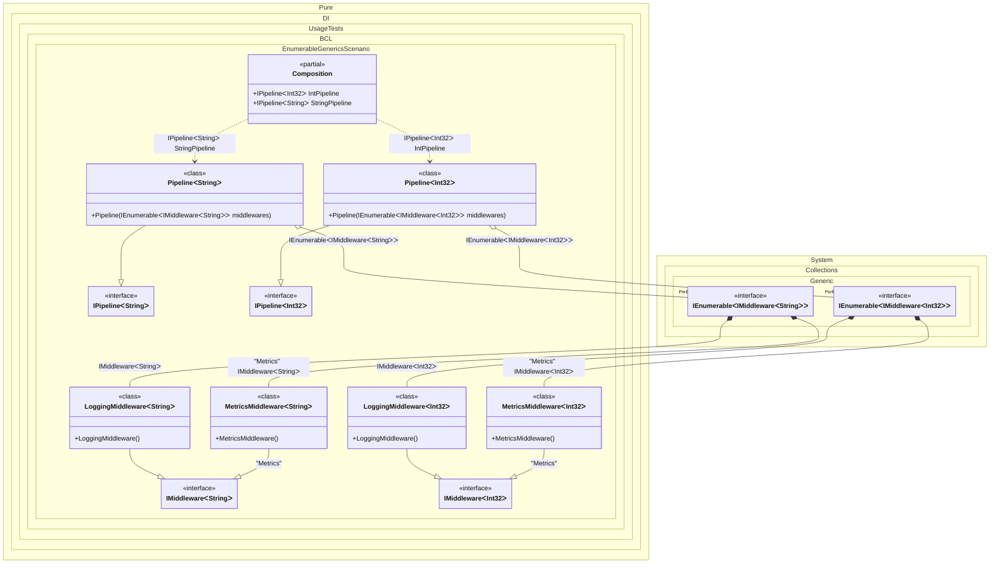

#### Enumerable generics

Shows how generic middleware pipelines collect all matching implementations.


```c#
using Shouldly;
using Pure.DI;
using System.Collections.Immutable;

DI.Setup(nameof(Composition))
    // Register generic middleware components.
    // LoggingMiddleware<T> is registered as the default implementation.
    .Bind<IMiddleware<TT>>().To<LoggingMiddleware<TT>>()
    // MetricsMiddleware<T> is registered with the "Metrics" tag.
    .Bind<IMiddleware<TT>>("Metrics").To<MetricsMiddleware<TT>>()

    // Register the pipeline that takes the collection of all middleware.
    .Bind<IPipeline<TT>>().To<Pipeline<TT>>()

    // Composition roots for different data types (int and string)
    .Root<IPipeline<int>>("IntPipeline")
    .Root<IPipeline<string>>("StringPipeline");

var composition = new Composition();

// Validate the pipeline for int
var intPipeline = composition.IntPipeline;
intPipeline.Middlewares.Length.ShouldBe(2);
intPipeline.Middlewares[0].ShouldBeOfType<LoggingMiddleware<int>>();
intPipeline.Middlewares[1].ShouldBeOfType<MetricsMiddleware<int>>();

// Validate the pipeline for string
var stringPipeline = composition.StringPipeline;
stringPipeline.Middlewares.Length.ShouldBe(2);
stringPipeline.Middlewares[0].ShouldBeOfType<LoggingMiddleware<string>>();
stringPipeline.Middlewares[1].ShouldBeOfType<MetricsMiddleware<string>>();

// Middleware interface
interface IMiddleware<T>;

// Logging implementation
class LoggingMiddleware<T> : IMiddleware<T>;

// Metrics implementation
class MetricsMiddleware<T> : IMiddleware<T>;

// Pipeline interface
interface IPipeline<T>
{
    ImmutableArray<IMiddleware<T>> Middlewares { get; }
}

// Pipeline implementation that aggregates all available middleware
class Pipeline<T>(IEnumerable<IMiddleware<T>> middlewares) : IPipeline<T>
{
    public ImmutableArray<IMiddleware<T>> Middlewares { get; }
        = [..middlewares];
}
```

<details>
<summary>Running this code sample locally</summary>

- Make sure you have the [.NET SDK 10.0](https://dotnet.microsoft.com/en-us/download/dotnet/10.0) or later installed
```bash
dotnet --list-sdk
```
- Create a net10.0 (or later) console application
```bash
dotnet new console -n Sample
```
- Add references to the NuGet packages
  - [Pure.DI](https://www.nuget.org/packages/Pure.DI)
  - [Shouldly](https://www.nuget.org/packages/Shouldly)
```bash
dotnet add package Pure.DI
dotnet add package Shouldly
```
- Copy the example code into the _Program.cs_ file

You are ready to run the example 🚀
```bash
dotnet run
```

</details>

>[!NOTE]
>Generic enumerable injections are useful for implementing middleware patterns where multiple handlers need to be invoked in sequence.

The following partial class will be generated:

```c#
partial class Composition
{
  public IPipeline<string> StringPipeline
  {
    [MethodImpl(MethodImplOptions.AggressiveInlining)]
    get
    {
      [MethodImpl(MethodImplOptions.AggressiveInlining)]
      IEnumerable<IMiddleware<string>> EnumerationOf_perBlockIEnumerable390()
      {
        yield return new LoggingMiddleware<string>();
        yield return new MetricsMiddleware<string>();
      }

      return new Pipeline<string>(EnumerationOf_perBlockIEnumerable390());
    }
  }

  public IPipeline<int> IntPipeline
  {
    [MethodImpl(MethodImplOptions.AggressiveInlining)]
    get
    {
      [MethodImpl(MethodImplOptions.AggressiveInlining)]
      IEnumerable<IMiddleware<int>> EnumerationOf_perBlockIEnumerable394()
      {
        yield return new LoggingMiddleware<int>();
        yield return new MetricsMiddleware<int>();
      }

      return new Pipeline<int>(EnumerationOf_perBlockIEnumerable394());
    }
  }
}
```

Class diagram:


```mermaid
---
 config:
  maxTextSize: 2147483647
  maxEdges: 2147483647
  class:
   hideEmptyMembersBox: true
---
classDiagram
	PipelineᐸStringᐳ --|> IPipelineᐸStringᐳ
	PipelineᐸInt32ᐳ --|> IPipelineᐸInt32ᐳ
	LoggingMiddlewareᐸStringᐳ --|> IMiddlewareᐸStringᐳ
	MetricsMiddlewareᐸStringᐳ --|> IMiddlewareᐸStringᐳ : "Metrics" 
	LoggingMiddlewareᐸInt32ᐳ --|> IMiddlewareᐸInt32ᐳ
	MetricsMiddlewareᐸInt32ᐳ --|> IMiddlewareᐸInt32ᐳ : "Metrics" 
	Composition ..> PipelineᐸStringᐳ : IPipelineᐸStringᐳ StringPipeline
	Composition ..> PipelineᐸInt32ᐳ : IPipelineᐸInt32ᐳ IntPipeline
	PipelineᐸStringᐳ o-- "PerBlock" IEnumerableᐸIMiddlewareᐸStringᐳᐳ : IEnumerableᐸIMiddlewareᐸStringᐳᐳ
	PipelineᐸInt32ᐳ o-- "PerBlock" IEnumerableᐸIMiddlewareᐸInt32ᐳᐳ : IEnumerableᐸIMiddlewareᐸInt32ᐳᐳ
	IEnumerableᐸIMiddlewareᐸStringᐳᐳ *--  LoggingMiddlewareᐸStringᐳ : IMiddlewareᐸStringᐳ
	IEnumerableᐸIMiddlewareᐸStringᐳᐳ *--  MetricsMiddlewareᐸStringᐳ : "Metrics"  IMiddlewareᐸStringᐳ
	IEnumerableᐸIMiddlewareᐸInt32ᐳᐳ *--  LoggingMiddlewareᐸInt32ᐳ : IMiddlewareᐸInt32ᐳ
	IEnumerableᐸIMiddlewareᐸInt32ᐳᐳ *--  MetricsMiddlewareᐸInt32ᐳ : "Metrics"  IMiddlewareᐸInt32ᐳ
	namespace Pure.DI.UsageTests.BCL.EnumerableGenericsScenario {
		class Composition {
		<<partial>>
		+IPipelineᐸInt32ᐳ IntPipeline
		+IPipelineᐸStringᐳ StringPipeline
		}
		class IMiddlewareᐸInt32ᐳ {
			<<interface>>
		}
		class IMiddlewareᐸStringᐳ {
			<<interface>>
		}
		class IPipelineᐸInt32ᐳ {
			<<interface>>
		}
		class IPipelineᐸStringᐳ {
			<<interface>>
		}
		class LoggingMiddlewareᐸInt32ᐳ {
				<<class>>
			+LoggingMiddleware()
		}
		class LoggingMiddlewareᐸStringᐳ {
				<<class>>
			+LoggingMiddleware()
		}
		class MetricsMiddlewareᐸInt32ᐳ {
				<<class>>
			+MetricsMiddleware()
		}
		class MetricsMiddlewareᐸStringᐳ {
				<<class>>
			+MetricsMiddleware()
		}
		class PipelineᐸInt32ᐳ {
				<<class>>
			+Pipeline(IEnumerableᐸIMiddlewareᐸInt32ᐳᐳ middlewares)
		}
		class PipelineᐸStringᐳ {
				<<class>>
			+Pipeline(IEnumerableᐸIMiddlewareᐸStringᐳᐳ middlewares)
		}
	}
	namespace System.Collections.Generic {
		class IEnumerableᐸIMiddlewareᐸInt32ᐳᐳ {
				<<interface>>
		}
		class IEnumerableᐸIMiddlewareᐸStringᐳᐳ {
				<<interface>>
		}
	}
```

