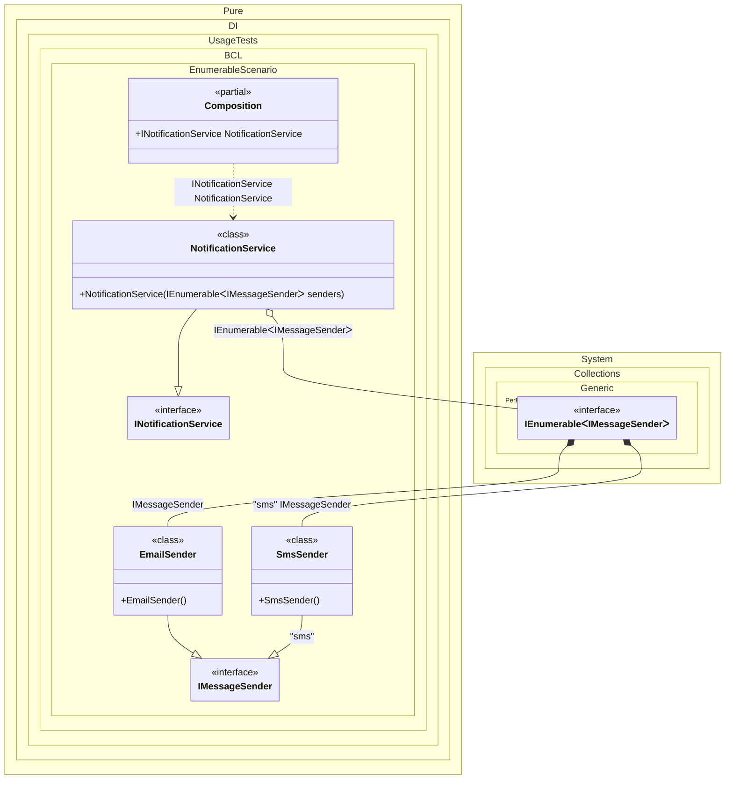

#### Enumerable

Specifying `IEnumerable<T>` as the injection type allows you to inject instances of all bindings that implement type `T` in a lazy fashion - the instances will be provided one by one, in order corresponding to the sequence of bindings.


```c#
using Shouldly;
using Pure.DI;
using System.Collections.Immutable;

DI.Setup(nameof(Composition))
    .Bind<IMessageSender>().To<EmailSender>()
    .Bind<IMessageSender>("sms").To<SmsSender>()
    .Bind<INotificationService>().To<NotificationService>()

    // Composition root
    .Root<INotificationService>("NotificationService");

var composition = new Composition();
var notificationService = composition.NotificationService;
notificationService.Senders.Length.ShouldBe(2);
notificationService.Senders[0].ShouldBeOfType<EmailSender>();
notificationService.Senders[1].ShouldBeOfType<SmsSender>();

notificationService.Notify("Hello World");

interface IMessageSender
{
    void Send(string message);
}

class EmailSender : IMessageSender
{
    public void Send(string message)
    {
        // Sending email...
    }
}

class SmsSender : IMessageSender
{
    public void Send(string message)
    {
        // Sending SMS...
    }
}

interface INotificationService
{
    ImmutableArray<IMessageSender> Senders { get; }

    void Notify(string message);
}

class NotificationService(IEnumerable<IMessageSender> senders) : INotificationService
{
    public ImmutableArray<IMessageSender> Senders { get; }
        = [..senders];

    public void Notify(string message)
    {
        foreach (var sender in Senders)
        {
            sender.Send(message);
        }
    }
}
```

<details>
<summary>Running this code sample locally</summary>

- Make sure you have the [.NET SDK 10.0](https://dotnet.microsoft.com/en-us/download/dotnet/10.0) or later is installed
```bash
dotnet --list-sdk
```
- Create a net10.0 (or later) console application
```bash
dotnet new console -n Sample
```
- Add references to NuGet packages
  - [Pure.DI](https://www.nuget.org/packages/Pure.DI)
  - [Shouldly](https://www.nuget.org/packages/Shouldly)
```bash
dotnet add package Pure.DI
dotnet add package Shouldly
```
- Copy the example code into the _Program.cs_ file

You are ready to run the example 🚀
```bash
dotnet run
```

</details>

The following partial class will be generated:

```c#
partial class Composition
{
  public INotificationService NotificationService
  {
    [MethodImpl(MethodImplOptions.AggressiveInlining)]
    get
    {
      [MethodImpl(MethodImplOptions.AggressiveInlining)]
      IEnumerable<IMessageSender> EnumerationOf_transientIEnumerable1()
      {
        yield return new EmailSender();
        yield return new SmsSender();
      }

      return new NotificationService(EnumerationOf_transientIEnumerable1());
    }
  }
}
```

Class diagram:



