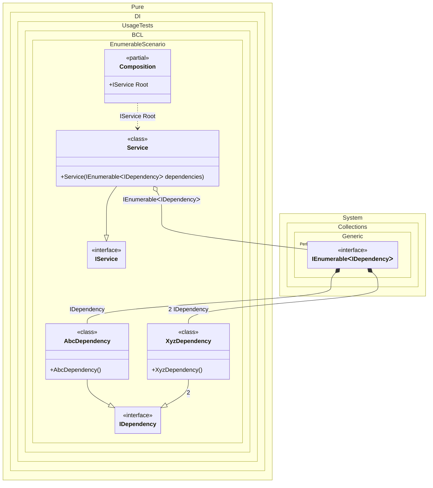

#### Enumerable

Specifying `IEnumerable<T>` as the injection type allows you to inject instances of all bindings that implement type `T` in a lazy fashion - the instances will be provided one by one, in order corresponding to the sequence of bindings.


```c#
using Shouldly;
using Pure.DI;
using System.Collections.Immutable;

DI.Setup(nameof(Composition))
    .Bind<IDependency>().To<AbcDependency>()
    .Bind<IDependency>(2).To<XyzDependency>()
    .Bind<IService>().To<Service>()

    // Composition root
    .Root<IService>("Root");

var composition = new Composition();
var service = composition.Root;
service.Dependencies.Length.ShouldBe(2);
service.Dependencies[0].ShouldBeOfType<AbcDependency>();
service.Dependencies[1].ShouldBeOfType<XyzDependency>();

interface IDependency;

class AbcDependency : IDependency;

class XyzDependency : IDependency;

interface IService
{
    ImmutableArray<IDependency> Dependencies { get; }
}

class Service(IEnumerable<IDependency> dependencies) : IService
{
    public ImmutableArray<IDependency> Dependencies { get; }
        = [..dependencies];
}
```

<details>
<summary>Running this code sample locally</summary>

- Make sure you have the [.NET SDK 10.0](https://dotnet.microsoft.com/en-us/download/dotnet/10.0) or later is installed
```bash
dotnet --list-sdk
```
- Create a net10.0 (or later) console application
```bash
dotnet new console -n Sample
```
- Add references to NuGet packages
  - [Pure.DI](https://www.nuget.org/packages/Pure.DI)
  - [Shouldly](https://www.nuget.org/packages/Shouldly)
```bash
dotnet add package Pure.DI
dotnet add package Shouldly
```
- Copy the example code into the _Program.cs_ file

You are ready to run the example 🚀
```bash
dotnet run
```

</details>

The following partial class will be generated:

```c#
partial class Composition
{
  [OrdinalAttribute(256)]
  public Composition()
  {
  }

  internal Composition(Composition parentScope)
  {
  }

  public IService Root
  {
    [MethodImpl(MethodImplOptions.AggressiveInlining)]
    get
    {
      [MethodImpl(MethodImplOptions.AggressiveInlining)]
      IEnumerable<IDependency> EnumerationOf_transientIEnumerable1()
      {
        yield return new AbcDependency();
        yield return new XyzDependency();
      }

      return new Service(EnumerationOf_transientIEnumerable1());
    }
  }
}
```

Class diagram:



