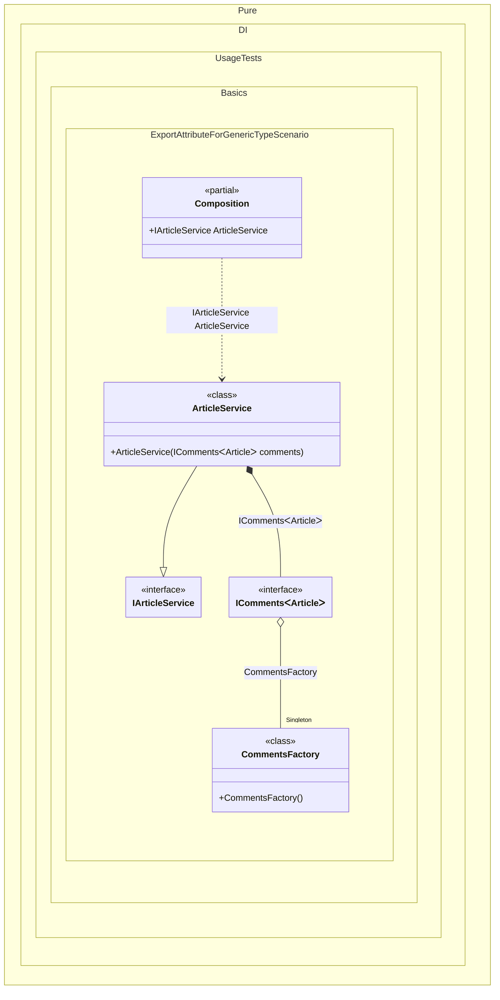

#### Export attribute for a generic type

The `[Export]` attribute works with generic types too: applied to a generic factory method with a `TT` marker, as in `[Export(typeof(IComments<TT>))]`, it makes a single method the source of `IComments<T>` for any requested `T`. This is handy when a factory class produces generic dependencies and you don't want to declare a separate binding for each closed type.


```c#
using Shouldly;
using Pure.DI;

DI.Setup(nameof(Composition))
    .Bind().As(Lifetime.Singleton).To<CommentsFactory>()
    .Bind().To<ArticleService>()

    // Composition root
    .Root<IArticleService>("ArticleService");

var composition = new Composition();
var articleService = composition.ArticleService;
articleService.DisplayComments();

interface IComments<T>
{
    void Load();
}

class Comments<T> : IComments<T>
{
    public void Load()
    {
    }
}

class CommentsFactory
{
    // The 'TT' type marker in the attribute indicates that this method
    // can produce 'IComments<T>' for any generic type 'T'.
    // This allows the factory to handle all requests for IComments<T>.
    [Export(typeof(IComments<TT>))]
    public IComments<T> Create<T>() => new Comments<T>();
}

interface IArticleService
{
    void DisplayComments();
}

class ArticleService(IComments<Article> comments) : IArticleService
{
    public void DisplayComments() => comments.Load();
}

class Article;
```

<details>
<summary>Running this code sample locally</summary>

- Make sure you have the [.NET SDK 10.0](https://dotnet.microsoft.com/en-us/download/dotnet/10.0) or later installed
```bash
dotnet --list-sdk
```
- Create a net10.0 (or later) console application
```bash
dotnet new console -n Sample
```
- Add references to the NuGet packages
  - [Pure.DI](https://www.nuget.org/packages/Pure.DI)
  - [Shouldly](https://www.nuget.org/packages/Shouldly)
```bash
dotnet add package Pure.DI
dotnet add package Shouldly
```
- Copy the example code into the _Program.cs_ file

You are ready to run the example 🚀
```bash
dotnet run
```

</details>

>[!NOTE]
>The Export attribute provides a declarative way to specify bindings directly on types, reducing the need for manual composition setup.

<details>
<summary>The following partial class will be generated</summary>

```c#
partial class Composition
{
#if NET9_0_OR_GREATER
  private readonly Lock _lock = new Lock();
#else
  private readonly Object _lock = new Object();
#endif

  private CommentsFactory? _singletonCompositionInOtherProject;

  public IArticleService ArticleService
  {
    [MethodImpl(MethodImplOptions.AggressiveInlining)]
    get
    {
      IComments<Article> transientICommentsArticle;
      if (_singletonCompositionInOtherProject is null)
        lock (_lock)
          if (_singletonCompositionInOtherProject is null)
          {
            _singletonCompositionInOtherProject = new CommentsFactory();
          }

      CommentsFactory localInstance_1182D127 = _singletonCompositionInOtherProject;
      transientICommentsArticle = localInstance_1182D127.Create<Article>();
      return new ArticleService(transientICommentsArticle);
    }
  }
}
```

</details>

Class diagram:



See also:

- [Export attribute](export-attribute.md)

