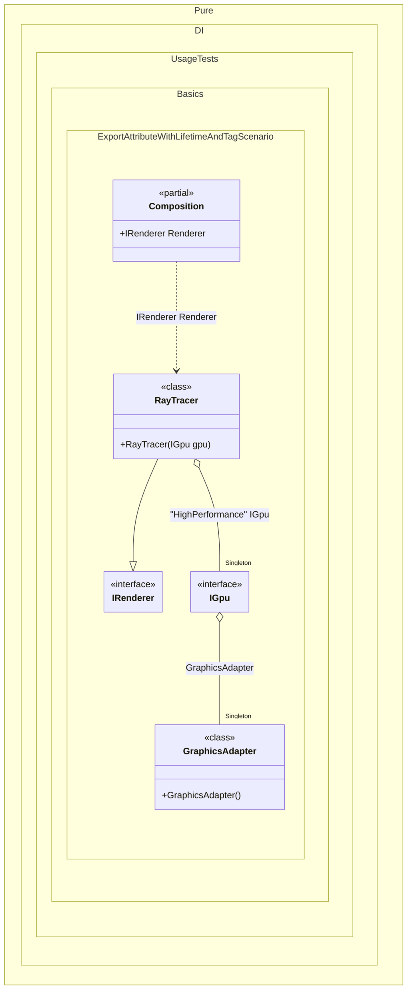

#### Export attribute with lifetime and tag

The `[Export]` attribute accepts optional `lifetime` and `tags` parameters, so an exported member is registered exactly like a hand-written binding. Here the `GraphicsAdapter.HighPerfGpu` property is exported as a `Singleton` with the tag `"HighPerformance"`, and `RayTracer` receives that instance by requesting `[Tag("HighPerformance")] IGpu`.


```c#
using Shouldly;
using Pure.DI;

DI.Setup(nameof(Composition))
    .Bind().As(Lifetime.Singleton).To<GraphicsAdapter>()
    .Bind().To<RayTracer>()

    // Composition root
    .Root<IRenderer>("Renderer");

var composition = new Composition();
var renderer = composition.Renderer;
renderer.Render();

interface IGpu
{
    void RenderFrame();
}

class DiscreteGpu : IGpu
{
    public void RenderFrame() => Console.WriteLine("Rendering with Discrete GPU");
}

class GraphicsAdapter
{
    // Binds the property to the composition with the specified
    // lifetime and tag. This allows the "HighPerformance" GPU
    // to be injected into other components.
    [Export(lifetime: Lifetime.Singleton, tags: ["HighPerformance"])]
    public IGpu HighPerfGpu { get; } = new DiscreteGpu();
}

interface IRenderer
{
    void Render();
}

class RayTracer([Tag("HighPerformance")] IGpu gpu) : IRenderer
{
    public void Render() => gpu.RenderFrame();
}
```

<details>
<summary>Running this code sample locally</summary>

- Make sure you have the [.NET SDK 10.0](https://dotnet.microsoft.com/en-us/download/dotnet/10.0) or later installed
```bash
dotnet --list-sdk
```
- Create a net10.0 (or later) console application
```bash
dotnet new console -n Sample
```
- Add references to the NuGet packages
  - [Pure.DI](https://www.nuget.org/packages/Pure.DI)
  - [Shouldly](https://www.nuget.org/packages/Shouldly)
```bash
dotnet add package Pure.DI
dotnet add package Shouldly
```
- Copy the example code into the _Program.cs_ file

You are ready to run the example 🚀
```bash
dotnet run
```

</details>

>[!NOTE]
>Specifying lifetime and tag in the Export attribute allows for fine-grained control over instance creation and binding resolution.

<details>
<summary>The following partial class will be generated</summary>

```c#
partial class Composition
{
#if NET9_0_OR_GREATER
  private readonly Lock _lock = new Lock();
#else
  private readonly Object _lock = new Object();
#endif

  private IGpu? _singletonIGpu2147482282;
  private GraphicsAdapter? _singletonGraphicsAdapter71;

  public IRenderer Renderer
  {
    [MethodImpl(MethodImplOptions.AggressiveInlining)]
    get
    {
      if (_singletonIGpu2147482282 is null)
        lock (_lock)
          if (_singletonIGpu2147482282 is null)
          {
            if (_singletonGraphicsAdapter71 is null)
            {
              _singletonGraphicsAdapter71 = new GraphicsAdapter();
            }

            GraphicsAdapter localInstance_1182D127 = _singletonGraphicsAdapter71;
            _singletonIGpu2147482282 = localInstance_1182D127.HighPerfGpu;
          }

      return new RayTracer(_singletonIGpu2147482282);
    }
  }
}
```

</details>

Class diagram:



See also:

- [Export attribute](export-attribute.md)

