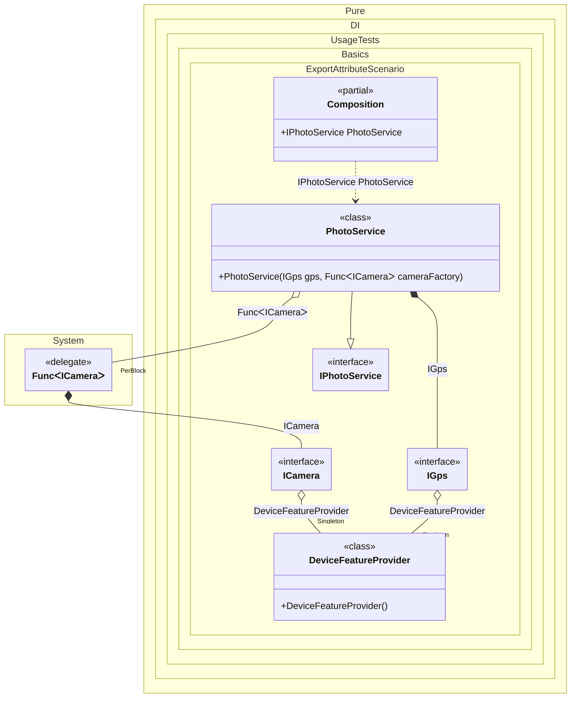

#### Export attribute

`ExportAttribute` lets you bind properties, fields, or methods declared on the bound type.


```c#
using Pure.DI;

DI.Setup(nameof(Composition))
    .Bind().As(Lifetime.Singleton).To<DeviceFeatureProvider>()
    .Bind().To<PhotoService>()

    // Composition root
    .Root<IPhotoService>("PhotoService");

var composition = new Composition();
var photoService = composition.PhotoService;
photoService.TakePhotoWithLocation();

interface IGps
{
    void GetLocation();
}

class Gps : IGps
{
    public void GetLocation() => Console.WriteLine("Coordinates: 123, 456");
}

interface ICamera
{
    void Capture();
}

class Camera : ICamera
{
    public void Capture() => Console.WriteLine("Photo captured");
}

class DeviceFeatureProvider
{
    // The [Export] attribute specifies that the property is a source of dependency
    [Export] public IGps Gps { get; } = new Gps();

    [Export] public ICamera Camera { get; } = new Camera();
}

interface IPhotoService
{
    void TakePhotoWithLocation();
}

class PhotoService(IGps gps, Func<ICamera> cameraFactory) : IPhotoService
{
    public void TakePhotoWithLocation()
    {
        gps.GetLocation();
        cameraFactory().Capture();
    }
}
```

<details>
<summary>Running this code sample locally</summary>

- Make sure you have the [.NET SDK 10.0](https://dotnet.microsoft.com/en-us/download/dotnet/10.0) or later installed
```bash
dotnet --list-sdk
```
- Create a net10.0 (or later) console application
```bash
dotnet new console -n Sample
```
- Add a reference to the NuGet package
  - [Pure.DI](https://www.nuget.org/packages/Pure.DI)
```bash
dotnet add package Pure.DI
```
- Copy the example code into the _Program.cs_ file

You are ready to run the example 🚀
```bash
dotnet run
```

</details>

It applies to instance or static members, including members that return generic types.

<details>
<summary>The following partial class will be generated</summary>

```c#
partial class Composition
{
#if NET9_0_OR_GREATER
  private readonly Lock _lock = new Lock();
#else
  private readonly Object _lock = new Object();
#endif

  private DeviceFeatureProvider? _singletonCompositionInOtherProject;

  public IPhotoService PhotoService
  {
    [MethodImpl(MethodImplOptions.AggressiveInlining)]
    get
    {
      IGps transientIGps;
      EnsureDeviceFeatureProviderExists();
      DeviceFeatureProvider localInstance_1182D127 = _singletonCompositionInOtherProject;
      transientIGps = localInstance_1182D127.Gps;
      Func<ICamera> perBlockFuncICamera = new Func<ICamera>(
      [MethodImpl(MethodImplOptions.AggressiveInlining)]
      () =>
      {
        // Creates a deferred value
        ICamera transientICamera;
        EnsureDeviceFeatureProviderExists();
        DeviceFeatureProvider localInstance_1182D1271 = _singletonCompositionInOtherProject;
        transientICamera = localInstance_1182D1271.Camera;
        return transientICamera;
      });
      return new PhotoService(transientIGps, perBlockFuncICamera);
      [MethodImpl(MethodImplOptions.AggressiveInlining)]
      void EnsureDeviceFeatureProviderExists()
      {
        if (_singletonCompositionInOtherProject is null)
          lock (_lock)
            if (_singletonCompositionInOtherProject is null)
            {
              _singletonCompositionInOtherProject = new DeviceFeatureProvider();
            }
      }
    }
  }
}
```

</details>

Class diagram:



See also:

- [Export attribute with lifetime and tag](export-attribute-with-lifetime-and-tag.md)
- [Export attribute for a generic type](export-attribute-for-a-generic-type.md)

