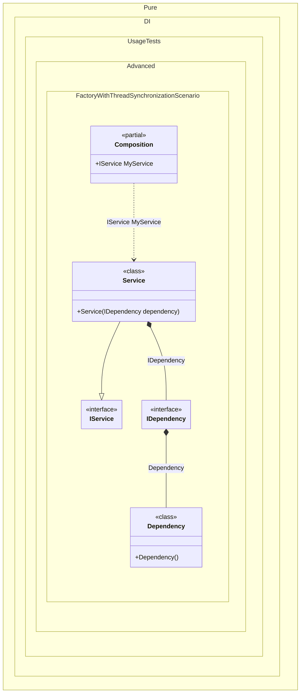

#### Factory with thread synchronization

In some cases, initialization of objects requires synchronization of the overall composition flow.


```c#
using Shouldly;
using Pure.DI;

DI.Setup(nameof(Composition))
    .Bind<IDependency>().To<IDependency>(ctx =>
    {
        // Some instance initialization logic that requires
        // synchronization of the overall composition flow
        lock (ctx.Lock)
        {
            ctx.Inject(out Dependency dependency);
            dependency.Initialize();
            return dependency;
        }
    })
    .Bind<IService>().To<Service>()

    // Composition root
    .Root<IService>("MyService");

var composition = new Composition();
var service = composition.MyService;
service.Dependency.IsInitialized.ShouldBeTrue();

interface IDependency
{
    bool IsInitialized { get; }
}

class Dependency : IDependency
{
    public bool IsInitialized { get; private set; }

    public void Initialize() => IsInitialized = true;
}

interface IService
{
    IDependency Dependency { get; }
}

class Service(IDependency dependency) : IService
{
    public IDependency Dependency { get; } = dependency;
}
```

<details>
<summary>Running this code sample locally</summary>

- Make sure you have the [.NET SDK 9.0](https://dotnet.microsoft.com/en-us/download/dotnet/9.0) or later is installed
```bash
dotnet --list-sdk
```
- Create a net9.0 (or later) console application
```bash
dotnet new console -n Sample
```
- Add references to NuGet packages
  - [Pure.DI](https://www.nuget.org/packages/Pure.DI)
  - [Shouldly](https://www.nuget.org/packages/Shouldly)
```bash
dotnet add package Pure.DI
dotnet add package Shouldly
```
- Copy the example code into the _Program.cs_ file

You are ready to run the example 🚀
```bash
dotnet run
```

</details>

The following partial class will be generated:

```c#
partial class Composition
{
#if NET9_0_OR_GREATER
  private readonly Lock _lock;
#else
  private readonly Object _lock;
#endif

  [OrdinalAttribute(256)]
  public Composition()
  {
#if NET9_0_OR_GREATER
    _lock = new Lock();
#else
    _lock = new Object();
#endif
  }

  internal Composition(Composition parentScope)
  {
    _lock = parentScope._lock;
  }

  public IService MyService
  {
    [MethodImpl(MethodImplOptions.AggressiveInlining)]
    get
    {
      IDependency transientIDependency1;
      // Some instance initialization logic that requires
      // synchronization of the overall composition flow
      lock (_lock)
      {
        Dependency localDependency = new Dependency();
        localDependency.Initialize();
        {
          transientIDependency1 = localDependency;
          goto transientIDependency1Finish;
        }
      }

      transientIDependency1Finish:
        ;
      return new Service(transientIDependency1);
    }
  }
}
```

Class diagram:



