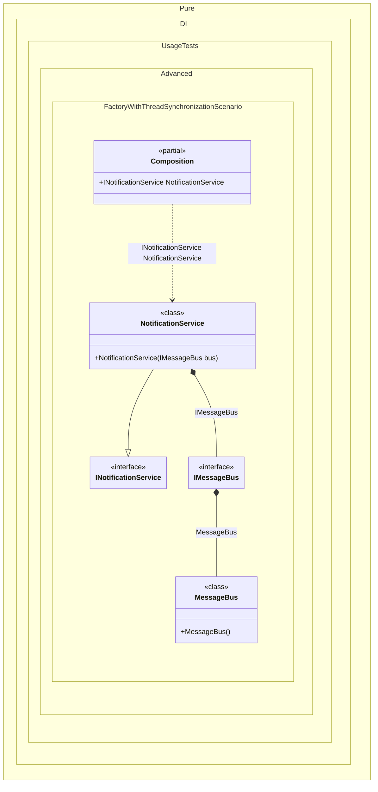

#### Factory with thread synchronization

In some cases, initialization of objects requires synchronization of the overall composition flow.


```c#
using Shouldly;
using Pure.DI;

DI.Setup(nameof(Composition))
    .Bind<IMessageBus>().To<IMessageBus>(ctx => {
        // Initialization logic requiring synchronization
        // of the overall composition flow.
        // For example, connecting to a message broker.
        lock (ctx.Lock)
        {
            ctx.Inject(out MessageBus bus);
            bus.Connect();
            return bus;
        }
    })
    .Bind<INotificationService>().To<NotificationService>()

    // Composition root
    .Root<INotificationService>("NotificationService");

var composition = new Composition();
var service = composition.NotificationService;
service.Bus.IsConnected.ShouldBeTrue();

interface IMessageBus
{
    bool IsConnected { get; }
}

class MessageBus : IMessageBus
{
    public bool IsConnected { get; private set; }

    public void Connect() => IsConnected = true;
}

interface INotificationService
{
    IMessageBus Bus { get; }
}

class NotificationService(IMessageBus bus) : INotificationService
{
    public IMessageBus Bus { get; } = bus;
}
```

<details>
<summary>Running this code sample locally</summary>

- Make sure you have the [.NET SDK 10.0](https://dotnet.microsoft.com/en-us/download/dotnet/10.0) or later is installed
```bash
dotnet --list-sdk
```
- Create a net10.0 (or later) console application
```bash
dotnet new console -n Sample
```
- Add references to NuGet packages
  - [Pure.DI](https://www.nuget.org/packages/Pure.DI)
  - [Shouldly](https://www.nuget.org/packages/Shouldly)
```bash
dotnet add package Pure.DI
dotnet add package Shouldly
```
- Copy the example code into the _Program.cs_ file

You are ready to run the example 🚀
```bash
dotnet run
```

</details>

The following partial class will be generated:

```c#
partial class Composition
{
#if NET9_0_OR_GREATER
  private readonly Lock _lock = new Lock();
#else
  private readonly Object _lock = new Object();
#endif

  public INotificationService NotificationService
  {
    [MethodImpl(MethodImplOptions.AggressiveInlining)]
    get
    {
      IMessageBus transientIMessageBus1;
      // Initialization logic requiring synchronization
      // of the overall composition flow.
      // For example, connecting to a message broker.
      lock (_lock)
      {
        MessageBus localBus = new MessageBus();
        localBus.Connect();
        {
          transientIMessageBus1 = localBus;
          goto transientIMessageBus1Finish;
        }
      }

      transientIMessageBus1Finish:
        ;
      return new NotificationService(transientIMessageBus1);
    }
  }
}
```

Class diagram:



