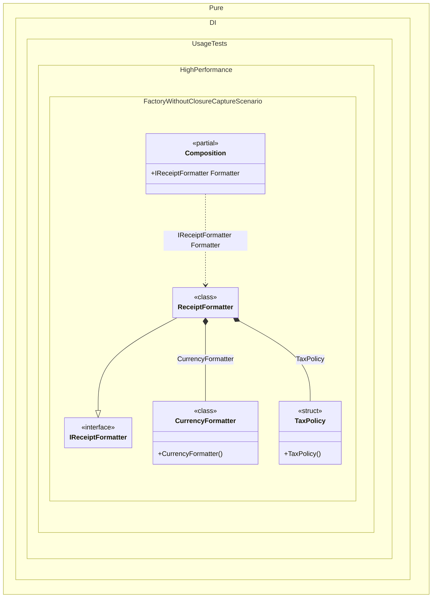

#### Factory without closure capture

Factory delegates often appear in hot object creation paths. Keep them deterministic and allocation-friendly by taking dependencies as factory parameters instead of capturing outer variables. Pure.DI can see those parameters as dependencies and generate the code that supplies them.
The receipt formatter below needs a currency formatter and tax policy. Both are declared as lambda parameters, so the factory does not close over mutable setup-local state and the generated graph remains explicit.


```c#
using Shouldly;
using Pure.DI;
using System.Globalization;

DI.Setup(nameof(Composition))
    .Bind().To<CurrencyFormatter>()
    .Bind().To<TaxPolicy>()
    .Bind<IReceiptFormatter>().To((
        CurrencyFormatter currency,
        TaxPolicy tax) => new ReceiptFormatter(currency, tax))
    .Root<IReceiptFormatter>("Formatter");

var composition = new Composition();
var formatter = composition.Formatter;

formatter.Format(100m).ShouldBe("$120.00");

interface IReceiptFormatter
{
    string Format(decimal subtotal);
}

sealed class ReceiptFormatter(
    CurrencyFormatter currency,
    TaxPolicy tax)
    : IReceiptFormatter
{
    public string Format(decimal subtotal) =>
        currency.Format(tax.Apply(subtotal));
}

sealed class CurrencyFormatter
{
    public string Format(decimal value) =>
        $"${value.ToString("0.00", CultureInfo.InvariantCulture)}";
}

readonly struct TaxPolicy
{
    public decimal Apply(decimal subtotal) => subtotal * 1.20m;
}
```

<details>
<summary>Running this code sample locally</summary>

- Make sure you have the [.NET SDK 10.0](https://dotnet.microsoft.com/en-us/download/dotnet/10.0) or later installed
```bash
dotnet --list-sdk
```
- Create a net10.0 (or later) console application
```bash
dotnet new console -n Sample
```
- Add references to the NuGet packages
  - [Pure.DI](https://www.nuget.org/packages/Pure.DI)
  - [Shouldly](https://www.nuget.org/packages/Shouldly)
```bash
dotnet add package Pure.DI
dotnet add package Shouldly
```
- Copy the example code into the _Program.cs_ file

You are ready to run the example 🚀
```bash
dotnet run
```

</details>

This is most useful when a factory adds a small construction decision or validates dependencies before creating an object. If the factory needs runtime values, prefer root arguments or `Func<TArg, TResult>` instead of capturing variables from the setup method.

<details>
<summary>The following partial class will be generated</summary>

```c#
partial class Composition
{
  public IReceiptFormatter Formatter
  {
    [MethodImpl(MethodImplOptions.AggressiveInlining)]
    get
    {
      ReceiptFormatter transientReceiptFormatter;
      CurrencyFormatter localCurrency = new CurrencyFormatter();
      TaxPolicy localTax = new TaxPolicy();
      transientReceiptFormatter = new ReceiptFormatter(localCurrency, localTax);
      return transientReceiptFormatter;
    }
  }
}
```

</details>

Class diagram:



See also:

- [Factory](factory.md)
- [Simplified factory](simplified-factory.md)

