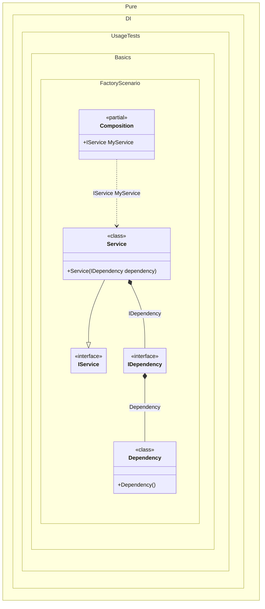

#### Factory

This example demonstrates how to create and initialize an instance manually. At the compilation stage, the set of dependencies that the object to be created needs is determined. In most cases, this happens automatically, according to the set of constructors and their arguments, and does not require additional customization efforts. But sometimes it is necessary to manually create and/or initialize an object, as in lines of code:


```c#
using Shouldly;
using Pure.DI;

DI.Setup(nameof(Composition))
    .Bind<IDependency>().To<IDependency>(ctx =>
    {
        // Some logic for creating an instance
        ctx.Inject(out Dependency dependency);
        dependency.Initialize();
        return dependency;
    })
    .Bind<IService>().To<Service>()

    // Composition root
    .Root<IService>("MyService");

var composition = new Composition();
var service = composition.MyService;
service.Dependency.IsInitialized.ShouldBeTrue();

interface IDependency
{
    bool IsInitialized { get; }
}

class Dependency : IDependency
{
    public bool IsInitialized { get; private set; }

    public void Initialize() => IsInitialized = true;
}

interface IService
{
    IDependency Dependency { get; }
}

class Service(IDependency dependency) : IService
{
    public IDependency Dependency { get; } = dependency;
}
```

<details>
<summary>Running this code sample locally</summary>

- Make sure you have the [.NET SDK 10.0](https://dotnet.microsoft.com/en-us/download/dotnet/10.0) or later is installed
```bash
dotnet --list-sdk
```
- Create a net10.0 (or later) console application
```bash
dotnet new console -n Sample
```
- Add references to NuGet packages
  - [Pure.DI](https://www.nuget.org/packages/Pure.DI)
  - [Shouldly](https://www.nuget.org/packages/Shouldly)
```bash
dotnet add package Pure.DI
dotnet add package Shouldly
```
- Copy the example code into the _Program.cs_ file

You are ready to run the example 🚀
```bash
dotnet run
```

</details>

There are scenarios where manual control over the creation process is required, such as
- When additional initialization logic is needed
- When complex construction steps are required
- When specific object states need to be set during creation

> [!IMPORTANT]
> The method `Inject()`cannot be used outside of the binding setup.

The following partial class will be generated:

```c#
partial class Composition
{
  [OrdinalAttribute(256)]
  public Composition()
  {
  }

  internal Composition(Composition parentScope)
  {
  }

  public IService MyService
  {
    [MethodImpl(MethodImplOptions.AggressiveInlining)]
    get
    {
      IDependency transientIDependency1;
      // Some logic for creating an instance
      Dependency localDependency3 = new Dependency();
      localDependency3.Initialize();
      transientIDependency1 = localDependency3;
      return new Service(transientIDependency1);
    }
  }
}
```

Class diagram:



