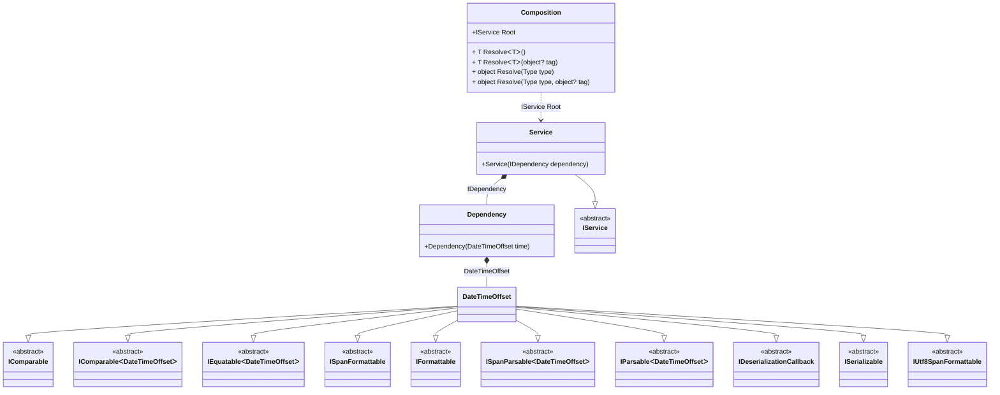

#### Factory

[](../tests/Pure.DI.UsageTests/Basics/FactoryScenario.cs)

This example demonstrates how to create and initialize an instance manually. This approach is more expensive to maintain, but allows you to create objects more flexibly by passing them some state and introducing dependencies. As in the case of automatic dependency embedding, objects give up control on embedding, and the whole process takes place when the object graph is created.

```c#
interface IDependency
{
    DateTimeOffset Time { get; }

    bool IsInitialized { get; }
}

class Dependency(DateTimeOffset time) : IDependency
{
    public DateTimeOffset Time { get; } = time;

    public bool IsInitialized { get; private set; }

    public void Initialize() => IsInitialized = true;
}

interface IService
{
    IDependency Dependency { get; }
}

class Service(IDependency dependency) : IService
{
    public IDependency Dependency { get; } = dependency;
}

DI.Setup(nameof(Composition))
    .Bind().To(_ => DateTimeOffset.Now)
    .Bind<IDependency>().To(ctx =>
    {
        ctx.Inject(out Dependency dependency);
        dependency.Initialize();
        return dependency;
    })
    .Bind<IService>().To<Service>()

    // Composition root
    .Root<IService>("Root");

var composition = new Composition();
var service = composition.Root;
service.Dependency.IsInitialized.ShouldBeTrue();
```

<details open>
<summary>Class Diagram</summary>



</details>

<details>
<summary>Pure.DI-generated partial class Composition</summary><blockquote>

```c#
partial class Composition
{
  private readonly Composition _rootM04D03di;
  
  public Composition()
  {
    _rootM04D03di = this;
  }
  
  internal Composition(Composition baseComposition)
  {
    _rootM04D03di = baseComposition._rootM04D03di;
  }
  
  public Pure.DI.UsageTests.Basics.FactoryScenario.IService Root
  {
    get
    {
      System.DateTimeOffset transientM04D03di3_DateTimeOffset = DateTimeOffset.Now;
      Pure.DI.UsageTests.Basics.FactoryScenario.Dependency transientM04D03di1_Dependency;
      {
          var dependency_M04D03di1 = new Pure.DI.UsageTests.Basics.FactoryScenario.Dependency(transientM04D03di3_DateTimeOffset);
          dependency_M04D03di1.Initialize();
          transientM04D03di1_Dependency = dependency_M04D03di1;
      }
      return new Pure.DI.UsageTests.Basics.FactoryScenario.Service(transientM04D03di1_Dependency);
    }
  }
  
  public T Resolve<T>()
  {
    return ResolverM04D03di<T>.Value.Resolve(this);
  }
  
  public T Resolve<T>(object? tag)
  {
    return ResolverM04D03di<T>.Value.ResolveByTag(this, tag);
  }
  
  public object Resolve(global::System.Type type)
  {
    var index = (int)(_bucketSizeM04D03di * ((uint)global::System.Runtime.CompilerServices.RuntimeHelpers.GetHashCode(type) % 1));
    var finish = index + _bucketSizeM04D03di;
    do {
      ref var pair = ref _bucketsM04D03di[index];
      if (pair.Key == type)
      {
        return pair.Value.Resolve(this);
      }
    } while (++index < finish);
    
    throw new global::System.InvalidOperationException($"Cannot resolve composition root of type {type}.");
  }
  
  public object Resolve(global::System.Type type, object? tag)
  {
    var index = (int)(_bucketSizeM04D03di * ((uint)global::System.Runtime.CompilerServices.RuntimeHelpers.GetHashCode(type) % 1));
    var finish = index + _bucketSizeM04D03di;
    do {
      ref var pair = ref _bucketsM04D03di[index];
      if (pair.Key == type)
      {
        return pair.Value.ResolveByTag(this, tag);
      }
    } while (++index < finish);
    
    throw new global::System.InvalidOperationException($"Cannot resolve composition root \"{tag}\" of type {type}.");
  }
  
  public override string ToString()
  {
    return
      "classDiagram\n" +
        "  class Composition {\n" +
          "    +IService Root\n" +
          "    + T ResolveᐸTᐳ()\n" +
          "    + T ResolveᐸTᐳ(object? tag)\n" +
          "    + object Resolve(Type type)\n" +
          "    + object Resolve(Type type, object? tag)\n" +
        "  }\n" +
        "  class Dependency {\n" +
          "    +Dependency(DateTimeOffset time)\n" +
        "  }\n" +
        "  DateTimeOffset --|> IComparable : \n" +
        "  DateTimeOffset --|> IComparableᐸDateTimeOffsetᐳ : \n" +
        "  DateTimeOffset --|> IEquatableᐸDateTimeOffsetᐳ : \n" +
        "  DateTimeOffset --|> ISpanFormattable : \n" +
        "  DateTimeOffset --|> IFormattable : \n" +
        "  DateTimeOffset --|> ISpanParsableᐸDateTimeOffsetᐳ : \n" +
        "  DateTimeOffset --|> IParsableᐸDateTimeOffsetᐳ : \n" +
        "  DateTimeOffset --|> IDeserializationCallback : \n" +
        "  DateTimeOffset --|> ISerializable : \n" +
        "  DateTimeOffset --|> IUtf8SpanFormattable : \n" +
        "  class DateTimeOffset\n" +
        "  Service --|> IService : \n" +
        "  class Service {\n" +
          "    +Service(IDependency dependency)\n" +
        "  }\n" +
        "  class IComparable {\n" +
          "    <<abstract>>\n" +
        "  }\n" +
        "  class IComparableᐸDateTimeOffsetᐳ {\n" +
          "    <<abstract>>\n" +
        "  }\n" +
        "  class IEquatableᐸDateTimeOffsetᐳ {\n" +
          "    <<abstract>>\n" +
        "  }\n" +
        "  class ISpanFormattable {\n" +
          "    <<abstract>>\n" +
        "  }\n" +
        "  class IFormattable {\n" +
          "    <<abstract>>\n" +
        "  }\n" +
        "  class ISpanParsableᐸDateTimeOffsetᐳ {\n" +
          "    <<abstract>>\n" +
        "  }\n" +
        "  class IParsableᐸDateTimeOffsetᐳ {\n" +
          "    <<abstract>>\n" +
        "  }\n" +
        "  class IDeserializationCallback {\n" +
          "    <<abstract>>\n" +
        "  }\n" +
        "  class ISerializable {\n" +
          "    <<abstract>>\n" +
        "  }\n" +
        "  class IUtf8SpanFormattable {\n" +
          "    <<abstract>>\n" +
        "  }\n" +
        "  class IService {\n" +
          "    <<abstract>>\n" +
        "  }\n" +
        "  Dependency *--  DateTimeOffset : DateTimeOffset\n" +
        "  Service *--  Dependency : IDependency\n" +
        "  Composition ..> Service : IService Root";
  }
  
  private readonly static int _bucketSizeM04D03di;
  private readonly static global::Pure.DI.Pair<global::System.Type, global::Pure.DI.IResolver<Composition, object>>[] _bucketsM04D03di;
  
  static Composition()
  {
    var valResolverM04D03di_0000 = new ResolverM04D03di_0000();
    ResolverM04D03di<Pure.DI.UsageTests.Basics.FactoryScenario.IService>.Value = valResolverM04D03di_0000;
    _bucketsM04D03di = global::Pure.DI.Buckets<global::System.Type, global::Pure.DI.IResolver<Composition, object>>.Create(
      1,
      out _bucketSizeM04D03di,
      new global::Pure.DI.Pair<global::System.Type, global::Pure.DI.IResolver<Composition, object>>[1]
      {
         new global::Pure.DI.Pair<global::System.Type, global::Pure.DI.IResolver<Composition, object>>(typeof(Pure.DI.UsageTests.Basics.FactoryScenario.IService), valResolverM04D03di_0000)
      });
  }
  
  private sealed class ResolverM04D03di<T>: global::Pure.DI.IResolver<Composition, T>
  {
    public static global::Pure.DI.IResolver<Composition, T> Value = new ResolverM04D03di<T>();
    
    public T Resolve(Composition composite)
    {
      throw new global::System.InvalidOperationException($"Cannot resolve composition root of type {typeof(T)}.");
    }
    
    public T ResolveByTag(Composition composite, object tag)
    {
      throw new global::System.InvalidOperationException($"Cannot resolve composition root \"{tag}\" of type {typeof(T)}.");
    }
  }
  
  private sealed class ResolverM04D03di_0000: global::Pure.DI.IResolver<Composition, Pure.DI.UsageTests.Basics.FactoryScenario.IService>
  {
    public Pure.DI.UsageTests.Basics.FactoryScenario.IService Resolve(Composition composition)
    {
      return composition.Root;
    }
    
    public Pure.DI.UsageTests.Basics.FactoryScenario.IService ResolveByTag(Composition composition, object tag)
    {
      switch (tag)
      {
        case null:
          return composition.Root;
      }
      throw new global::System.InvalidOperationException($"Cannot resolve composition root \"{tag}\" of type Pure.DI.UsageTests.Basics.FactoryScenario.IService.");
    }
  }
}
```

</blockquote></details>

