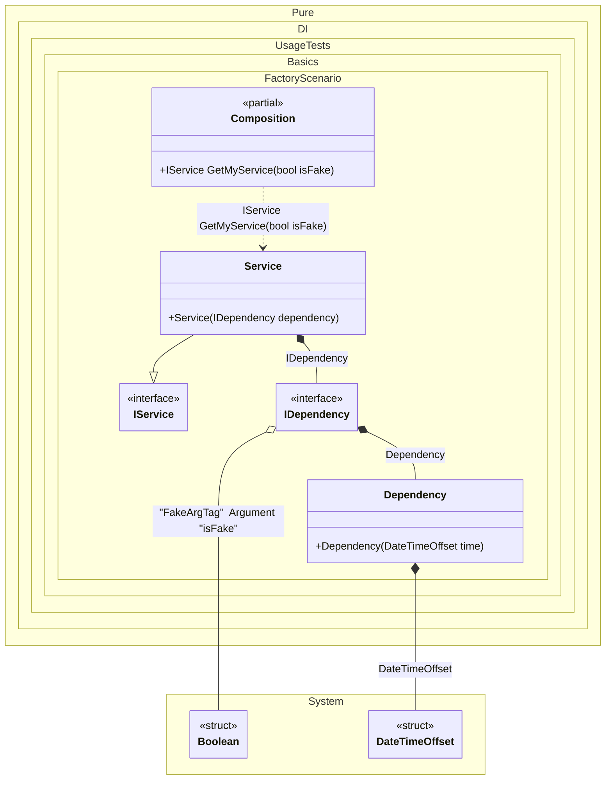

#### Factory

[](../tests/Pure.DI.UsageTests/Basics/FactoryScenario.cs)

This example demonstrates how to create and initialize an instance manually.
At the compilation stage, the set of dependencies that an object needs in order to be created is determined. In most cases, this happens automatically according to the set of constructors and their arguments and does not require any additional customization efforts. But sometimes it is necessary to manually create an object, as in lines of code:


```c#
using Shouldly;
using Pure.DI;

DI.Setup(nameof(Composition))
    .Bind().To(_ => DateTimeOffset.Now)
    .RootArg<bool>("isFake", "FakeArgTag")
    .Bind<IDependency>().To<IDependency>(ctx =>
    {
        // When building a composition of objects,
        // all of this code will be outside the lambda function.

        // Some custom logic for creating an instance.
        // For example, here's how you can inject and initialize
        // an instance of a particular type:

        ctx.Inject<bool>("FakeArgTag", out var isFake);
        if (isFake)
        {
            return new FakeDependency();
        }

        ctx.Inject(out Dependency dependency);
        dependency.Initialize();
        return dependency;

    })
    .Bind<IService>().To<Service>()

    // Composition root
    .Root<IService>("GetMyService");

var composition = new Composition();

var service = composition.GetMyService(isFake: false);
service.Dependency.ShouldBeOfType<Dependency>();
service.Dependency.IsInitialized.ShouldBeTrue();
        
var serviceWithFakeDependency = composition.GetMyService(isFake: true);
serviceWithFakeDependency.Dependency.ShouldBeOfType<FakeDependency>();

interface IDependency
{
    DateTimeOffset Time { get; }

    bool IsInitialized { get; }
}

class Dependency(DateTimeOffset time) : IDependency
{
    public DateTimeOffset Time { get; } = time;

    public bool IsInitialized { get; private set; }

    public void Initialize() => IsInitialized = true;
}

class FakeDependency : IDependency
{
    public DateTimeOffset Time => DateTimeOffset.MinValue;

    public bool IsInitialized => true;
}

interface IService
{
    IDependency Dependency { get; }
}

class Service(IDependency dependency) : IService
{
    public IDependency Dependency { get; } = dependency;
}
```

<details>
<summary>Running this code sample locally</summary>

- Make sure you have the [.NET SDK 9.0](https://dotnet.microsoft.com/en-us/download/dotnet/9.0) or later is installed
- Create a net9.0 (or later) console application
- Add references to NuGet packages
  - [Pure.DI](https://www.nuget.org/packages/Pure.DI)
  - [Shouldly](https://www.nuget.org/packages/Shouldly)
- Copy the example code into the _Program.cs_ file

You are ready to run the example!

</details>

This approach is more expensive to maintain, but allows you to create objects more flexibly by passing them some state and introducing dependencies. As in the case of automatic dependency injecting, objects give up control on embedding, and the whole process takes place when the object graph is created.
> [!IMPORTANT]
> The method `Inject()`cannot be used outside of the binding setup.


Class diagram:



