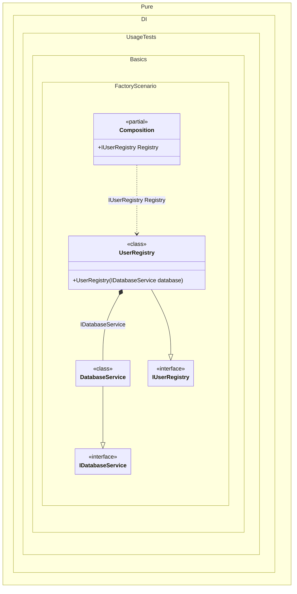

#### Factory

Demonstrates how to use factories for manual creation and initialization when constructor injection alone is not enough.
Use factory bindings for custom setup, external APIs, or controlled object state during creation.


```c#
using Shouldly;
using Pure.DI;

DI.Setup(nameof(Composition))
    .Bind<IDatabaseService>().To<DatabaseService>(ctx => {
        // Some logic for creating an instance.
        // For example, we need to manually initialize the connection.
        ctx.Inject(out DatabaseService service);
        service.Connect();
        return service;
    })
    .Bind<IUserRegistry>().To<UserRegistry>()

    // Composition root
    .Root<IUserRegistry>("Registry");

var composition = new Composition();
var registry = composition.Registry;
registry.Database.IsConnected.ShouldBeTrue();

interface IDatabaseService
{
    bool IsConnected { get; }
}

class DatabaseService : IDatabaseService
{
    public bool IsConnected { get; private set; }

    // Simulates a connection establishment that must be called explicitly
    public void Connect() => IsConnected = true;
}

interface IUserRegistry
{
    IDatabaseService Database { get; }
}

class UserRegistry(IDatabaseService database) : IUserRegistry
{
    public IDatabaseService Database { get; } = database;
}
```

<details>
<summary>Running this code sample locally</summary>

- Make sure you have the [.NET SDK 10.0](https://dotnet.microsoft.com/en-us/download/dotnet/10.0) or later installed
```bash
dotnet --list-sdk
```
- Create a net10.0 (or later) console application
```bash
dotnet new console -n Sample
```
- Add references to the NuGet packages
  - [Pure.DI](https://www.nuget.org/packages/Pure.DI)
  - [Shouldly](https://www.nuget.org/packages/Shouldly)
```bash
dotnet add package Pure.DI
dotnet add package Shouldly
```
- Copy the example code into the _Program.cs_ file

You are ready to run the example 🚀
```bash
dotnet run
```

</details>

There are scenarios where manual control over the creation process is required, such as
- When additional initialization logic is needed
- When complex construction steps are required
- When specific object states need to be set during creation

>[!IMPORTANT]
>The method `Inject()` cannot be used outside of the binding setup.
Limitations: factory bindings introduce custom construction logic that must be maintained and tested.
Common pitfalls:
- Moving business decisions into DI factory code.
- Overusing `Inject()` where normal constructor binding is enough.
See also: [Simplified factory](simplified-factory.md), [Injection on demand](injection-on-demand.md).

The following partial class will be generated:

```c#
partial class Composition
{
  public IUserRegistry Registry
  {
    [MethodImpl(MethodImplOptions.AggressiveInlining)]
    get
    {
      DatabaseService transientDatabaseService291;
      // Some logic for creating an instance.
      // For example, we need to manually initialize the connection.
      DatabaseService localService3 = new DatabaseService();
      localService3.Connect();
      transientDatabaseService291 = localService3;
      return new UserRegistry(transientDatabaseService291);
    }
  }
}
```

Class diagram:


```mermaid
---
 config:
  maxTextSize: 2147483647
  maxEdges: 2147483647
  class:
   hideEmptyMembersBox: true
---
classDiagram
	DatabaseService --|> IDatabaseService
	UserRegistry --|> IUserRegistry
	Composition ..> UserRegistry : IUserRegistry Registry
	UserRegistry *--  DatabaseService : IDatabaseService
	namespace Pure.DI.UsageTests.Basics.FactoryScenario {
		class Composition {
		<<partial>>
		+IUserRegistry Registry
		}
		class DatabaseService {
				<<class>>
		}
		class IDatabaseService {
			<<interface>>
		}
		class IUserRegistry {
			<<interface>>
		}
		class UserRegistry {
				<<class>>
			+UserRegistry(IDatabaseService database)
		}
	}
```

