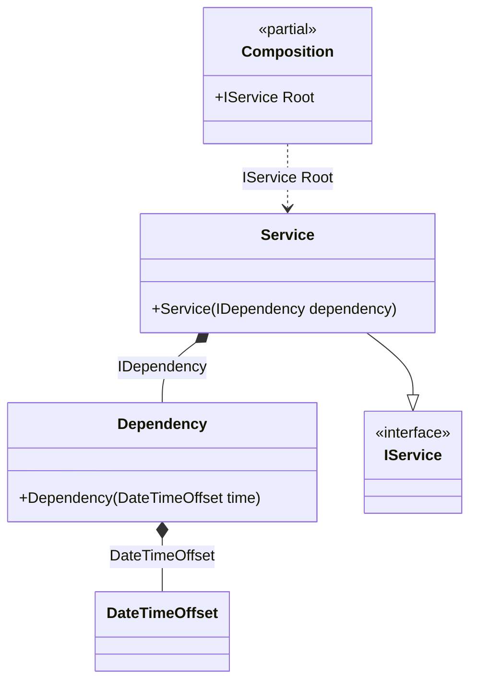

#### Factory

[](../tests/Pure.DI.UsageTests/Basics/FactoryScenario.cs)

This example demonstrates how to create and initialize an instance manually. This approach is more expensive to maintain, but allows you to create objects more flexibly by passing them some state and introducing dependencies. As in the case of automatic dependency embedding, objects give up control on embedding, and the whole process takes place when the object graph is created.


```c#
interface IDependency
{
    DateTimeOffset Time { get; }

    bool IsInitialized { get; }
}

class Dependency(DateTimeOffset time) : IDependency
{
    public DateTimeOffset Time { get; } = time;

    public bool IsInitialized { get; private set; }

    public void Initialize() => IsInitialized = true;
}

interface IService
{
    IDependency Dependency { get; }
}

class Service(IDependency dependency) : IService
{
    public IDependency Dependency { get; } = dependency;
}

DI.Setup(nameof(Composition))
    .Bind().To(_ => DateTimeOffset.Now)
    .Bind<IDependency>().To(ctx =>
    {
        // When building a composition of objects,
        // all of this code will be outside the lambda function:

        // Some custom logic for creating an instance.
        // For example, here's how you can inject
        // an instance of a particular type
        ctx.Inject(out Dependency dependency);

        // And do something about it.
        dependency.Initialize();

        // And at the end return an instance
        return dependency;
    })
    .Bind<IService>().To<Service>()

    // Composition root
    .Root<IService>("Root");

var composition = new Composition();
var service = composition.Root;
service.Dependency.IsInitialized.ShouldBeTrue();
```

The following partial class will be generated:

```c#
partial class Composition
{
  private readonly Composition _root;

  public Composition()
  {
    _root = this;
  }

  internal Composition(Composition parentScope)
  {
    _root = (parentScope ?? throw new ArgumentNullException(nameof(parentScope)))._root;
  }

  public IService Root
  {
    [MethodImpl(MethodImplOptions.AggressiveInlining)]
    get
    {
      DateTimeOffset transient3_DateTimeOffset = DateTimeOffset.Now;
      Dependency transient1_Dependency;
      {
          var dependency_0 = new Dependency(transient3_DateTimeOffset);
          dependency_0.Initialize();
          transient1_Dependency = dependency_0;
      }
      return new Service(transient1_Dependency);
    }
  }
}
```

Class diagram:



