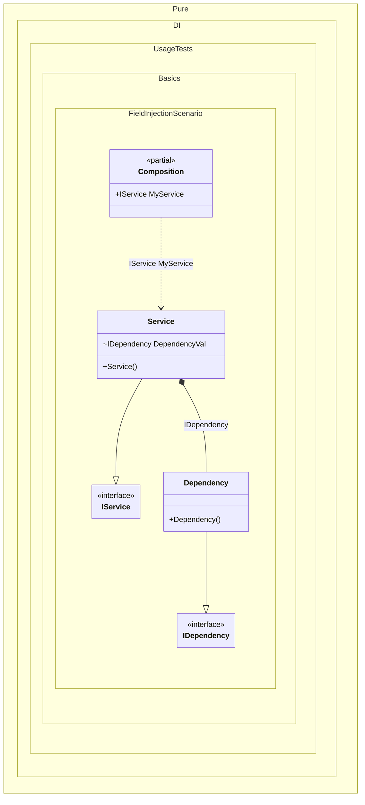

#### Field injection

[](../tests/Pure.DI.UsageTests/Basics/FieldInjectionScenario.cs)

To use dependency injection for a field, make sure the field is writable and simply add the _Ordinal_ attribute to that field, specifying an ordinal that will be used to determine the injection order:


```c#
using Shouldly;
using Pure.DI;

DI.Setup(nameof(Composition))
    .Bind<IDependency>().To<Dependency>()
    .Bind<IService>().To<Service>()

    // Composition root
    .Root<IService>("MyService");

var composition = new Composition();
var service = composition.MyService;
service.Dependency.ShouldBeOfType<Dependency>();

interface IDependency;

class Dependency : IDependency;

interface IService
{
    IDependency? Dependency { get; }
}

class Service : IService
{
    // The Ordinal attribute specifies to perform an injection,
    // the integer value in the argument specifies
    // the ordinal of injection
    [Ordinal(0)] internal IDependency? DependencyVal;

    public IDependency? Dependency => DependencyVal;
}
```

<details>
<summary>Running this code sample locally</summary>

- Make sure you have the [.NET SDK 9.0](https://dotnet.microsoft.com/en-us/download/dotnet/9.0) or later is installed
- Create a net9.0 (or later) console application
- Add references to NuGet packages
  - [Pure.DI](https://www.nuget.org/packages/Pure.DI)
  - [Shouldly](https://www.nuget.org/packages/Shouldly)
- Copy the example code into the _Program.cs_ file

You are ready to run the example!

</details>


Class diagram:



