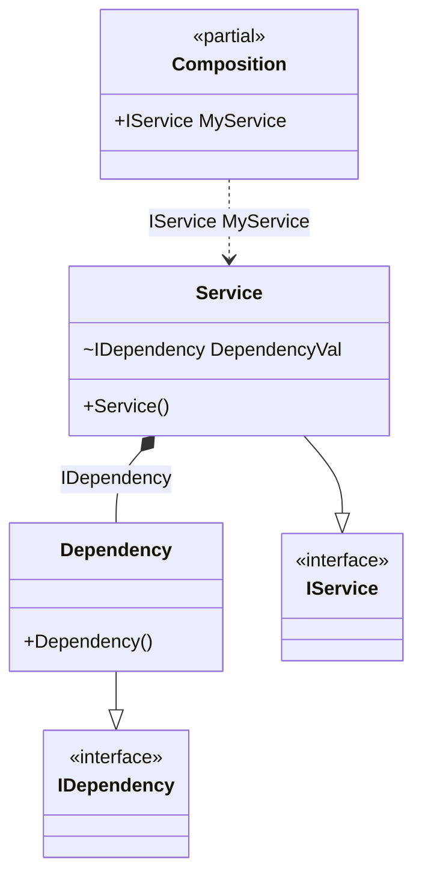

#### Field injection

[](../tests/Pure.DI.UsageTests/Basics/FieldInjectionScenario.cs)

To use dependency injection for a field, make sure the field is writable and simply add the _Ordinal_ attribute to that field, specifying an ordinal that will be used to determine the injection order:


```c#
interface IDependency;

class Dependency : IDependency;

interface IService
{
    IDependency? Dependency { get; }
}

class Service : IService
{
    // The Ordinal attribute specifies to perform an injection,
    // the integer value in the argument specifies
    // the ordinal of injection
    [Ordinal(0)]
    internal IDependency? DependencyVal;

    public IDependency? Dependency => DependencyVal;
}

DI.Setup(nameof(Composition))
    .Bind<IDependency>().To<Dependency>()
    .Bind<IService>().To<Service>()

    // Composition root
    .Root<IService>("MyService");

var composition = new Composition();
var service = composition.MyService;
service.Dependency.ShouldBeOfType<Dependency>();
```

The following partial class will be generated:

```c#
partial class Composition
{
  private readonly Composition _root;

  public Composition()
  {
    _root = this;
  }

  internal Composition(Composition parentScope)
  {
    _root = (parentScope ?? throw new ArgumentNullException(nameof(parentScope)))._root;
  }

  public IService MyService
  {
    [MethodImpl(MethodImplOptions.AggressiveInlining)]
    get
    {
      Service transientService0 = new Service();
      transientService0.DependencyVal = new Dependency();
      return transientService0;
    }
  }
}
```

Class diagram:



