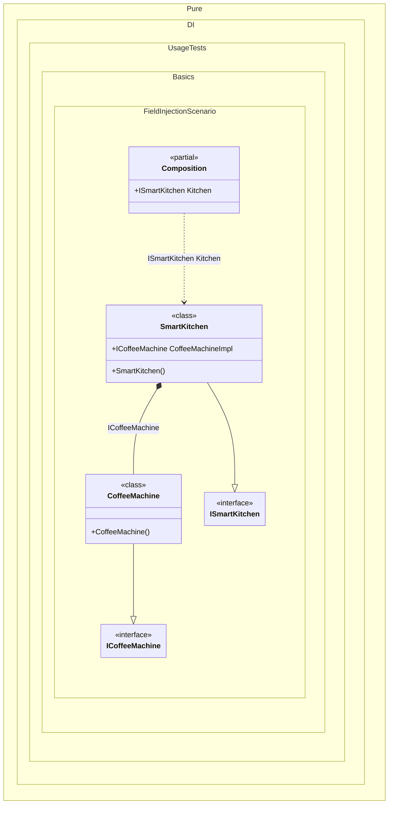

#### Field injection

To use dependency injection for a field, make sure the field is writable and simply add the _Ordinal_ attribute to that field, specifying an ordinal that will be used to determine the injection order:


```c#
using Shouldly;
using Pure.DI;

DI.Setup(nameof(Composition))
    .Bind<ICoffeeMachine>().To<CoffeeMachine>()
    .Bind<ISmartKitchen>().To<SmartKitchen>()

    // Composition root
    .Root<ISmartKitchen>("Kitchen");

var composition = new Composition();
var kitchen = composition.Kitchen;
kitchen.CoffeeMachine.ShouldBeOfType<CoffeeMachine>();

interface ICoffeeMachine;

class CoffeeMachine : ICoffeeMachine;

interface ISmartKitchen
{
    ICoffeeMachine? CoffeeMachine { get; }
}

class SmartKitchen : ISmartKitchen
{
    // The Dependency attribute specifies to perform an injection.
    // The container will automatically assign a value to this field
    // when creating the SmartKitchen instance.
    [Dependency]
    public ICoffeeMachine? CoffeeMachineImpl;

    // Expose the injected dependency through a public property
    public ICoffeeMachine? CoffeeMachine => CoffeeMachineImpl;
}
```

<details>
<summary>Running this code sample locally</summary>

- Make sure you have the [.NET SDK 10.0](https://dotnet.microsoft.com/en-us/download/dotnet/10.0) or later is installed
```bash
dotnet --list-sdk
```
- Create a net10.0 (or later) console application
```bash
dotnet new console -n Sample
```
- Add references to NuGet packages
  - [Pure.DI](https://www.nuget.org/packages/Pure.DI)
  - [Shouldly](https://www.nuget.org/packages/Shouldly)
```bash
dotnet add package Pure.DI
dotnet add package Shouldly
```
- Copy the example code into the _Program.cs_ file

You are ready to run the example 🚀
```bash
dotnet run
```

</details>

The key points are:
- The field must be writable
- The `Dependency` (or `Ordinal`) attribute is used to mark the field for injection
- The container automatically injects the dependency when resolving the object graph

The following partial class will be generated:

```c#
partial class Composition
{
  [OrdinalAttribute(256)]
  public Composition()
  {
  }

  internal Composition(Composition parentScope)
  {
  }

  public ISmartKitchen Kitchen
  {
    [MethodImpl(MethodImplOptions.AggressiveInlining)]
    get
    {
      var transientSmartKitchen = new SmartKitchen();
      transientSmartKitchen.CoffeeMachineImpl = new CoffeeMachine();
      return transientSmartKitchen;
    }
  }
}
```

Class diagram:



