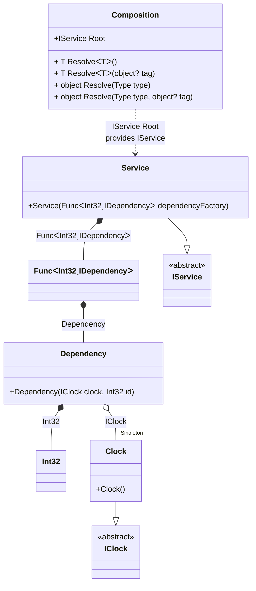

#### Func with arguments

[](../tests/Pure.DI.UsageTests/BaseClassLibrary/FuncWithArgumentsScenario.cs)

```c#
interface IClock
{
    DateTimeOffset Now { get; }
}

class Clock : IClock
{
    public DateTimeOffset Now => DateTimeOffset.Now;
}

interface IDependency
{
    int Id { get; }
}

class Dependency(IClock clock, int id) : IDependency
{
    public int Id => id;
}

interface IService
{
    ImmutableArray<IDependency> Dependencies { get; }
}

class Service : IService
{
    public Service(Func<int, IDependency> dependencyFactory) =>
        Dependencies = Enumerable
            .Range(0, 10)
            .Select((_, index) => dependencyFactory(index))
            .ToImmutableArray();

    public ImmutableArray<IDependency> Dependencies { get; }
}

DI.Setup(nameof(Composition))
    .Bind<IClock>().As(Lifetime.Singleton).To<Clock>()
    // Binds a dependency of type int
    // to the source code statement "dependencyId"
    .Bind<int>().To<int>("dependencyId")
    .Bind<Func<int, IDependency>>()
        .To<Func<int, IDependency>>(ctx =>
            dependencyId =>
            {
                // Builds up an instance of type Dependency
                // referring the source code statement "dependencyId"
                ctx.Inject<Dependency>(out var dependency);
                return dependency;
            })
    .Bind<IService>().To<Service>().Root<IService>("Root");

var composition = new Composition();
var service = composition.Root;
service.Dependencies.Length.ShouldBe(10);
service.Dependencies[3].Id.ShouldBe(3);
```

<details open>
<summary>Class Diagram</summary>



</details>

<details>
<summary>Pure.DI-generated partial class Composition</summary><blockquote>

```c#
/// <para>
/// <b>Composition roots</b><br/>
/// <list type="table">
/// <listheader>
/// <term>Root</term>
/// <description>Description</description>
/// </listheader>
/// <item>
/// <term>
/// <see cref="Pure.DI.UsageTests.BCL.FuncWithArgumentsScenario.IService"/> <see cref="Root"/><br/>or using <see cref="Resolve{T}()"/> method: <c>Resolve&lt;Pure.DI.UsageTests.BCL.FuncWithArgumentsScenario.IService&gt;()</c>
/// </term>
/// <description>
/// Provides a composition root of type <see cref="Pure.DI.UsageTests.BCL.FuncWithArgumentsScenario.Service"/>.
/// </description>
/// </item>
/// </list>
/// </para>
/// </summary>
/// <example>
/// This shows how to get an instance of type <see cref="Pure.DI.UsageTests.BCL.FuncWithArgumentsScenario.Service"/> using the composition root <see cref="Root"/>:
/// <code>
/// var composition = new Composition();
/// var instance = composition.Root;
/// </code>
/// </example>
/// <a href="https://mermaid.live/view#pako:eNqdVEFuwjAQ_Irlc6UiOKTlBkmRcgWOvhhnRV0SO3IMEkK8ofyll_6hr-AndeyEmBBC1cvKXu_O7M6ufMBMJoDHmKW0KCJO14pmRBFh7yiUWS4LrrkUiGwHg2BavpWn4TRegNpxBmgupW7caInmUMh0B-fT9_J8-rLuF2tfH4bJ1QcwXZ5HM6Tp-ibNBdS5Lmm5zwFpY_4RHaJ-yiBq1IggB5GAYPsbMZonRxKHqWQbxEpb8cRCj4aIJ_fxbURznW0FM-JY789n3FCUapkoR2HhosYGoW3lDVUl2NsEeTO9uP0GrLdrVK7Aetb32fyIKz7_wWes_I6zr1eUXG4zyrRU-x4Ju7obuSJDuiq0Mgiu5Mp2gXSX_HcYb1GkrxhCBC-4WKegpSDYG4VRzJXeSrd5k2sMt0h1Vr0zvQp2wbRYDJa3xO2Rt3Ifkhm0h-vb-luGVkpnzUK19un6t7FzWCny7IJzJXc8gWZyJT5-whmojPLEfG8HgvU7ZEDwmOCEqg3BR3z8BSsnupA">Class diagram</a><br/>
/// This class was created by <a href="https://github.com/DevTeam/Pure.DI">Pure.DI</a> source code generator.
/// <seealso cref="Pure.DI.DI.Setup"/>
/// <seealso cref="Pure.DI.IConfiguration.Bind(object[])"/>
/// <seealso cref="Pure.DI.IConfiguration.Bind{T}(object[])"/>
[global::System.Diagnostics.CodeAnalysis.ExcludeFromCodeCoverage]
partial class Composition
{
  private readonly Composition _rootM03D14di;
  private readonly object _lockM03D14di;
  private Pure.DI.UsageTests.BCL.FuncWithArgumentsScenario.Clock _singletonM03D14di34_Clock;
  
  /// <summary>
  /// This constructor creates a new instance of <see cref="Composition"/>.
  /// </summary>
  public Composition()
  {
    _rootM03D14di = this;
    _lockM03D14di = new object();
  }
  
  /// <summary>
  /// This constructor creates a new instance of <see cref="Composition"/> scope based on <paramref name="baseComposition"/>. This allows the <see cref="Lifetime.Scoped"/> life time to be applied.
  /// </summary>
  /// <param name="baseComposition">Base composition.</param>
  internal Composition(Composition baseComposition)
  {
    _rootM03D14di = baseComposition._rootM03D14di;
    _lockM03D14di = _rootM03D14di._lockM03D14di;
  }
  
  #region Composition Roots
  /// <summary>
  /// Provides a composition root of type <see cref="Pure.DI.UsageTests.BCL.FuncWithArgumentsScenario.Service"/>.
  /// </summary>
  /// <example>
  /// This shows how to get an instance of type <see cref="Pure.DI.UsageTests.BCL.FuncWithArgumentsScenario.Service"/>:
  /// <code>
  /// var composition = new Composition();
  /// var instance = composition.Root;
  /// </code>
  /// </example>
  public Pure.DI.UsageTests.BCL.FuncWithArgumentsScenario.IService Root
  {
    #if NETSTANDARD2_0_OR_GREATER || NETCOREAPP || NET40_OR_GREATER || NET
    [global::System.Diagnostics.Contracts.Pure]
    #endif
    get
    {
      System.Func<int, Pure.DI.UsageTests.BCL.FuncWithArgumentsScenario.IDependency> transientM03D14di1_Func = dependencyId =>
      {
          int transientM03D14di3_Int32 = dependencyId;
          if (ReferenceEquals(_rootM03D14di._singletonM03D14di34_Clock, null))
          {
              lock (_lockM03D14di)
              {
                  if (ReferenceEquals(_rootM03D14di._singletonM03D14di34_Clock, null))
                  {
                      _singletonM03D14di34_Clock = new Pure.DI.UsageTests.BCL.FuncWithArgumentsScenario.Clock();
                      _rootM03D14di._singletonM03D14di34_Clock = _singletonM03D14di34_Clock;
                  }
              }
          }
          var dependency_M03D14di1 = new Pure.DI.UsageTests.BCL.FuncWithArgumentsScenario.Dependency(_rootM03D14di._singletonM03D14di34_Clock, transientM03D14di3_Int32);
          return dependency_M03D14di1;
      };
      return new Pure.DI.UsageTests.BCL.FuncWithArgumentsScenario.Service(transientM03D14di1_Func);
    }
  }
  #endregion
  
  #region API
  /// <summary>
  /// Resolves the composition root.
  /// </summary>
  /// <typeparam name="T">The type of the composition root.</typeparam>
  /// <returns>A composition root.</returns>
  #if NETSTANDARD2_0_OR_GREATER || NETCOREAPP || NET40_OR_GREATER || NET
  [global::System.Diagnostics.Contracts.Pure]
  #endif
  public T Resolve<T>()
  {
    return ResolverM03D14di<T>.Value.Resolve(this);
  }
  
  /// <summary>
  /// Resolves the composition root by tag.
  /// </summary>
  /// <typeparam name="T">The type of the composition root.</typeparam>
  /// <param name="tag">The tag of a composition root.</param>
  /// <returns>A composition root.</returns>
  #if NETSTANDARD2_0_OR_GREATER || NETCOREAPP || NET40_OR_GREATER || NET
  [global::System.Diagnostics.Contracts.Pure]
  #endif
  public T Resolve<T>(object? tag)
  {
    return ResolverM03D14di<T>.Value.ResolveByTag(this, tag);
  }
  
  /// <summary>
  /// Resolves the composition root.
  /// </summary>
  /// <param name="type">The type of the composition root.</param>
  /// <returns>A composition root.</returns>
  #if NETSTANDARD2_0_OR_GREATER || NETCOREAPP || NET40_OR_GREATER || NET
  [global::System.Diagnostics.Contracts.Pure]
  #endif
  public object Resolve(global::System.Type type)
  {
    var index = (int)(_bucketSizeM03D14di * ((uint)global::System.Runtime.CompilerServices.RuntimeHelpers.GetHashCode(type) % 1));
    var finish = index + _bucketSizeM03D14di;
    do {
      ref var pair = ref _bucketsM03D14di[index];
      if (ReferenceEquals(pair.Key, type))
      {
        return pair.Value.Resolve(this);
      }
    } while (++index < finish);
    
    throw new global::System.InvalidOperationException($"Cannot resolve composition root of type {type}.");
  }
  
  /// <summary>
  /// Resolves the composition root by tag.
  /// </summary>
  /// <param name="type">The type of the composition root.</param>
  /// <param name="tag">The tag of a composition root.</param>
  /// <returns>A composition root.</returns>
  #if NETSTANDARD2_0_OR_GREATER || NETCOREAPP || NET40_OR_GREATER || NET
  [global::System.Diagnostics.Contracts.Pure]
  #endif
  public object Resolve(global::System.Type type, object? tag)
  {
    var index = (int)(_bucketSizeM03D14di * ((uint)global::System.Runtime.CompilerServices.RuntimeHelpers.GetHashCode(type) % 1));
    var finish = index + _bucketSizeM03D14di;
    do {
      ref var pair = ref _bucketsM03D14di[index];
      if (ReferenceEquals(pair.Key, type))
      {
        return pair.Value.ResolveByTag(this, tag);
      }
    } while (++index < finish);
    
    throw new global::System.InvalidOperationException($"Cannot resolve composition root \"{tag}\" of type {type}.");
  }
  #endregion
  
  /// <summary>
  /// This method provides a class diagram in mermaid format. To see this diagram, simply call the method and copy the text to this site https://mermaid.live/.
  /// </summary>
  public override string ToString()
  {
    return
      "classDiagram\n" +
        "  class Composition {\n" +
          "    +IService Root\n" +
          "    + T ResolveᐸTᐳ()\n" +
          "    + T ResolveᐸTᐳ(object? tag)\n" +
          "    + object Resolve(Type type)\n" +
          "    + object Resolve(Type type, object? tag)\n" +
        "  }\n" +
        "  class Dependency {\n" +
          "    +Dependency(IClock clock, Int32 id)\n" +
        "  }\n" +
        "  class Int32\n" +
        "  class FuncᐸInt32ˏIDependencyᐳ\n" +
        "  Clock --|> IClock : \n" +
        "  class Clock {\n" +
          "    +Clock()\n" +
        "  }\n" +
        "  Service --|> IService : \n" +
        "  class Service {\n" +
          "    +Service(FuncᐸInt32ˏIDependencyᐳ dependencyFactory)\n" +
        "  }\n" +
        "  class IClock {\n" +
          "    <<abstract>>\n" +
        "  }\n" +
        "  class IService {\n" +
          "    <<abstract>>\n" +
        "  }\n" +
        "  Dependency o--  \"Singleton\" Clock : IClock\n" +
        "  Dependency *--  Int32 : Int32\n" +
        "  FuncᐸInt32ˏIDependencyᐳ *--  Dependency : Dependency\n" +
        "  Service *--  FuncᐸInt32ˏIDependencyᐳ : FuncᐸInt32ˏIDependencyᐳ\n" +
        "  Composition ..> Service : IService Root<br/>provides IService";
  }
  
  private readonly static int _bucketSizeM03D14di;
  private readonly static global::Pure.DI.Pair<global::System.Type, global::Pure.DI.IResolver<Composition, object>>[] _bucketsM03D14di;
  
  static Composition()
  {
    var valResolverM03D14di_0000 = new ResolverM03D14di_0000();
    ResolverM03D14di<Pure.DI.UsageTests.BCL.FuncWithArgumentsScenario.IService>.Value = valResolverM03D14di_0000;
    _bucketsM03D14di = global::Pure.DI.Buckets<global::System.Type, global::Pure.DI.IResolver<Composition, object>>.Create(
      1,
      out _bucketSizeM03D14di,
      new global::Pure.DI.Pair<global::System.Type, global::Pure.DI.IResolver<Composition, object>>[1]
      {
         new global::Pure.DI.Pair<global::System.Type, global::Pure.DI.IResolver<Composition, object>>(typeof(Pure.DI.UsageTests.BCL.FuncWithArgumentsScenario.IService), valResolverM03D14di_0000)
      });
  }
  
  #region Resolvers
  private sealed class ResolverM03D14di<T>: global::Pure.DI.IResolver<Composition, T>
  {
    public static global::Pure.DI.IResolver<Composition, T> Value = new ResolverM03D14di<T>();
    
    public T Resolve(Composition composite)
    {
      throw new global::System.InvalidOperationException($"Cannot resolve composition root of type {typeof(T)}.");
    }
    
    public T ResolveByTag(Composition composite, object tag)
    {
      throw new global::System.InvalidOperationException($"Cannot resolve composition root \"{tag}\" of type {typeof(T)}.");
    }
  }
  
  private sealed class ResolverM03D14di_0000: global::Pure.DI.IResolver<Composition, Pure.DI.UsageTests.BCL.FuncWithArgumentsScenario.IService>
  {
    public Pure.DI.UsageTests.BCL.FuncWithArgumentsScenario.IService Resolve(Composition composition)
    {
      return composition.Root;
    }
    
    public Pure.DI.UsageTests.BCL.FuncWithArgumentsScenario.IService ResolveByTag(Composition composition, object tag)
    {
      switch (tag)
      {
        case null:
          return composition.Root;
      }
      throw new global::System.InvalidOperationException($"Cannot resolve composition root \"{tag}\" of type Pure.DI.UsageTests.BCL.FuncWithArgumentsScenario.IService.");
    }
  }
  #endregion
}
```

</blockquote></details>

