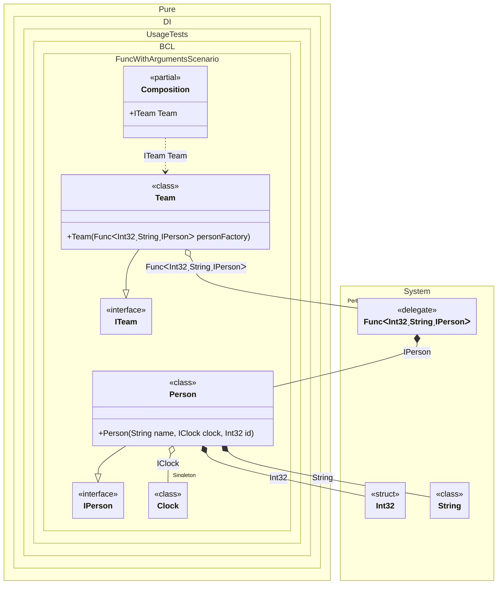

#### Func with arguments


```c#
using Shouldly;
using Pure.DI;
using System.Collections.Immutable;

DI.Setup(nameof(Composition))
    .Bind().As(Lifetime.Singleton).To<Clock>()
    .Bind().To<Person>()
    .Bind().To<Team>()

    // Composition root
    .Root<ITeam>("Team");

var composition = new Composition();
var team = composition.Team;

team.Members.Length.ShouldBe(3);

team.Members[0].Id.ShouldBe(10);
team.Members[0].Name.ShouldBe("Nik");

team.Members[1].Id.ShouldBe(20);
team.Members[1].Name.ShouldBe("Mike");

team.Members[2].Id.ShouldBe(30);
team.Members[2].Name.ShouldBe("Jake");

interface IClock
{
    DateTimeOffset Now { get; }
}

class Clock : IClock
{
    public DateTimeOffset Now => DateTimeOffset.Now;
}

interface IPerson
{
    int Id { get; }

    string Name { get; }
}

class Person(string name, IClock clock, int id)
    : IPerson
{
    public int Id => id;

    public string Name => name;
}

interface ITeam
{
    ImmutableArray<IPerson> Members { get; }
}

class Team(Func<int, string, IPerson> personFactory) : ITeam
{
    public ImmutableArray<IPerson> Members { get; } =
    [
        personFactory(10, "Nik"),
        personFactory(20, "Mike"),
        personFactory(30, "Jake")
    ];
}
```

<details>
<summary>Running this code sample locally</summary>

- Make sure you have the [.NET SDK 10.0](https://dotnet.microsoft.com/en-us/download/dotnet/10.0) or later is installed
```bash
dotnet --list-sdk
```
- Create a net10.0 (or later) console application
```bash
dotnet new console -n Sample
```
- Add references to NuGet packages
  - [Pure.DI](https://www.nuget.org/packages/Pure.DI)
  - [Shouldly](https://www.nuget.org/packages/Shouldly)
```bash
dotnet add package Pure.DI
dotnet add package Shouldly
```
- Copy the example code into the _Program.cs_ file

You are ready to run the example 🚀
```bash
dotnet run
```

</details>

The following partial class will be generated:

```c#
partial class Composition
{
#if NET9_0_OR_GREATER
  private readonly Lock _lock = new Lock();
#else
  private readonly Object _lock = new Object();
#endif

  private Clock? _singletonClock51;

  public ITeam Team
  {
    [MethodImpl(MethodImplOptions.AggressiveInlining)]
    get
    {
      Func<int, string, IPerson> transientFunc1;
      Func<int, string, IPerson> localFactory2 = new Func<int, string, IPerson>((int localArg1, string localArg2) =>
      {
        lock (_lock)
        {
          int overriddenInt32 = localArg1;
          string overriddenString2 = localArg2;
          if (_singletonClock51 is null)
            lock (_lock)
              if (_singletonClock51 is null)
              {
                _singletonClock51 = new Clock();
              }

          IPerson localValue20 = new Person(overriddenString2, _singletonClock51, overriddenInt32);
          return localValue20;
        }
      });
      transientFunc1 = localFactory2;
      return new Team(transientFunc1);
    }
  }
}
```

Class diagram:



