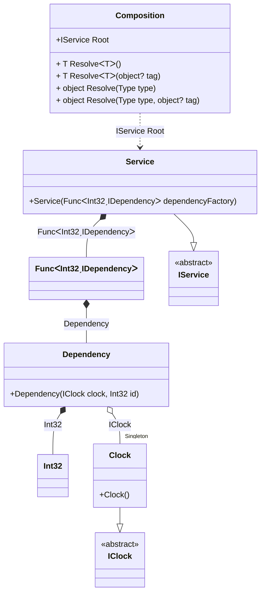

#### Func with arguments

[](../tests/Pure.DI.UsageTests/BaseClassLibrary/FuncWithArgumentsScenario.cs)

```c#
interface IClock
{
    DateTimeOffset Now { get; }
}

class Clock : IClock
{
    public DateTimeOffset Now => DateTimeOffset.Now;
}

interface IDependency
{
    int Id { get; }
}

class Dependency(IClock clock, int id) : IDependency
{
    public int Id => id;
}

interface IService
{
    ImmutableArray<IDependency> Dependencies { get; }
}

class Service : IService
{
    public Service(Func<int, IDependency> dependencyFactory) =>
        Dependencies = [
            ..Enumerable
                .Range(0, 10)
                .Select((_, index) => dependencyFactory(index))
        ];

    public ImmutableArray<IDependency> Dependencies { get; }
}

DI.Setup(nameof(Composition))
    .Bind<IClock>().As(Lifetime.Singleton).To<Clock>()
    // Binds a dependency of type int
    // to the source code statement "dependencyId"
    .Bind<int>().To<int>("dependencyId")
    .Bind<Func<int, IDependency>>()
        .To<Func<int, IDependency>>(ctx =>
            dependencyId =>
            {
                // Builds up an instance of type Dependency
                // referring the source code statement "dependencyId"
                ctx.Inject<Dependency>(out var dependency);
                return dependency;
            })
    .Bind<IService>().To<Service>()

    // Composition root
    .Root<IService>("Root");

var composition = new Composition();
var service = composition.Root;
service.Dependencies.Length.ShouldBe(10);
service.Dependencies[3].Id.ShouldBe(3);
```

<details open>
<summary>Class Diagram</summary>



</details>

<details>
<summary>Pure.DI-generated partial class Composition</summary><blockquote>

```c#
partial class Composition
{
  private readonly Composition _root;
  private readonly object _lock;
  private Clock? _singleton36_Clock;

  public Composition()
  {
    _root = this;
    _lock = new object();
  }

  internal Composition(Composition parentScope)
  {
    _root = (parentScope ?? throw new ArgumentNullException(nameof(parentScope)))._root;
    _lock = _root._lock;
  }

  public IService Root
  {
    [MethodImpl((MethodImplOptions)0x100)]
    get
    {
      Func<int, IDependency> transient1_Func = dependencyId =>
      {
          int transient3_Int32 = dependencyId;
          if (_root._singleton36_Clock == null)
          {
              lock (_lock)
              {
                  if (_root._singleton36_Clock == null)
                  {
                      _root._singleton36_Clock = new Clock();
                  }
              }
          }
          var dependency_1 = new Dependency(_root._singleton36_Clock!, transient3_Int32);
          return dependency_1;
      };
      return new Service(transient1_Func);
    }
  }

  [MethodImpl((MethodImplOptions)0x100)]
  public T Resolve<T>()
  {
    return Resolver<T>.Value.Resolve(this);
  }

  [MethodImpl((MethodImplOptions)0x100)]
  public T Resolve<T>(object? tag)
  {
    return Resolver<T>.Value.ResolveByTag(this, tag);
  }

  [MethodImpl((MethodImplOptions)0x100)]
  public object Resolve(Type type)
  {
    var index = (int)(_bucketSize * ((uint)RuntimeHelpers.GetHashCode(type) % 1));
    ref var pair = ref _buckets[index];
    return pair.Key == type ? pair.Value.Resolve(this) : Resolve(type, index);
  }

  [MethodImpl((MethodImplOptions)0x8)]
  private object Resolve(Type type, int index)
  {
    var finish = index + _bucketSize;
    while (++index < finish)
    {
      ref var pair = ref _buckets[index];
      if (pair.Key == type)
      {
        return pair.Value.Resolve(this);
      }
    }

    throw new InvalidOperationException($"{CannotResolveMessage} {OfTypeMessage} {type}.");
  }

  [MethodImpl((MethodImplOptions)0x100)]
  public object Resolve(Type type, object? tag)
  {
    var index = (int)(_bucketSize * ((uint)RuntimeHelpers.GetHashCode(type) % 1));
    ref var pair = ref _buckets[index];
    return pair.Key == type ? pair.Value.ResolveByTag(this, tag) : Resolve(type, tag, index);
  }

  [MethodImpl((MethodImplOptions)0x8)]
  private object Resolve(Type type, object? tag, int index)
  {
    var finish = index + _bucketSize;
    while (++index < finish)
    {
      ref var pair = ref _buckets[index];
      if (pair.Key == type)
      {
        return pair.Value.ResolveByTag(this, tag);
      }
    }

    throw new InvalidOperationException($"{CannotResolveMessage} \"{tag}\" {OfTypeMessage} {type}.");
  }

  public override string ToString()
  {
    return
      "classDiagram\n" +
        "  class Composition {\n" +
          "    +IService Root\n" +
          "    + T ResolveᐸTᐳ()\n" +
          "    + T ResolveᐸTᐳ(object? tag)\n" +
          "    + object Resolve(Type type)\n" +
          "    + object Resolve(Type type, object? tag)\n" +
        "  }\n" +
        "  class Dependency {\n" +
          "    +Dependency(IClock clock, Int32 id)\n" +
        "  }\n" +
        "  class Int32\n" +
        "  class FuncᐸInt32ˏIDependencyᐳ\n" +
        "  Clock --|> IClock : \n" +
        "  class Clock {\n" +
          "    +Clock()\n" +
        "  }\n" +
        "  Service --|> IService : \n" +
        "  class Service {\n" +
          "    +Service(FuncᐸInt32ˏIDependencyᐳ dependencyFactory)\n" +
        "  }\n" +
        "  class IClock {\n" +
          "    <<abstract>>\n" +
        "  }\n" +
        "  class IService {\n" +
          "    <<abstract>>\n" +
        "  }\n" +
        "  Dependency o--  \"Singleton\" Clock : IClock\n" +
        "  Dependency *--  Int32 : Int32\n" +
        "  FuncᐸInt32ˏIDependencyᐳ *--  Dependency : Dependency\n" +
        "  Service *--  FuncᐸInt32ˏIDependencyᐳ : FuncᐸInt32ˏIDependencyᐳ\n" +
        "  Composition ..> Service : IService Root";
  }

  private readonly static int _bucketSize;
  private readonly static Pair<Type, IResolver<Composition, object>>[] _buckets;

  static Composition()
  {
    var valResolver_0000 = new Resolver_0000();
    Resolver<IService>.Value = valResolver_0000;
    _buckets = Buckets<Type, IResolver<Composition, object>>.Create(
      1,
      out _bucketSize,
      new Pair<Type, IResolver<Composition, object>>[1]
      {
         new Pair<Type, IResolver<Composition, object>>(typeof(IService), valResolver_0000)
      });
  }

  private const string CannotResolveMessage = "Cannot resolve composition root ";
  private const string OfTypeMessage = "of type ";

  private class Resolver<T>: IResolver<Composition, T>
  {
    public static IResolver<Composition, T> Value = new Resolver<T>();

    public virtual T Resolve(Composition composite)
    {
      throw new InvalidOperationException($"{CannotResolveMessage}{OfTypeMessage}{typeof(T)}.");
    }

    public virtual T ResolveByTag(Composition composite, object tag)
    {
      throw new InvalidOperationException($"{CannotResolveMessage}\"{tag}\" {OfTypeMessage}{typeof(T)}.");
    }
  }

  private sealed class Resolver_0000: Resolver<IService>
  {
    public override IService Resolve(Composition composition)
    {
      return composition.Root;
    }

    public override IService ResolveByTag(Composition composition, object tag)
    {
      switch (tag)
      {
        case null:
          return composition.Root;
        default:
          return base.ResolveByTag(composition, tag);
      }
    }
  }
}
```

</blockquote></details>

