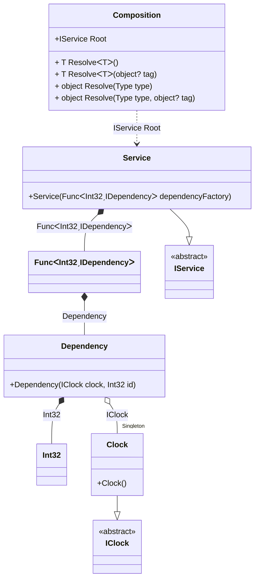

#### Func with arguments

[](../tests/Pure.DI.UsageTests/BaseClassLibrary/FuncWithArgumentsScenario.cs)

```c#
interface IClock
{
    DateTimeOffset Now { get; }
}

class Clock : IClock
{
    public DateTimeOffset Now => DateTimeOffset.Now;
}

interface IDependency
{
    int Id { get; }
}

class Dependency(IClock clock, int id) : IDependency
{
    public int Id => id;
}

interface IService
{
    ImmutableArray<IDependency> Dependencies { get; }
}

class Service : IService
{
    public Service(Func<int, IDependency> dependencyFactory) =>
        Dependencies = Enumerable
            .Range(0, 10)
            .Select((_, index) => dependencyFactory(index))
            .ToImmutableArray();

    public ImmutableArray<IDependency> Dependencies { get; }
}

DI.Setup(nameof(Composition))
    .Bind<IClock>().As(Lifetime.Singleton).To<Clock>()
    // Binds a dependency of type int
    // to the source code statement "dependencyId"
    .Bind<int>().To<int>("dependencyId")
    .Bind<Func<int, IDependency>>()
        .To<Func<int, IDependency>>(ctx =>
            dependencyId =>
            {
                // Builds up an instance of type Dependency
                // referring the source code statement "dependencyId"
                ctx.Inject<Dependency>(out var dependency);
                return dependency;
            })
    .Bind<IService>().To<Service>()

    // Composition root
    .Root<IService>("Root");

var composition = new Composition();
var service = composition.Root;
service.Dependencies.Length.ShouldBe(10);
service.Dependencies[3].Id.ShouldBe(3);
```

<details open>
<summary>Class Diagram</summary>



</details>

<details>
<summary>Pure.DI-generated partial class Composition</summary><blockquote>

```c#
partial class Composition
{
  private readonly Composition _rootM04D12di;
  private readonly object _lockM04D12di;
  private Pure.DI.UsageTests.BCL.FuncWithArgumentsScenario.Clock _singletonM04D12di36_Clock;
  
  public Composition()
  {
    _rootM04D12di = this;
    _lockM04D12di = new object();
  }
  
  internal Composition(Composition baseComposition)
  {
    _rootM04D12di = baseComposition._rootM04D12di;
    _lockM04D12di = _rootM04D12di._lockM04D12di;
  }
  
  public Pure.DI.UsageTests.BCL.FuncWithArgumentsScenario.IService Root
  {
    [global::System.Runtime.CompilerServices.MethodImpl((global::System.Runtime.CompilerServices.MethodImplOptions)0x100)]
    get
    {
      System.Func<int, Pure.DI.UsageTests.BCL.FuncWithArgumentsScenario.IDependency> transientM04D12di1_Func = dependencyId =>
      {
          int transientM04D12di3_Int32 = dependencyId;
          if (_rootM04D12di._singletonM04D12di36_Clock == null)
          {
              lock (_lockM04D12di)
              {
                  if (_rootM04D12di._singletonM04D12di36_Clock == null)
                  {
                      _singletonM04D12di36_Clock = new Pure.DI.UsageTests.BCL.FuncWithArgumentsScenario.Clock();
                      _rootM04D12di._singletonM04D12di36_Clock = _singletonM04D12di36_Clock;
                  }
              }
          }
          var dependency_M04D12di1 = new Pure.DI.UsageTests.BCL.FuncWithArgumentsScenario.Dependency(_rootM04D12di._singletonM04D12di36_Clock, transientM04D12di3_Int32);
          return dependency_M04D12di1;
      };
      return new Pure.DI.UsageTests.BCL.FuncWithArgumentsScenario.Service(transientM04D12di1_Func);
    }
  }
  
  public T Resolve<T>()
  {
    return ResolverM04D12di<T>.Value.Resolve(this);
  }
  
  public T Resolve<T>(object? tag)
  {
    return ResolverM04D12di<T>.Value.ResolveByTag(this, tag);
  }
  
  [global::System.Runtime.CompilerServices.MethodImpl((global::System.Runtime.CompilerServices.MethodImplOptions)0x100)]
  public object Resolve(global::System.Type type)
  {
    var index = (int)(_bucketSizeM04D12di * ((uint)global::System.Runtime.CompilerServices.RuntimeHelpers.GetHashCode(type) % 1));
    ref var pair = ref _bucketsM04D12di[index];
    return pair.Key == type ? pair.Value.Resolve(this) : ResolveM04D12di(type, index);
  }
  
  [global::System.Runtime.CompilerServices.MethodImpl((global::System.Runtime.CompilerServices.MethodImplOptions)0x8)]
  private object ResolveM04D12di(global::System.Type type, int index)
  {
    var finish = index + _bucketSizeM04D12di;
    while (++index < finish)
    {
      ref var pair = ref _bucketsM04D12di[index];
      if (pair.Key == type)
      {
        return pair.Value.Resolve(this);
      }
    }
    
    throw new global::System.InvalidOperationException($"Cannot resolve composition root of type {type}.");
  }
  
  [global::System.Runtime.CompilerServices.MethodImpl((global::System.Runtime.CompilerServices.MethodImplOptions)0x100)]
  public object Resolve(global::System.Type type, object? tag)
  {
    var index = (int)(_bucketSizeM04D12di * ((uint)global::System.Runtime.CompilerServices.RuntimeHelpers.GetHashCode(type) % 1));
    ref var pair = ref _bucketsM04D12di[index];
    return pair.Key == type ? pair.Value.ResolveByTag(this, tag) : ResolveM04D12di(type, index);
  }
  
  [global::System.Runtime.CompilerServices.MethodImpl((global::System.Runtime.CompilerServices.MethodImplOptions)0x8)]
  private object ResolveM04D12di(global::System.Type type, object? tag, int index)
  {
    var finish = index + _bucketSizeM04D12di;
    while (++index < finish)
    {
      ref var pair = ref _bucketsM04D12di[index];
      if (pair.Key == type)
      {
        return pair.Value.ResolveByTag(this, tag);
      }
    }
    
    throw new global::System.InvalidOperationException($"Cannot resolve composition root \"{tag}\" of type {type}.");
  }
  
  public override string ToString()
  {
    return
      "classDiagram\n" +
        "  class Composition {\n" +
          "    +IService Root\n" +
          "    + T ResolveᐸTᐳ()\n" +
          "    + T ResolveᐸTᐳ(object? tag)\n" +
          "    + object Resolve(Type type)\n" +
          "    + object Resolve(Type type, object? tag)\n" +
        "  }\n" +
        "  class Dependency {\n" +
          "    +Dependency(IClock clock, Int32 id)\n" +
        "  }\n" +
        "  class Int32\n" +
        "  class FuncᐸInt32ˏIDependencyᐳ\n" +
        "  Clock --|> IClock : \n" +
        "  class Clock {\n" +
          "    +Clock()\n" +
        "  }\n" +
        "  Service --|> IService : \n" +
        "  class Service {\n" +
          "    +Service(FuncᐸInt32ˏIDependencyᐳ dependencyFactory)\n" +
        "  }\n" +
        "  class IClock {\n" +
          "    <<abstract>>\n" +
        "  }\n" +
        "  class IService {\n" +
          "    <<abstract>>\n" +
        "  }\n" +
        "  Dependency o--  \"Singleton\" Clock : IClock\n" +
        "  Dependency *--  Int32 : Int32\n" +
        "  FuncᐸInt32ˏIDependencyᐳ *--  Dependency : Dependency\n" +
        "  Service *--  FuncᐸInt32ˏIDependencyᐳ : FuncᐸInt32ˏIDependencyᐳ\n" +
        "  Composition ..> Service : IService Root";
  }
  
  private readonly static int _bucketSizeM04D12di;
  private readonly static global::Pure.DI.Pair<global::System.Type, global::Pure.DI.IResolver<Composition, object>>[] _bucketsM04D12di;
  
  static Composition()
  {
    var valResolverM04D12di_0000 = new ResolverM04D12di_0000();
    ResolverM04D12di<Pure.DI.UsageTests.BCL.FuncWithArgumentsScenario.IService>.Value = valResolverM04D12di_0000;
    _bucketsM04D12di = global::Pure.DI.Buckets<global::System.Type, global::Pure.DI.IResolver<Composition, object>>.Create(
      1,
      out _bucketSizeM04D12di,
      new global::Pure.DI.Pair<global::System.Type, global::Pure.DI.IResolver<Composition, object>>[1]
      {
         new global::Pure.DI.Pair<global::System.Type, global::Pure.DI.IResolver<Composition, object>>(typeof(Pure.DI.UsageTests.BCL.FuncWithArgumentsScenario.IService), valResolverM04D12di_0000)
      });
  }
  
  private sealed class ResolverM04D12di<T>: global::Pure.DI.IResolver<Composition, T>
  {
    public static global::Pure.DI.IResolver<Composition, T> Value = new ResolverM04D12di<T>();
    
    public T Resolve(Composition composite)
    {
      throw new global::System.InvalidOperationException($"Cannot resolve composition root of type {typeof(T)}.");
    }
    
    public T ResolveByTag(Composition composite, object tag)
    {
      throw new global::System.InvalidOperationException($"Cannot resolve composition root \"{tag}\" of type {typeof(T)}.");
    }
  }
  
  private sealed class ResolverM04D12di_0000: global::Pure.DI.IResolver<Composition, Pure.DI.UsageTests.BCL.FuncWithArgumentsScenario.IService>
  {
    public Pure.DI.UsageTests.BCL.FuncWithArgumentsScenario.IService Resolve(Composition composition)
    {
      return composition.Root;
    }
    
    public Pure.DI.UsageTests.BCL.FuncWithArgumentsScenario.IService ResolveByTag(Composition composition, object tag)
    {
      switch (tag)
      {
        case null:
          return composition.Root;
      }
      throw new global::System.InvalidOperationException($"Cannot resolve composition root \"{tag}\" of type Pure.DI.UsageTests.BCL.FuncWithArgumentsScenario.IService.");
    }
  }
}
```

</blockquote></details>

