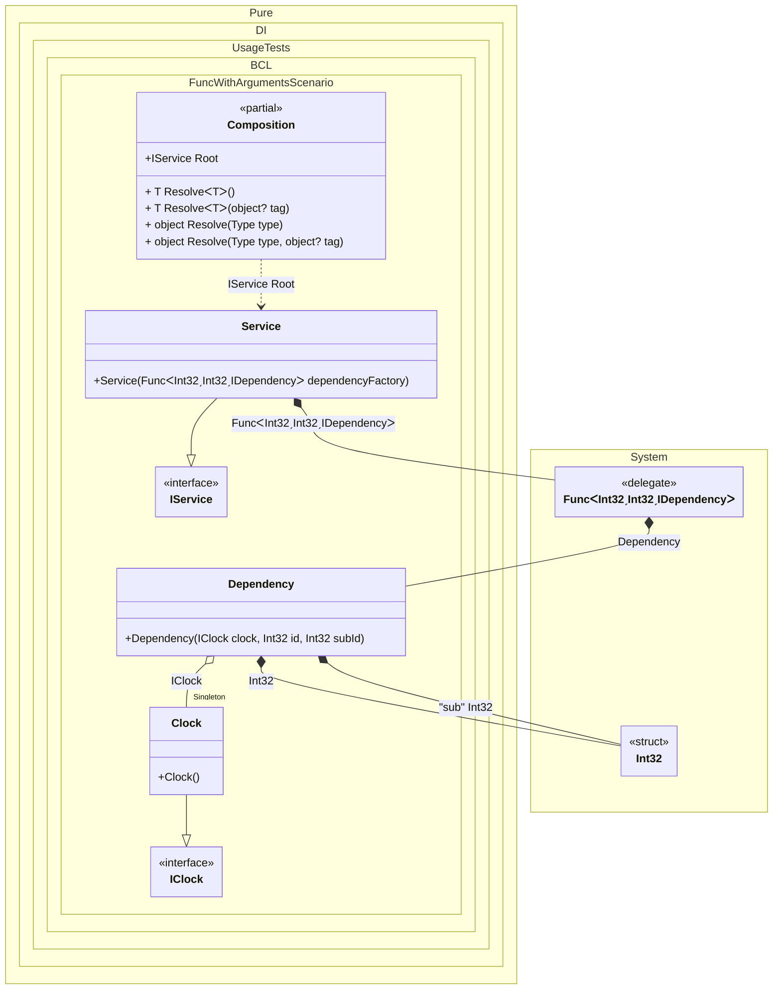

#### Func with arguments

[](../tests/Pure.DI.UsageTests/BaseClassLibrary/FuncWithArgumentsScenario.cs)


```c#
using Shouldly;
using Pure.DI;
using System.Collections.Immutable;

DI.Setup(nameof(Composition))
    .Bind<IClock>().As(Lifetime.Singleton).To<Clock>()
    // Binds a dependency of type int
    // to the source code statement "dependencyId"
    .Bind<int>().To<int>("dependencyId")
    // Binds a dependency of type int with tag "sub"
    // to the source code statement "subId"
    .Bind<int>("sub").To<int>("subId")
    .Bind<Func<int, int, IDependency>>()
    .To<Func<int, int, IDependency>>(ctx =>
        (dependencyId, subId) =>
        {
            // Builds up an instance of type Dependency
            // referring source code statements "dependencyId"
            // and source code statements "subId"
            ctx.Inject<Dependency>(out var dependency);
            return dependency;
        })
    .Bind<IService>().To<Service>()

    // Composition root
    .Root<IService>("Root");

var composition = new Composition();
var service = composition.Root;
service.Dependencies.Length.ShouldBe(3);
service.Dependencies[0].Id.ShouldBe(0);
service.Dependencies[1].Id.ShouldBe(1);
service.Dependencies[2].Id.ShouldBe(2);

interface IClock
{
    DateTimeOffset Now { get; }
}

class Clock : IClock
{
    public DateTimeOffset Now => DateTimeOffset.Now;
}

interface IDependency
{
    int Id { get; }

    int SubId { get; }
}

class Dependency(
    IClock clock,
    int id,
    [Tag("sub")] int subId)
    : IDependency
{
    public int Id => id;

    public int SubId => subId;
}

interface IService
{
    ImmutableArray<IDependency> Dependencies { get; }
}

class Service(Func<int, int, IDependency> dependencyFactory): IService
{
    public ImmutableArray<IDependency> Dependencies { get; } =
    [
        dependencyFactory(0, 99),
        dependencyFactory(1, 99),
        dependencyFactory(2, 99)
    ];
}
```

<details>
<summary>Running this code sample locally</summary>

- Make sure you have the [.NET SDK 9.0](https://dotnet.microsoft.com/en-us/download/dotnet/9.0) or later is installed
- Create a net9.0 (or later) console application
- Add references to NuGet packages
  - [Pure.DI](https://www.nuget.org/packages/Pure.DI)
  - [Shouldly](https://www.nuget.org/packages/Shouldly)
- Copy the example code into the _Program.cs_ file

You are ready to run the example!

</details>

Using a binding of the form `.Bind<T>().To<T>("some statement")` is a kind of hack that allows you to replace an injection with just its own string.


Class diagram:



